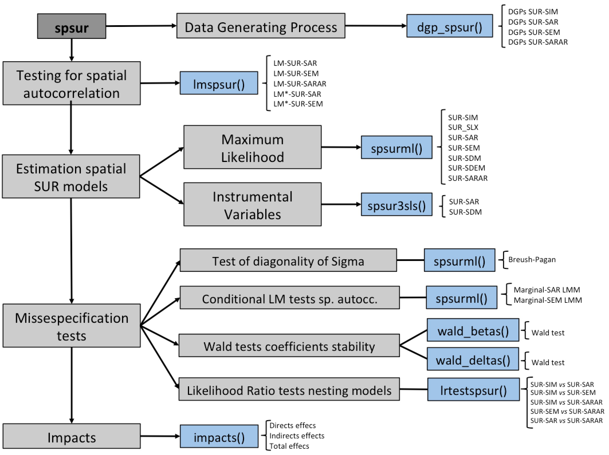

---
author:
  - name: Roman Mínguez
    affiliation: 'Universidad Castilla La Mancha \AND'
    email: \email{roman.minguez@uclm.es}
    url: https://github.com/rominsal
    address:  Avenida de Los Alfares, 42. 16002 Cuenca (Spain)
  - name: Fernando A. López
    affiliation: Universidad Politécnica de Cartagena
    email: \email{fernando.lopez@upct.es}
    address: Facultad de Ciencias de la Empresa, Dept. de Métodos Cuantitativos e Informáticos, Calle Real, 3. 30201 Cartagena, Murcia (Spain) 
  - name: Jesús Mur
    affiliation: Universidad de Zaragoza
    email: \email{jmur@unizar.es}
    address:
title:
  formatted: "\\pkg{spsur}: an \\proglang{R} package for testing and estimation spatial seemingly unrelated regression models"
  plain: "A Capitalized Title: Something about a Package foo"
  short: "\\pkg{spsur}: Testing and estimation spatial SUR"
bibliography: bibliosure
output: 
 bookdown::pdf_book:
    
    base_format: rticles::jss_article
 bookdown::git_book:
   base_format: rticles::jss_article
link-citations: yes
linkcolor: red
keywords:
  formatted: [spatial seemingly unrelated regression models, lagrange multipliers test, maximum likelihood, instrumental variables, panel data, R package]
  plain: [keywords, not capitalized, Java]
preamble: >
  \usepackage{amsmath}
  \usepackage[utf8]{inputenc}
  
abstract: >
  In recent decades, several methodological developments to improve the specification, estimation and inference of Seemingly Unrelated Regression (SUR) models in a spatial setting have been proposed. These procedures allow us testing for the presence of spatial autocorrelation and estimate several spatial SUR models using different algorithms. Furthermore, there have been described different misspecification test, singularly in a maximum likelihood framework. Unfortuanlly, no standard software is avaliable to make those tasks. This is the gap that the \pkg{spsur} R package pretends to overcome. The new package allows for the estimation of the most usual spatial econometric models by maximum likelihood or instrumental variable procedures. Moreover, the package implement a collection of Lagrange Multipliers and Likelihood Ratio tests to treat for misspecifications in the equations. A specific also code allows for the estimation of the so-called 'spatial impacts' (direct, indirect and total effects). An important ability of \pkg(spsur) is that all functions has been developt to work both in a cross-section or panel data framework. The principal features of this new \proglang{R} package are illustrated by two well-known data set in the applied literature on spatial data.
---

# Introduction

Seemingly unrelated regression models (SUR from now on) are a type of multivariate econometric formulation very popular since the seminal papers of @Zellner1962, @Malinvaud1970 or @Theil1971. SUR has been applied in many research areas in economics and others fields [for instance see @Fiebig2007], especially in the topics of consumption, production and environmental economics, but also on economic growth, health economics, real estate or competition between local agents. Distinct mechanisms may result in the type of dependence that lies behind SUR models such as omitted variables, unobserved effects with a random nature or pure serial dependence. The concept of common factors, with a different impact for each equation but but uniform among the individuals, offers a comprehensive framework to interpret the purpose of this kind of models. It is clear that if the equations are interconnected through the errors, a SUR framework assures efficiency gains, as has been repeatedly demonstrated, by estimating jointly the whole system rather than processing each equation separately. These gains explain the good position that SUR models occupy in the applied research. Spatial data analysis is a bit weird exception, because there has been a quite extensive reflection on SUR models in the spatial econometrics literature, but the applied literature is very short.

@Anselin1988a introduced the term *spatial SUR* in reference to a model that *'consists of an equation for each time period which is estimated for a cross section of spatial units'* (p. 141). The approach of Anselin focuses on the problem of serial dependence in the errors of an equation, which has been estimated using several cross-sections. This concern is perfectly natural if the same agents intervene in each period (i.e., my decision in t is going to be affected, surely, by my previous decisions). According to usual practice at the end of the eighties, the proposal of Anselin allows for a very limited heterogeneity. In fact, the regression coefficients are assumed to be the same across individuals, and unobserved effects are excluded. These constraints have been overcome in the more recent works of @Mur2010 and @Anselin2016, where spatial and nonspatial parameters can take on different values in each cross-section.

Different spatial mechanisms may appear in each equation, revolving around the classical ones, i.e.  SEM or SLM processes. Additionally, it is assumed that the cross-sectional dimension of the sample (*N*, number of individuals) is greater than the time dimension (*T*, number of periods). That is, the implicit framework is large *N* and finite *T*. @Rey1999, @Egger2004, @LeGallo2006, @Fingleton2007, @Moscone2007, @LeGallo2008,  @Lauridsen2010, @Kakamu2012 or @Bech2012 are well-known examples of this approach. If the number of individuals is small but they are observed for a long time period (finite *N* and large *T*), perhaps it would be preferable to base the inference on the time dimension, specifying an equation for each unit in the sample which, later, can be connected with the others using some of the typical interaction mechanisms. @Arora1977, @Hordijk1977 and @White1982 follow the last approach.

A significant milestone in this literature is @Wang2007 who allow for greater heterogeneity among the individuals by introducing unobserved random effects. They extend the equation of the errors by including a mechanism of error components 'a la KKP', from @Kapoor2007, where the unobserved effects are intermingled with the random term of the SEM equation. This scheme is different from the proposal of @Baltagi2003, BSK, where the error is the sum of a SEM mechanism plus an unobserved individual effect. The numerical difficulty of both approaches is similar but KKP seems to be more popular. Another point of interest in the work of Wang and Kockelman is that they built a standard SUR model, where there are *G* equations, *T* cross-sections and *N* individuals and the focus moves from to heterogeneity and spatial dependence, in addition to the dependence between equations. @Baltagibresson extend the results of Wang and Kockelman by developing a collection of misspecification tests, under a ML framework, whereas @Baltagipirotte introduce GMM methods in a spatial SUR with a SEM structure in the errors, also 'a la KKP'. Finally @Lopez2014 address the problem of selecting the best specification for this type of spatial SUR models, using a battery of Lagrange Multipliers obtained in a ML framework. @Lundberg2006, @Zhou2009, @Cotteleer2012, @Izon2016 and @Lopez2017 present nice examples of the use of spatial SUR models implying various equations.

From the discussion above, it is clear that there is a growing interest in the case of seemingly unrelated regressions in a spatial context, although the lack of specific software has delayed its full generalization in applied research. This the purpose of the present paper: introduce a new \proglang{R} package, called \pkg{spsur}, directed at the management of SUR equations in spatial relations. The preferred framework (because,in general, the asymptotics requires of a large cross-sectional dimension) is large *N* and finite *T*. Specifically, we admit a moderate to large *N* (over thousands observations) but a limited *T* (a few dozen cross-sections), together with a small number of different equations (from one to several more). The core of the package lies in ML estimation because, at this time, we value exactitude and trustworthiness over quickness. There is no need to recall that the hypothesis of normality plays a key role in supporting the ML approach. The user will rarely have information supporting the normality assumption so, indeed, we are talking about quasi maximum-likelihood, QML, with good properties even in the absence of normality as shown in @Lee2004. Partly for this reason, and also for rewarding the speed of calculation in very large samples, the ML approach is completed with modules devoted to IV, FGLS and GMM procedures.

Among the limitations, let us note that we rely explicitly on the assumptions of linearity and temporal dynamic relations are not allowed. This version of the package does not contain items to tackle the case of unobserved random effects, but we include the possibility of removing potential unobserved individual effects from the equation (which are not estimated, in any case). Finally, we require the user to specify the weighting matrix that corresponds to the case under study; this matrix is assumed to be exogenous, known, constant across time and the same for the different equations in the model (this restriction can be relaxed in the future).

Following usual practice in current applied literature, we include a module devoted to the quantification of spatial multipliers (direct, indirect and total effects) and, in vein with @LeSage2009, several measures of statistical significance are obtained by bootstrapping the estimates. We have carefully looked at the issue of misspecification tests, especially those dedicated to the omission/relevance of spatial structures in the equations.Moreover, the issue of parameter stability, for a known breakpoint, is also included in \pkg{spsur}.

Second Section of the paper introduces notation and reviews the main results in the literature on spatial SUR models, is necessary for a proper use of the \pkg{spsur} package. Section 3 presents a battery of misspecification tests related to spatial SUR models. Section 4 introduces the analysis of spatial multipliers whereas Section 5 reports on several estimation algorithms that complement the ML approach. Section 6 presents an application to a well known case in the applied literature, with the aim of illustrating \pkg{spsur} functionalists. Finally, Section 7 concludes with a summary of results and prospect for the near future.

# SUR and Spatial SUR models {#SecSUR}

The SUR model specification is a multiequational model that extend the classical regression model. The specification consist of several equations, each having its own dependent variables and possibly different sets of independent variables, where the error terms of each equation are correlated. We focused our discussion in the panel case of *T* cross-sections and *N* individuals following the classical propose of @Anselin1988a or more recently @Anselin2016, with *N*>*T* ^[Anselin's book consider *T* temporal periods but will be equivalent *G* equations for the same cross-section. There follows both interpretation are possible.]. In this case, the expression for baseline model with out spatial effects is,

\begin{equation}
{\bf y_t}={\bf X_t \beta_t}+{\bf \varepsilon_t}\ ; \ \ \ \ \ \
E[{\bf \varepsilon_t}]=0\ ;\ \ \ \ \ E[{\bf \varepsilon_t} {\bf {\varepsilon'}_s}]= \sigma_{ts} {\bf I_N}  \ \ \ \ \ \ t,s=1,...,T
(\#eq:baseline)
\end{equation}

where ${\bf y_t}$, ${\bf u_t}$ and ${\bf \varepsilon_t}$ are $N \times 1$ vectors, ${\bf X_t}$ is a $N \times k_t$ matrix, with $k_t$ is the number of regressors that appear in t-th cross-section and $\beta_t$ is the $k_t \times 1$ vector of coefficients. We denote this model as SUR-SIM following the terminology of @Lopez2014.

The singular aspect of the specification of \@ref(eq:baseline) is that the SUR structure appears because there is intra-individual serial dependence due to, for example, time inertia and behavioral persistence. Inter-individual serial dependence is excluded from Anselin approach (this assumption can be checked). The serial dependence in the errors of each individual is not parameterized, but estimated non-parametrically in the $(T \times T)$ covariance matrix, $\boldsymbol \Sigma$=$(\sigma_{ts})$. An important constraint to mention is that the-non parametric serial dependence is uniform for all individuals in the sample. <!--- Finally, it is assumed that the data are time-stationary which prevents from the unit root issue (same applies for the general spatial SUR model).--->

In applied regional science, when the cross-section is a set of regions or georeferenced spatial points, a potential problem of SUR model is the presence of spatial autocorrelation. Several alternatives specifications has been proposes [@Elhorst2014] to incorporate spatial effects in the SUR model. The general expression that include all possible spatial effects is:
\begin{equation}
{\bf y_t}=\lambda_t \textbf W_t^y {\bf y_t}+ {\bf X_t}\beta_t+\textbf W_t^x {\bf X_t^*} \gamma_t +u_t;\ \ u_t=\rho_t\textbf W_t^u u_t +\varepsilon_t\ ; \ \  E[\varepsilon_t]=0\ ;\ \ E[{\bf \varepsilon_t} {\bf {\varepsilon'}_s}]=\sigma_{ts}{\bf I_N}
(\#eq:GNM)
\end{equation}

where ${\bf X_t}$ is a $N \times k_t$ matrix of independent variables, allowing a different number of regressors in each equation ($k_t$); ${\bf X_t^*}$ is the same matrix without the intercept term, in the case that there are; $\bf W_t^y$, $\bf W_t^x$, $\textbf W_t^u$ are $N \times N$ matrices. The model in \@ref(eq:GNM) is often referred to as a General Nesting Model (GNM) in cross-section and we extended this terminology to SUR (SUR-GNM). From SUR-GNM model emerge with slight modifications several models that incorporate only some spatial terms (see @Elhorst2014, for the details). The list is:

1. The SUR-SIM, least squares model, with no spatial interaction, $\lambda_t = \rho_t = \theta_t = 0, (\forall t)$.
2. The SUR-SLX, spatial lags in Xs model, where , $\lambda_t = \rho_t = 0, (\forall t)$.
3. The SUR-SLM, spatial autoregressive model, where $\rho_t=\gamma_t = 0, (\forall t)$.
4. The SUR-SEM, spatial error model, where $\lambda_t=\gamma_t = 0, (\forall t)$.
5. The SUR-SDM, spatial Durbin model, where $\rho_t = 0, (\forall t)$.
6. The SUR-SARAR, spatial simultaneos autoregresive error model, where $\gamma_t = 0, (\forall t)$.
7. The SUR-SDEM, spatial Durbin error model, where $\lambda_t= 0, (\forall t)$.

It is usual in applied literature to assume that the weighting matrices $\textbf{W}_t^x$, $\textbf{W}_t^u$ and $\textbf{W}_t^{\varepsilon}$ are the same; additionally we assume that they are also the same for the different equations ($\textbf W$ hereinafther). The user has ample flexibility to specify the weighting matrix that, in any case, must conform to the requisites in [@Kelejian2004]: the terms on the main diagonal are zero and the row and column sums of the matrices $\textbf W$ are uniformly bounded in absolute value, the same as $\textbf A_{t}^{-1} :=\mathop{\left({\bf I_N} -\lambda _{t} {\bf W}\right)}\nolimits^{-1}$ and $\textbf B_{t}^{-1} :=\mathop{\left({\bf I_N} -\rho _{t} {\bf W}\right)}\nolimits^{-1}$ which must exist.

Note that the model \@ref(eq:GNM) can be rewrite using obvious matrix notation:
\begin{equation}
\begin{array}{ll} 
\ \ \ \ \ \ \ \ \ \ \ \ \ \ \ \ \ {\bf A}y={\bf X}\beta + ({\bf I_T} \otimes {\bf W}){\bf X^*} \gamma +u; \ \ {\bf B}u=\varepsilon; \ \ \varepsilon \sim N(0,{\bf \Omega} )
\\
\\
{{\bf y}=\mathop{\left[\begin{array}{c} {{\bf y_1} } \\ {\mathop{y}\nolimits_{2} } \\ {\cdots } \\ {\mathop{y}\nolimits_{T} } \end{array}\right]}\limits_{TN\times1} ;
{\bf X} =\mathop{\left[\begin{array}{cccc} {\mathop{\bf X}\nolimits_{1} } & {0} & {\cdots } & {0} \\ {0} & {\mathop{\bf X}\nolimits_{2} } & {\cdots } & {0} \\ {\cdots } & {\cdots } & {\cdots } & {\cdots } \\ {0} & {0} & {\cdots } & {\mathop{\bf X}\nolimits_{T} } \end{array}\right]}\limits_{TN\times k} ;\, \, {\bf \beta} =\mathop{\left[\begin{array}{c} {\mathop{\beta }\nolimits_{1} } \\ {\mathop{\beta }\nolimits_{2} } \\ {\cdots } \\ {\mathop{\beta }\nolimits_{T} } \end{array}\right]}\limits_{k\times 1} ;u=\mathop{\left[\begin{array}{c} {\mathop{u}\nolimits_{1} } \\ {\mathop{u}\nolimits_{2} } \\ {\cdots } \\ {\mathop{u}\nolimits_{T} } \end{array}\right]}\limits_{TN\times1} ;\, \, {\bf \varepsilon} =\mathop{\left[\begin{array}{c} {\mathop{\varepsilon }\nolimits_{1} } \\ {\mathop{\varepsilon }\nolimits_{2} } \\ {\cdots } \\ {\mathop{\varepsilon }\nolimits_{T} } \end{array}\right]}\limits_{TN\times1} } 
\end{array} 
(\#eq:pool)
\end{equation}

where $k=\sum k_t$ , ${\bf A}={\bf I_{TN}}-{\bf \Lambda} \otimes \textbf W$ with ${\bf \Lambda}=diag(\lambda_1,\dots,\lambda_T)$; ${\bf B=I_{TN}}- {\bf \Gamma} \otimes \textbf W$ with ${\bf \Gamma}=diag(\rho_1,\dots,\rho_T)$ and ${\bf \Omega}={\bf \Sigma} \otimes {\bf I_T}$, being $\otimes$ the Kronecker product. Assuming that the errors are normally distributed, the log-likelihood function of the SUR-GNM model of \@ref(eq:GNM) can be written as:
\begin{multline}
l(y;\theta)=-\frac{NT}{2} \ln (2\pi)-\frac{N}{2} \ln |{\bf \Sigma}|+T\sum _{t=1}^{T}\ln|{\bf B_t}| +T\sum _{t=1}^{T}\ln|{\bf A_t}| \\
-\frac{\left({\bf A}y-{\bf \bar{X}}[\beta \ \gamma]' \right)'{\bf B}'\mathop{{\bf \Omega}}\nolimits^{-1} {\bf B}\left({\bf A}y-{\bf  \bar{X}}[\beta \ \gamma]' \right)}{2}
(\#eq:Lik)
\end{multline}
where $\bar{\textbf X}=[\textbf X,\bf W {\bf X^*}]$ is a $RT \times (2k-T)$ matrix with $\bf X$ a $NT \times k$ and the parameter vector is $\theta'=\left[\beta';\gamma';\lambda_1; \dots ;\lambda_T;\rho_1;\dots ;\rho_T ;\mathop{\sigma }\nolimits_{ij} \right]$  is the vector of $K= 2k+T+T(T+1)/2$ parameters of the model. @Wang2007 and @Lopez2014 use numerical optimization techniques to solve the maximum likelihood estimates, which are implemented in \pkg{spsur} package. Note that the presence of the log of the Jacobian terms, $\ln|B_t|$ and $\ln|A_t|$, forces the spatial parameters, $\lambda_t$ and $\rho_t$, to lie inside the so-called *stability interval* (if the weighting matrix is row-standardized, a rough approximation is -1,+1; see @Elhorst2014). Under the assumption that the spatial SUR model is correctly specified (including normality), the ML estimators are consistent \footnote{Let us recall that we assume a finite $T$, so the asymptotics is with $N$.} with $N$, at a rate $N^{-1/2}$, efficient and asymptotically normally distributed @Davidson1993.

## Testing for spatial effects

Since the estimation of spatial SUR model becomes more complex when the spatial autocorrelation is present, it is useful develop statistical tests to identify the presence of this complication. The Lagrange Multiplier (LM) tests are attractive because to get the statistic is not necessary to estimate the model under the alternative, thereby the cost in computing time is reduced. In this section we present the LM statistics to test spatial autocorrelation in a SUR framework. Those statistics are similar to the LM tests of spatial autocorrelation for a simple equation in cross-section (see \code{lm.LMtests} in package \pkg{spdep}) and are implements in the \pkg{spsur} package.

In @Mur2010 and @Lopez2014, the same as @Baltagibresson for the SUR with unobserved random effects, develop a collection of LM tests to check for the presence of spatial effects in a SUR model. Below we present their main results, the details can be consulted in @Lopez2014.

The first LM test is a global test for the presence of spatial effects in the SUR. The null hypothesis is the SUR without spatial effects (SUR-SIM), whereas the model under the alternative is a SUR-SARAR model:
\begin{equation*}
H_0 :\lambda_t =\rho_t =0 \ \ (\forall t)  \ \ \ \ vs  \ \  \ \ H_A: No  \ \ H_0
\end{equation*}

In brief, the LM test can be written as:
\begin{equation}
\mathop{{\rm LM}}\nolimits_{{\rm SARAR}}^{{\rm SUR}} =\left[\begin{array}{cc} {\mathop{g'}\nolimits_{(\lambda )_{\left|\mathop{H}\nolimits_{0} \right. } } } & {\mathop{g'}\nolimits_{(\rho )_{\left|\mathop{H}\nolimits_{0} \right. } } } \end{array}\right]\mathop{\left[\begin{array}{cc} {\mathop{I}\nolimits_{\lambda \lambda } -\mathop{I}\nolimits_{\lambda \beta } \mathop{I}\nolimits_{\beta \beta }^{-1} \mathop{I}\nolimits_{\beta \lambda } } & {\mathop{I}\nolimits_{\lambda \rho } } \\ {\mathop{I}\nolimits_{\rho \lambda } } & {\mathop{I}\nolimits_{\rho \rho } } \end{array}\right]}\nolimits_{_{\left|\mathop{H}\nolimits_{0} \right. } }^{-1} \left[\begin{array}{c} {\mathop{g}\nolimits_{(\lambda )_{\left|\mathop{H}\nolimits_{0} \right. } } } \\ {\mathop{g}\nolimits_{(\rho )_{\left|\mathop{H}\nolimits_{0} \right. } } } \end{array}\right]\mathop{\sim }\limits_{as} \mathop{\chi }\nolimits^{2} (2T)
(\#eq:LMSARAR)
\end{equation}

where $\mathop{g}\nolimits_{(\lambda )_{\left|\mathop{H}\nolimits_{0} \right.}}$ and $\mathop{g}\nolimits_{(\rho )_{\left|\mathop{H}\nolimits_{0} \right. } }$ are the subvectors, of the score vector, corresponding to the spatial parameters, evaluated at the null. $\mathop{I}\nolimits_{\lambda \lambda }$, $\mathop{I}\nolimits_{\rho \rho }$, $I_{\beta \beta }$, $\mathop{I}\nolimits_{\lambda \beta }$ and $\mathop{I}\nolimits_{\rho \lambda }$ are the submatrices of the information matrix corresponding to the variances of $\lambda$, $\rho$ and $\beta$, and the covariances between them. 

If we change the model of the alternative from the SUR-SARAR to the SUR-SLM, we obtain the following test:
$$
H_0 :\lambda_t =0 \ \ (\forall t)  \ \ \ \ vs  \ \  \ \ H_A: No  \ \ H_0
$$
where it is assumed that the $\rho$ parameters are zero. Our focus is on the omission of spatial lags of the endogenous variables from the main equation. The discussion is entirely similar to the test of \@ref(eq:LMSARAR), just changing the SARAR by the SLM. The corresponding Lagrange Multiplier can be written as:
\begin{equation}
\mathop{{\rm LM}}\nolimits_{{\rm SLM}}^{{\rm SUR}} =\mathop{g'}\nolimits_{(\lambda )_{\left|\mathop{H}\nolimits_{0} \right. } } \left[\mathop{I}\nolimits_{\lambda \lambda } -\mathop{I}\nolimits_{\lambda \beta } \mathop{I}\nolimits_{\beta \beta }^{-1} \mathop{I}\nolimits_{\beta \lambda } \right]^{-1} \mathop{g}\nolimits_{(\lambda )_{\left|\mathop{H}\nolimits_{0} \right. } } \mathop{\sim }\limits_{as} \mathop{\chi }\nolimits^{2} (T)
(\#eq:LMSURSAR)
\end{equation}

Similarly, we can put the SEM in the alternative, assuming that the $\lambda$ parameters are zero:
$$
\mathop{H}\nolimits_{0} :\mathop{\rho}\nolimits_{t} =0\, \, \, (\forall t)\, \, \, \, \, \, \, \, \, \, \, \, \, {\rm \textit{vs}}\, \, \, \, \, \, \, \, \, \, \, H_{A} :\, \, No\, \, H_{0}
$$
Now we are interested in the omission of a spatial structure in the errors. The Lagrange Multiplier is:
\begin{equation}
\mathop{{\rm LM}}\nolimits_{{\rm SEM}}^{{\rm SUR}} =\mathop{g'}\nolimits_{(\rho )_{\left|\mathop{H}\nolimits_{0} \right. } } \left[\mathop{I}\nolimits_{\rho \rho } \right]^{-1} \mathop{g}\nolimits_{(\rho )_{\left|\mathop{H}\nolimits_{0} \right. } } \mathop{\sim }\limits_{as} \mathop{\chi }\nolimits^{2} (T)
(\#eq:LMSURSEM)
\end{equation}

The tests of \@ref(eq:LMSURSAR) and \@ref(eq:LMSURSEM) are known in the literature as *raw* or *crude* Multipliers in the sense, as shown in @Bera1993, that they are not robust to misspecifications of the alternative hypothesis. The lack of robustness renders difficult the correct identification of the type of misspecification that affects the model. This problem is not specific of the spatial case but extends to other models where there are groups of parameters whose scores are not orthogonal. The consequence is a non-centrality parameter in the individual Multipliers that increases, dramatically, the empirical size of the tests. The solution [@Anselin1996] is to *robustify* the raw Multipliers to obtain the robust Lagrange Multipliers  which, in our case, are:
\begin{equation}
\, \mathop{H}\nolimits_{0} :\mathop{\rho }\nolimits_{t} =0{\rm \; (}\forall t{\rm )}\, \, \, \, \, \, vs\, \, \, \, \, \, \, \, \mathop{H}\nolimits_{A} :{\rm \; \; No\; H}_{{\rm 0}}
(\#eq:SURSLMR1)
\end{equation}
\begin{equation}
 \mathop{{\rm LM^{\bf *}}}\nolimits_{{\rm SLM}}^{{\rm SUR}} = \left[\mathop{g}\nolimits_{(\lambda )_{\left|\mathop{H}\nolimits_{0} \right. } } -\mathop{I}\nolimits_{\lambda \rho \cdot \varphi } \mathop{I}\nolimits_{\rho \cdot \varphi }^{-1} \mathop{g}\nolimits_{(\rho )_{\left|\mathop{H}\nolimits_{0} \right. } } \right]' \mathop{\left[\mathop{I}\nolimits_{\lambda \cdot \varphi } -\mathop{I}\nolimits_{\lambda \rho \cdot \varphi } \mathop{I}\nolimits_{\rho \cdot \varphi }^{-1} \mathop{I}\nolimits_{\lambda \rho \cdot \varphi } \right]}\nolimits^{-1} \left[\mathop{g}\nolimits_{(\lambda )_{\left|\mathop{H}\nolimits_{0} \right. } } -\mathop{I}\nolimits_{\lambda \rho \cdot \varphi } \mathop{I}\nolimits_{\rho \cdot \varphi }^{-1} \mathop{g}\nolimits_{(\rho )_{\left|\mathop{H}\nolimits_{0} \right. } } \right]\mathop{\sim }\limits_{as}\mathop{\chi }\nolimits^{2}(T)
(\#eq:SURSLMR2)
\end{equation}
\begin{equation}
\, \mathop{H}\nolimits_{0} :\mathop{\lambda }\nolimits_{t} =0{\rm \; (}\forall t{\rm )}\, \, \, \, \, \, vs\, \, \, \, \, \, \, \, \mathop{H}\nolimits_{A} :{\rm \; \; No\; H}_{{\rm 0}}
(\#eq:SURSEMR1)
\end{equation}
\begin{equation}
\mathop{{\rm LM^{\bf *}}}\nolimits_{{\rm SEM}}^{{\rm SUR}} =\left[\mathop{g}\nolimits_{(\rho )_{\left|\mathop{H}\nolimits_{0} \right. } } -\mathop{I}\nolimits_{\lambda \rho \cdot \varphi } \mathop{I}\nolimits_{\lambda \cdot \varphi }^{-1} \mathop{g}\nolimits_{(\lambda )_{\left|\mathop{H}\nolimits_{0} \right. } } \right]'\mathop{\left[\mathop{I}\nolimits_{\rho \cdot \varphi } -\mathop{I}\nolimits_{\lambda \rho \cdot \varphi } \mathop{I}\nolimits_{\lambda \cdot \varphi }^{-1} \mathop{I}\nolimits_{\lambda \rho \cdot \varphi } \right]}\nolimits^{-1} \left[\mathop{g}\nolimits_{(\rho )_{\left|\mathop{H}\nolimits_{0} \right. } } -\mathop{I}\nolimits_{\lambda \rho \cdot \varphi } \mathop{I}\nolimits_{\lambda \cdot \varphi }^{-1} \mathop{g}\nolimits_{(\lambda )_{\left|\mathop{H}\nolimits_{0} \right. } } \right]\mathop{\sim }\limits_{as} \mathop{\chi }\nolimits^{2}(T)
(\#eq:SURSEMR2)
\end{equation}
Note that the misspecification of the alternative does not affect the variance, but the score terms are demeaned with respect the non-centrality factor [see @Lopez2014 for the details].

## Software review

There is no standard software to test spatial autocorrelation in the residual of a non-spatial SUR model or to estimate spatial SUR models. There are several \proglang{R} packages that develop methods in the spatial econometric field. The \pkg{spdep} [@spdep] and \pkg{spml} [@spml] packages are with difference the most populars. The \pkg{spdep} is an \proglang{R} package with high functionalities for spatial econometric analysis in cross-section data and \pkg{spml} is more relevant in case of spatial panels. On the other hand, the \proglang{R} package \pkg{systemfit} [@systemfit] estimate SUR model but do not incorporate spatial effects. None of the three packages have specific functions to estimate spatial SUR models. This methodology has been the great forgotten in the development of free software. The research that wants to analyze spatial structure in SUR framework has only some software available with limited functionalities. To our knowledge, the first alternative is a beta version developed by Luc Anselin extending the know software \pkg{Spacestat} [@AnselinSpaceStat]. This old-software that we named \pkg{May91} only run under Windows 98 and have limited functionalities (see [video YouTube](https://www.youtube.com/watch?v=6pM0tDWqt3o&t=53s)). \pkg{May91} is not free available and only some researches have a copy in his computer. Furthermore, actually is difficult run in our computer a software under Windows 98. In any case, using this software it is possible to test spatial autocorrelation in a SUR model and to estimate some spatial SUR model specification (only SUR-SLM). The second alternative is a Python sub-package include in \pkg{Python Analysis Library}. The modules \code{spreg.sur} provide the estimation of a SUR model with out spatial effects and in the output a LM test of spatial autocorrelation is included. The module \code{spreg.sur_error} provide the estimation of a SUR model including spatial autocorrelation structure in the residual by ML and finally, the module \code{spreg.sur_lag} obtain the estimation of a SUR model with substantive spatial dependence by instrumental variables (IV). Finally, the last alternative to our knowledge, is some Matlab codes available under request to researchers that have some papers where develop the methodology [@Lopez2014]. Unfortunally Matlab is not a free software and therefore has a high cost of accesibility. In conclusion, with this new \proglang{R} package, \pkg{spsur} the researchers has an important tool to estimate and looking for the correct especification in spatial SUR that overcome all software develop to date.


# Introducing the spsur package

Package \pkg{spsur} is an open-source software package for the \proglang{R} computing platform. The \pkg{spsur} depend of the packages \pkg{Formula}, \pkg{MASS}, \pkg{Matrix}, \pkg{methods}, \pkg{numDeriv}, \pkg{minqa}, \pkg{sparseMVN}, \pkg{spdep}, \pkg{stats}. The \pkg{spsur} package includes complete documentation and a vignette to guide to the researcher to know the functionalities of the package and to help to use it.

A few functions are necessary to test spatial autocorrelation in SUR and estimate the spatial SUR models listed in Section \@ref(SecSUR). Figure 1 show the main functionalities of the \pkg{spsur} package. The \pkg{spsur} package has one function to test spatial autocorrelation on the residuals of a SUR model (\code{lmtestspsur()}); two functions to estimate SUR models with several spatial structures, by maximum likelihood (\code{spsurml()}) and instrumental variables (\code{spsur3sls()}); three functions to help to the user to select the correct espeficication (\code{lrtestspsur}; \code{wald_betas} and \code{wald_deltas()}); one function to get the impacts (\code{impacts()}). Finally another function has been included in this package to help to the user to develop Monte Carlo exercices (\code{dgp_spsur()}).


```{r Figure1, echo=FALSE, out.width = "75%", fig.pos = 'h',fig.cap="\\label{Fig1} Main functionatities of spsur package"}

```

## The data sets and baselin models

In order to show the functionality of the \pkg{spsur} package, two data sets has been included in the package: \code{spc} and \code{NAT}:

*Example 1:* The first dataset, \code{spc}, correspond with a classical data set from @Anselin1988a [p. 203-211]. The data set contain 25 counties in South-West Ohio for two time periods (1981 and 1983) and the matrix $\textbf {Wspc}$ is include in the package. This data was used in Anselin's book to estimate a Spatial Phillips-Curve specification, which relate changes in wage rates (WAGE) to the inverse unemployment rate (UN); net-migration rate (NMR) and a dummy variable (SMSA) wich takes on the value 1 for counties that are part of the Ohio metropolitan area.

The expression of the SUR model estimate in Anselin's book is:
\begin{equation}
(\#eq:Anselin0)
\begin{array}{ll}
WAGE_{83} = \beta_{10} + \beta_{11} \ UN_{83} + \beta_{12} \  NMR_{83} + \beta_{13} \ SMSA + \varepsilon_{83} \\
WAGE_{81} = \beta_{20} + \beta_{21} \ UN_{80} + \beta_{22} \ NMR_{80} + \beta_{23} \ SMSA+ \varepsilon_{81}
\end{array}
\end{equation}

```{r, setup, include=FALSE}
knitr::opts_chunk$set(collapse = TRUE, cache = TRUE)
```

The package is installed from the CRAN repository and the data set loaded with the usual instructions,
```{r cargadatos}
library(spsur)
data("spc", package = "spsur")
```
We use the \pkg{Formula} package [@Formula] to especify the multiequational SUR model propose in equation \@ref(eq:Anselin0). The expresion is (following to @Chambers1992):
```{r spcformula}
spcformula <- WAGE83 | WAGE81 ~ UN83 + NMR83 + SMSA | UN80 + NMR80 + SMSA
```
Note that in the left side of the formula, two dependent variables has been included separated by the symbol |. In right side, the independent variables for each equation are included separated newly by a vertical bar |, keeping the same order that in the left side.

*Example 2:* The second data set (`NAT`) containing data obtain from GeoDa Data and Lab collection about homicide rates for 3,085 continental U.S. counties for four time periods (1960, 1970, 1980 and 1990). This data set includes a high number of socio-economic characteristics in the counties of U.S. The matrix $\textbf W$ is include in the \pkg{spsur}. This data set has been used by @Baller2001 and collected via a non-gridded sampling design. A full description of this data set in [Geoda](https://geodacenter.github.io/data-and-lab/ncovr/).

The model that we propose to illustrate the functionalities of \pkg{spsur} is a model with three equations and different number of exogenous variables in each equation. We select this model only for illustration propouse and economic interpretation of the results can not be made. Note that in this case, unlike the Example 1, we consider the same cross-section in a specific year for three equations. The proposed model is:
\begin{equation}
\begin{array}{lll}
HR_{80} = \beta_{10} + \beta_{11} \ PS_{80} + \beta_{12} \ UE_{80} + \varepsilon_{HR} \\
DV_{80} = \beta_{20} + \beta_{21} \ PS_{80} + \beta_{22} \ UE_{80} + \beta_{23} \  SOUTH + \varepsilon_{DV} \\
FP_{79} = \beta_{30} + \beta_{31} \ PS_{80}+ \varepsilon_{FP}
\end{array}
(\#eq:NAT)
\end{equation}
In this case, the code used to input the expresion \@ref(eq:NAT) in \proglang{R} is,
```{r NATformula}
data(NAT, package = "spsur")
NATformula <- HR80 | DV80 | FP79 ~ PS80 + UE80 | PS80 + UE80 + SOUTH | PS80
```

### The LM tests in spsur package

The function \code{lmtestspsur()} obtain the value of five LM statistics for testing spatial dependence in SUR models. The syxtax of this function is:
\newline
\newline
\code{lmtestspsur(Form = NULL, data = NULL, W = NULL, X = NULL,Y = NULL,
time = NULL, G = NULL, N = NULL, Tm = NULL, print_table = TRUE)}
\newline
\newline
The user can to use two different sets of arguments to obtain the LM tests. The first alernative is based on the formula. In this case, the arguments of this function are: \code{Form}, to introduce the formula; \code{data}, to indicate the data frame and \code{W} to espefify the $\bf W$ matrix.
In case of Example 1, using \code{spc} dataset, the function \code{lmtestspsur()} test the presence of spatial structure in the residual of model \@ref(eq:Anselin0). The code is,
```{r LMspc, cache=TRUE}
LMs.spc <- lmtestspsur(Form = spcformula, data = spc, W = Wspc)

```
Note that in this example the cross-section has only `r dim(spc)[1]` observations and therefore the power of LM tests is low. Similar code can be use to test spatial autocorrelation in the residuals of equation \@ref(eq:NAT) for \code{NAT} data set,
```{r LMNAT}
LMs.NAT <- lmtestspsur(Form = NATformula, data = NCOVR, W = W)

```
The second alternative use a syntax based on the matrix expresion of the model \@ref(eq:pool) instead of use the formula. This set of arguments will be preferred in case of develop Monte-Carlo exercises (see Section \ref(Additional)). In this case, in first place it is necessary to construct the matrices of associated with the model \@ref(eq:NAT),
```{r}
Y <- as.matrix(c(NCOVR$HR80,NCOVR$DV80,NCOVR$FP79))
Intercep <- matrix(1,ncol = 1,nrow = 3085)
X1 <- cbind(Intercep,NCOVR$PS80,NCOVR$UE80)
X2 <- cbind(Intercep,NCOVR$PS80,NCOVR$UE80,NCOVR$SOUTH)
X3 <- cbind(Intercep,NCOVR$PS80)
X <- as.matrix(Matrix::bdiag(X1,X2,X3))
```
In second place, the user can introduce those matrices as alternative arguments in \code{lmtestspsur()}. In this case, the number of observations in cross-section (using the argument N); the number of equations (using the argument G) and the number of temporal periods (using the argument Tm \footnote{Tm instead of T to avoid coincidence with TRUE}) must be specified,
```{r LMNAT2, results="hide"}
LMs.NAT.matrix <- lmtestspsur(Y = Y, X = X, G = 3, Tm = 1, N = 3085, W = W)
```
Is clear that the LM tests reject the null in model \@ref(eq:NAT) and, therefore, the classical SUR model has a problem of misspecification that needs to solve including some type of spatial effect.

### Maximum Likelihood estimation of spatial SUR models

In case of LM tests reject the null, a spatial SUR model must be estimate. The function \code{spsurml()} obtain the ML estimation of the different models listed in Section \@ref(SecSUR). The syntax of this fuction is:
\newline
\newline
\code{spsurml(Form = NULL, data = NULL, R = NULL, r = NULL, W = NULL,
  X = NULL, Y = NULL, G = NULL, N = NULL, Tm = NULL,
  p = NULL, demean = FALSE, type = "sim", cov = TRUE,
  control = list(tol = 0.001, maxit = 200, trace = TRUE))}
\newline
\newline
The \pkg{spsur} package provides the detailed descriptions of the arguments required to run this function. Like in case of \code{lmtestspsur()} two alternative sets of arguments can be used to obtain the estimation of a spatial model. 

The first, is based on the formula and a minimum number of arguments are required: The \code{Form}, an object create with the \pkg{Formula} package; \code{data}, an object of class data frame; the argument \code{type} allows select seven alternative spatial SUR especifications (including as default the SUR-SIM model without spatial effect) "sim", "slx", "slm", "sem", "sdm", "sdem", "sarar"; and finally \code{W} to indicate the $\textbf W$ matrix. By example, in case to estimate a SUR-SLM model with the data set of Example 1, the syntax is:

```{r spcsursar}
spcsur.slm <- spsurml(Form = spcformula, data = spc, type = 'slm', W = Wspc)
```

the output of this function show detail information about the process of convergence in each iteration and computational time. Aditionally, as a optional argument, the user could to control the convergence proces using the \code{control} argument. The tolerance of the convergence process could be pre-defined (\code{tol}); the number of maximum iterations (\code{maxit}) and with (\code{trace}) the user can show/hide the output. The output of \code{spsurlm()} function is an object of class \code{spsur}. 

Consistent with the conventions in the \proglang{R} environment, the \code{summary()} method prints the output equation by equation.
```{r}
summary(spcsur.slm)

```
The summary of all spatial SUR models showed the usual information (coefficients, Std-error, t-value and p-value) for each equation. Additionally, the estimated covariance and correlation matrices of inter-equation residuals is showed. The output also shows information of the value of maximum log likelihood of the model (Log-Likelihood), the pseudo-$R^2$ of the pool model ($R$-sq. pooled) and for each cross-section (R-squared). The Breusch-Pagan test of diagonality [@BP1980] and LM marginal tests ($LMM$) are included in the output (Section \@ref(miss) describe both tests).

All spatial SUR models listed (including a SUR model with out spatial effects) can be estimate using the same syntax, changing only the \code{type} of model,
```{r todos, results="hide", cache = TRUE}
spcSUR.sim <- spsurml(Form = spcformula, data = spc, type = 'sim', W = Wspc)
spcSUR.slx <- spsurml(Form = spcformula, data = spc, type = 'slx', W = Wspc)
spcSUR.sem <- spsurml(Form = spcformula, data = spc, type = 'sem', W = Wspc)
spcSUR.sarar <- spsurml(Form = spcformula, data = spc, type = 'sarar', W = Wspc)
spcSUR.sdm <- spsurml(Form = spcformula, data = spc, type = 'sdm', W = Wspc)
spcSUR.sdem <- spsurml(Form = spcformula, data = spc, type = 'sdem', W = Wspc)
```
To save space, the output of those models are not showed. From here all examples use the SUR-SLM especification but the funcionality of \pkg{spsur} allowed obtain similar results with all models listed in Section \ref{SecSUR}. 

To conclude this Section, we showed the code to estimate the SUR-SLM model with the NAT dataset. In this case, the control options are included. The `tol` and `maxit` are the values to control the iterative process. The concergence process stop in case of the difference in the likelihood value between two consecutive iterations is lower than \code{tol}=0.1 or the number of iterations are upper than \code{maxit}=20. The `trace` control the output. In case of `trace=FALSE` the output of convergence process is hide.
```{r, results='hide', collapse=TRUE, cache = TRUE}
mlcontrol <- list(tol = 0.1, maxit = 20, trace = FALSE)
NATSUR.slm <- spsurml(Form = NATformula, data = NCOVR, 
                      type = 'slm', W = W, control = mlcontrol)

```
The second alternative to estimate the SUR-SLM model use the set of arguments based on the matrix form of the SUR-SLM model. Like in case of \code{lmtestspsur()} this set of arguments is especially recommended for Monte-Carlo porpouse (see Section \@ref(Additional)) 
```{r, results='hide', collapse=TRUE, cache = TRUE}
mlcontrol <- list(tol = 0.1, maxit = 20, trace = FALSE)
NATSUR.slm.matrix <- spsurml(Y = Y, X = X, G = 3, Tm = 1, N = 3085,
                             W = W, type = 'slm', control = mlcontrol)
```
The output of the funtion \code{spsurml()} are object of the a new 'spsur' class.

# Testing for misspecification in the spatial SUR {#miss}

The estimation of spatial SUR models lies on a series of assumptions that are critical to guarantee the good properties of the ML estimates. It is clear that the users should check for these hypotheses before moving forward. Below we present the misspecification tests that are implemented in the \pkg{spsur} package.

## Testing for the diagonality of varianza-covarianza matrix

This problem is a well known issue in the SUR literature because if the \textbf{$\bf \Sigma$} matrix is diagonal, the SUR structure collapses to a set of non-related equations that can be estimated separately. <!--- There are different proposals in the literature but the most popular is the Likelihood Ratio, LR, of @BP1980. ---> The null hypothesis points that \textbf{$\bf \Sigma$} is a diagonal matrix whereas the alternative implies non-diagonality:

\begin{equation}
\begin{array}{ll}
H_0: {\bf \Sigma} = diag(\sigma_{11},...,\sigma_{TT}) \\
H_A: no \ \ H_0
\end{array}
(\#eq:BP1)
\end{equation}

The Lagrange Multiplier test [@BP1980], LM, for the hypothesis of diagonality is simple because we need only the model estimated under the null: $\mathop{LM}\nolimits_{\Sigma }^{} =N\sum _{t=1}^{T}\sum _{j=1}^{t-1}\mathop{r}\nolimits_{ij}^{2} = \chi^2_{T(T-1)/2}$. The correlation coefficients, $\mathop{r}\nolimits_{ij}$, are obtained from the series of ML residuals corresponding to each equation, which have been estimated separately. As indicated above, under mild regularity conditions, the $LM_{\Sigma}$ statistic converge asymptotically to the $\chi^2$ with $T(T-1)/2$ degrees of freedom.

This LM test is implement in the \pkg{spsur} package when use the \code{spsurml()} function and is report to the end of the output (see 'Breusch-Pagan:' in the output of \code{spsurml()} function).

## Marginal Multipliers tests

We be interested also in the Marginal or Conditional Multipliers. Contrary to the tests in \@ref(eq:LMSURSAR),\@ref(eq:LMSURSEM) or his robust version \@ref(eq:SURSLMR2), \@ref(eq:SURSEMR2), we want to check if there remains correlation in the error terms *once we have estimated a SUR-SLM model*. The null hypothesis for this case is formally the same:

\begin{equation}
H_0 :\, \mathop{\, \, \, \rho }\nolimits_{t} =0\, \, (\forall t)\, \, \, \, \, \, \, vs\, \, \, \, \, \, H_{A} :\, \, \, No\, \, \, H_{0}
(\#eq:MARSLM1)
\end{equation}

and the corresponding Multiplier is:

\begin{equation}
\mathop{{\rm LMM}}\nolimits_{{\rm SEM}}^{{\rm SUR}} =\left[g(\theta )_{\left|\mathop{H}\nolimits_{0} \right. } \right]'\mathop{\left[\mathop{I}\nolimits_{\rho ,\rho } -\mathop{I}\nolimits_{\rho \mathop{,\theta }\nolimits_{SLM} } \mathop{I}\nolimits_{\mathop{\theta }\nolimits_{SLM} ,\mathop{\theta }\nolimits_{SLM} }^{-1} \mathop{I}\nolimits_{\mathop{\theta }\nolimits_{SAR} ,\rho } \right]}\nolimits^{-1} \left[g(\theta )_{\left|\mathop{H}\nolimits_{0} \right. } \right]\mathop{\sim }\limits_{as} \mathop{\chi }\nolimits^{2}(T)
(\#eq:MARSLM2)
\end{equation}

The model of the null is the SUR-SLM and the model of the alternative the SUR-SARAR, which means that we we need to evaluate the score vector and the information matrix using the ML estimation of the SUR-SLM model. 

Alternativelly, our starting point may be a SUR-SEM model and we want to test if there are omitted spatial lags from the main equation. The null hypothesis is the same as \@ref(eq:MARSLM2):

\begin{equation}
H_{0} :\, \mathop{\, \, \, \lambda }\nolimits_{t} =0\, \, (\forall t)\, \, \, \, \, \, \, vs\, \, \, \, \, \, H_{A} :\, \, \, No\, \, \, H_{0}
(\#eq:MARSEM1)
\end{equation}

but the corresponding conditional Multiplier is:

\begin{equation}
\mathop{{\rm LMM}}\nolimits_{{\rm SLM}}^{{\rm SUR}} =\left[g(\theta )_{\left|\mathop{H}\nolimits_{0} \right. } \right]'\mathop{\left[\mathop{I}\nolimits_{\lambda ,\lambda } -\mathop{I}\nolimits_{\lambda \mathop{,\theta }\nolimits_{SEM} } \mathop{I}\nolimits_{\mathop{\theta }\nolimits_{SEM} ,\mathop{\theta }\nolimits_{SEM} }^{-1} \mathop{I}\nolimits_{\mathop{\theta }\nolimits_{SEM} ,\lambda } \right]}\nolimits^{-1} \left[g(\theta )_{\left|\mathop{H}\nolimits_{0} \right. } \right]\mathop{\sim }\limits_{as} \mathop{\chi }\nolimits^{2}(T)
(\#eq:MARSEM2)
\end{equation}

Both tests are implement in the output of the \code{spsurml()} function. In case of estimate a SUR-SLM model, the output of \code{spsurml()} show the test $LMM_{SEM}^{SUR}$ (see $LMM$ at the end of the output) and in case of estimate a SUR-SEM the $LMM$ value in the output of \code{spsurml()} correspond with the $LMM_{SAR}^{SUR}$ test.

## Likelihood Ratio tests and the Common Factor test

Serveral spatial SUR models listed in Section \@ref(SecSUR) are nested. Therefore, under maximum likelihood estimation it is possible obtain several LR tests to help to select the correct specification. The function \code{lrtestspsur()} obtain the LR tests of nesting models. In case of Example 1 the syntax to obtain the LR test is,

```{r LRtest, cache = TRUE}
LRtests <- lrtestspsur(Form = spcformula, data = spc, W = Wspc)
```
A final test that might be of interest for the user is the Common Factor test, called $LRCOM_{SUR}$ in @Lopez2014, where the model of the null is the SUR-SEM and that of the alternative a SUR-SDM. Note that the SUR-SDM nests both the SUR-SEM and the SUR-SLM models.

As the output of \code{spsurml()} give the value of the likelihood function it easy calculate the statistic,
```{r, collapse=TRUE}
LRCOM_SUR <- 2*(spcSUR.sdm$llsur-spcSUR.sem$llsur)
print(LRCOM_SUR)
```
Therefore, with this battery of LMs and LRs tests the user can discuss thoroughly the spatial fundaments of the specification.

## Testing for linear restrictions on the parameters

The \pkg{spsur} solves ML estimates which @Lee2004 shows to be $\sqrt{N}-consistent$ for the standard spatial autoregressive model given that the elements of the weighting matrix are of the appropiate order. Here we assume the same regularity conditions as in @Lee2004. One of the results is that the ML estimates are asymptotically normally distributed, with a well-defined covariance matrix that depends on the *Information Matrix* of the model. In our case, let us write the vector $\theta$ as  $\theta '=\left[\beta ';\bf \lambda;\bf \rho;\bf \sigma \right]$ , where $\bf \lambda$, $\bf \rho$  and $\bf \sigma$ are the vectors of $\it \lambda$s, $\it \rho$s and $\it \sigma$s parameters (of order $T\times1$, $T\times1$ and $\frac{T(T+1)}{2}\times1$, respectively). For the case of the SUR-SARAR model, the Information Matrix has the following estructure [details in @Lopez2014]:

\begin{equation}
\bf I = \begin{pmatrix} I_{\beta\beta} & I_{\beta\lambda}& 0 & 0 \\
I_{\beta\lambda}' & I_{\lambda\lambda}& I_{\lambda\rho}&  I_{\lambda\sigma}\\
0' & I_{\lambda\rho}'& I_{\rho\rho}& I_{\rho\sigma}\\
0' & I_{\sigma\lambda}'& I_{\sigma\rho}'&I_{\sigma\sigma} \end{pmatrix} =
\begin{pmatrix} I_{\beta\beta} & I_{\beta\bullet} \\
I_{\beta\bullet}' & I_{\bullet\bullet} \end{pmatrix}
\end{equation}

Using the inverse of the partitioned matrix, the covariance matrix of the ML estimates of $\bf \beta$ is:

\begin{equation}
V(\beta) =\left[I_{\beta\beta}-I_{\beta\bullet}I_{\bullet\bullet}^{-1}I_{\beta\bullet}'\right]^{-1}
\end{equation}

Note that for the SUR-SARAR, SUR-SLM and SUR-SDM cases, the term $I_{\beta\beta}$ is ${\bf X'B'{\Omega}^{-1}BX}$, which is different from the usual result of ${\bf X'{\Omega}^{-1}X}$ that applies for nonspatial SUR models. The last expression, $I_{\beta\beta}=X'\Omega^{-1}X$ , remains valid only for SUR-SEM, SUR-SDEM, SUR-SLM or SUR-SIM equations where there are no spatial lags of the endogeneous variables on the right hand side. As said, the asymptotic distribution of the ML estimates in the SUR-SARAR, under standard conditions, remains normal [@Lee2004] so we can write:

\begin{equation}
\sqrt{R}\left(\hat{\beta}-\beta\right) \approx  N \left(0; V(\beta) \right)
(\#eq:Normal)
\end{equation}

Using the result of \@ref(eq:Normal) it is immediate solving any kind of linear restriction on the  vector of parameters $\beta$, such as exclusion restrictions or across-equation linear homogeneous restrictions. The procedure is as usual. First we need to write down the $s \times k$ matrix $\bf R$, with rank $s$, that captures the linear restrictions so we can write the corresponding null hypothesis:
\begin{equation}
H_0:\, \mathop{\, \, \, \textbf{R} \beta} = r \, \, \, \, \, \, \, \, \textit{vs}\, \, \, \, \, \, H_{A} :\, \mathop{\, \, \, \textbf{R} \beta} \neq  r
(\#eq:Linrestrition)
\end{equation}

The Wald statistic for testing \@ref(eq:Linrestrition) is [@Spanos86]
\begin{equation}
W = \left( \textbf{R} \hat{\beta} -  r \right)' \left(\textbf{R} \hat{V}\textbf{R}'\right)^{-1} \left(\textbf{R}\hat{\beta} -  r \right)  \underset{as}{\sim} \chi_s^2
(\#eq:Waldlin)
\end{equation}

### Illustration

The \pkg{spsur} package includes two functions to solve linear restrictions. The first, is the function \code{wald_betas()} to test linear restriction on the $\beta$ parameters and the second one, is \code{wald_deltas()} to test a linear restriction of coefficients of spatial autocorrelation ($\lambda$ or $\rho$ parametres) using the Wald statistic of \@ref(eq:LMlin).

The first function \code{wald_betas()} obtain the Wald test with restriccion on $\beta$ paremeters. This function need three arguments. The first one (argument \code{results=}) is a object of spsur class obtain with the estimation of a spatial SUR model, the second (argument \code{R=}) is a matrix with the restriction (argument \code{r=}). 

In case of Example 1, to test the null of equality of two SMSA coefficients in equation \@ref(eq:Anselin0):

$$ H_0: \beta_{10}=\beta_{20} \ \ \ \ vs \ \ \ \ H_A: \beta_{10} \neq \beta_{20} $$

The code is:

```{r waldbeta2}
R1 <- matrix(c(1,0,0,0,-1,0,0,0), nrow = 1)
b1 <- matrix(0, ncol = 1)
Wald_beta <- wald_betas(results = spcsur.slm, R = R1, b = b1)

```
In same way the user can to test another hypothesis. By example, is easy test the null,
\begin{equation}
H_0: \beta_{10}=2\beta_{20} \ \ \ \ vs \ \ \ \ H_A: \beta_{10} \neq 2\beta_{20}
\end{equation}
using the \code{wald_betas()} function:
```{r waldbeta3}
R1 <- matrix(c(1,0,0,0,-2,0,0,0), nrow = 1)
Wald_beta <- wald_betas(results = spcsur.slm, R = R1, b = b1)
```

Note, that with those results the researcher could to consider to estimate the restricted model with the same coefficient for the intercep term in the SUR-SLM version of the equation \@ref(eq:Anselin0). In this case de model to estimate will be,

\begin{equation}
\begin{array}{ll}
WAGE_{83} = \beta_{0} + \beta_{11} \ UN_{83} + \beta_{12} \  NMR_{83} + \beta_{31} \ SMSA + \lambda_{1} WAGE_{83} + \varepsilon_{83} \\
WAGE_{81} = \beta_{0} + \beta_{21} \ UN_{80} + \beta_{22} \ NMR_{80} + \beta_{32} \ SMSA +  \lambda_{1} WAGE_{81} + \varepsilon_{81}
\end{array}
(\#eq:AnselinR)
\end{equation}

The function \code{spsurml()} can estimate this model including the optional arguments of the lineal restriction (\code{R}=R1 and \code{r}=r1). The code in \proglang{R} to estimate the restricted model is,  
```{r estrest, results="hide", cache = TRUE}
R1 <- matrix(c(1,0,0,0,-1,0,0,0),nrow=1)
b1 <- matrix(0, ncol = 1)
spcSUR.slm.restricted <- spsurml(Form = spcformula, data = spc, type = "slm",
                                W = Wspc, R = R1, b = b1)
```
```{r, cache = TRUE}
summary(spcSUR.slm.restricted)
```
The second function \code{wald_deltas()} is used to obtain the Wald test with restriccion on $\lambda$ or $\rho$ parameters. By example, in model \@ref(eq:AnselinR) the next hypothesis can be tested,

$$ H_0: \lambda_1=\lambda_2 \ \ \ \ vs \ \ \ \ H_A: \lambda_1 \neq \lambda_2 $$
```{r walddeltas}
R2 <- matrix(c(1,-1), nrow = 1)
b2 <- matrix(0, ncol = 1)
Wald_lambda <- wald_deltas(results=spcSUR.slm.restricted, R = R2, b = b2)
```
In this case, the test reject the null and therefore the unrestricted model is the rigth model.

## The IV estimation method for spatial SUR

IV is a common alternative in spatial econometrics, which avoid the computational burden of the Jacobian term in ML algorithms, especially cumbersome for large samples (in *N*). The limits between the two are vey fuzzy so we are going to present them together following @Kelejian1998, @Kelejian1999.

The IV was introduced by @Durbin1954 and @Sargan1958 as a method to deal with models where some explanatory variables are correlated with the error term. This is the typical case of a spatial model that includes lags of the explained variable in the rhs of the equation. For example, in the SARAR model is inmediate to conclude that $E\left[\bar{y}' u\right]=tr\left [{\bf A'^{-1}} \left({\bf I_{TN}} \otimes \textbf{W}' \right) \left( {\bf B^{-1} \Omega B^{'-1}} \right) \right] \neq 0$, being  $A_{*}={\bf I_T} \otimes {\bf \Lambda} \otimes \bf W$ and $\bar{y}$ the spatial lag of the explained variable, $\bar{y} = \left[ {\bf I_T} \otimes \bf {\bf W} \right] y$. There might be other regressors that are also endogeneous (we postpone this issue to the end of the section).

A good instrument, say *Z* for the case of $\bar{y}$, should combine two rare properties:

- the instrument must be orthogonal with the error term, $E\left[Z^{'} u\right]=0$ but, at the same time
- must be highly correlated with the endogenous regressor $E\left[Z^{'} \bar{y} \right] \neq 0$

Moreover an instrument cannot tackle problems originated in the error term of the equation, such as spatial correlation in SARAR; this limits the use of IV to endogenous regressors in the main equation. Specifically, for models with lags of the endogenous variable in the rhs of the equation:

1. Define the list of instruments in matrix **H**. By default, in the \pkg{spsur} package, ${\bf H}=[X,\left( I_{T} \otimes \bf W\right)X]$ for the case of SAR or SARAR models and ${\bf H}=\left[{\bf X},\left( {\bf I_T} \otimes \bf {\bf W}\right){\bf X},\left( {\bf I_T} \otimes \textbf{W}^{2} \right){\bf X} \right]$ in the case of SUR-SDM or SUR-SDEM models.

2. Solve a LS regresion of the lags of the endogenous on the list of instruments to obtain an approximation to the *optimal instruments*, $\hat{\overline{y}} = H\left( {\bf H'H} \right)^{-1} {\bf H'} {\overline{y}}$

3. Substitute the lag ${\overline{y}}$ for its estimate $\hat{\overline{y}}$ in the corresponding SURE equation and continue with the ML algorithm to estimate the complete SURE structure.

The IV method is a linear algorithm, which means that they are less demanding in terms of computational burden. Moreover, they avoid the Jacobian term, whose evaluation is always a mattern of concern. On the negative side, the estimation of the spatial parameters is not restricted to the usual *stability interval*: $\dfrac{1}{\lambda_{t}^{-}} < \lambda_{t} < \dfrac{1}{\lambda_{t}^{+}}$, being ${\lambda_{t}^{-}}$ and ${\lambda_{t}^{+}}$ the greatest negative (in absolute value) and positive eigenvalues, respectively, of the weighting matrix of the t-th equation (in our case, assumed to be the same for all equation, $\bf W$). This means that we can obtain explosive, implausible values.

A full simulation experiment is developped in (López et al. 2019), in which compare the ML and IV algorithms looking for their strengths and weaknesses.

### Illustration

The function \code{spsur3sls()} estimate the spatial SUR models by IV. The syntax of this fuction is similar to \code{spsurml()} function. 
\newline
\newline
\code{spsur3sls(Form = NULL, data = NULL, R = NULL, r = NULL, W = NULL,
  X = NULL, Y = NULL, G = NULL, N = NULL, Tm = NULL,
  p = NULL, demean = FALSE, type = "sar", maxlagW = 2)}
\newline
\newline
The main differences between both function are: (i) the argument \code{type} now was reduce only to two spatial SUR models: "sar" or "sdm" and (ii) a new argument \code{maxlagW} in the function \code{spsur3sls()} let to the user select the maximum order of the instruments. This argument is optional with \code{maxlagW}=2 as the defaul value.

We will use the data of Example 2 to illustrate this function. Note that the IV estimation is uselfull in case of large data sets. The code to estimate the model \@ref(eq:NAT) including spatial lag (SUR-SLM) is,
```{r}
NATSUR.slm.3sls <-spsur3sls(Form = NATformula, data = NCOVR, type = "slm", W = W)
summary(NATSUR.slm.3sls)
```
The main advantage of this code is the reduction of computing time in comparison with the ML method. In the case of \code{NAT} data set with 3085 observations and three equations, the estimation spends less than a second. The ML estimation using the function \code{spsurml()} for the same problem is close to 10 minutes (with a Intel Core i7 2.93 GHz). Like in case of \code{spsurml()}, the output of the funtion \code{spsur3sls()} are object of the 'spsur' class.

# Direct, Indirect and Total effects

@LeSage2009 affirms that one of the main differences between times series models and spatial models consists in the interpretation of the $\beta$ parameters. In a time series model, once the equation has been linearized, the $\beta$ parameters have a unequivocal meaning: they measure the expected increase in the (transform of the) endogenous variable as a consequence of a unitary change in (the transform of) a given explanatory variable. The idea of a constant first derivative, $\dfrac{\partial y_{t}}{\partial x_{t}} = \beta_{k}$, resumes the concept. This impact, in a time series standard model, is homogeneous across the time axis and its significance can be checked by a simple tratio.

However, things are not so evident in a spatial model because of the feed-back effects. In fact, any change in a certain variable in a point in space will trigger a chain of reactions that, probably, will, spill over into other regions of space depending, among other things, in the weights matrix, $\bf W$. 

Specifically, *for each equation*, we can evaluate the three effects for every explanatory variable, such as:

\begin{equation}
\begin{array}{c} {\mathop{M}\nolimits_{Total_{g}^{h}}} = \dfrac{1}{N} \tau^{'}_{R} S^{h}_{..g} \tau_{R} \ \ \ \
{\mathop{M}\nolimits_{Direct_{g}^{h}}} = \dfrac{1}{N} tr S^{h}_{..g}\\
{\mathop{M}\nolimits_{Indirect_{g}^{h}}} = {\mathop{M}\nolimits_{Total_{g}^{h}}} -{\mathop{M}\nolimits_{Direct_{g}^{h}}} \\
\\ h=1,\ldots k_{g}; g=1 \ldots G \end{array}
(\#eq:Efectos3)
\end{equation}

being $\tau_{R}$ a $N \times 1$ unitary vector (using the notation of @LeSage2009, see this book for details)

In the case that the same ser of variables intervenes in every equation, we can aggregate the multipliers described above to obtain overall measures:

\begin{equation}
\begin{array}{c} {\mathop{M}\nolimits_{Total_{\bullet}^{h}}} = \sum_{g=1}^{G} {\mathop{M}\nolimits_{Total_{g}^{h}}} \\  {\mathop{M}\nolimits_{Direct_{\bullet}^{h}}} = \sum_{g=1}^{G} {\mathop{M}\nolimits_{Direct_{g}^{h}}}  \\  {\mathop{M}\nolimits_{Indirect_{\bullet}^{h}}} = \sum_{g=1}^{G} {\mathop{M}\nolimits_{Indirect_{g}^{h}}} \\ \\ h=1,\ldots k_{g} \end{array}
(\#eq:Efectos4)
\end{equation}

The scalar measures \@ref(eq:Efectos3) and \@ref(eq:Efectos4) should be accompanied by measures of dispersion to be useful for the user. @LeSage2009 suggest a *bootstrap* procedure, which means that:

- We estimate the spatial SUR model by ML.
- We maintain fixed the regressors in each equation.
- We draw *B* samples of random matrices $N \times T$ using a multivariate normal distribution, $N \left(\textbf{0}; \hat{\Sigma}\right)$. 

These terms are rearranged into the corresponding $TN \times 1$ vector, $\hat{\varepsilon}^{(n)}; b=1,\ldots, B$, which is added to the estimated vector of the explained variable to form the bootstraped $y$ vector, $\hat{y}^{(n)} = \hat{y} +\hat{\varepsilon}^{(n)}$. $\hat{y}$ is the vector of the vector of expected values of the endogenous variables, using the corresponding estimates of $\theta$ and the values in the $X$ matrix.

- We estimate the SUR spatial model but using $\hat{y}^{(n)}$ instead of $y$ (maintaining the $X$ matrix) and compute the corresponding multipliers ${\mathop{M}\nolimits_{Total_{g}^{h^{(n)}}}}$, ${\mathop{M}\nolimits_{Direct_{g}^{h^{(n)}}}}$ and ${\mathop{M}\nolimits_{Indirect_{g}^{h^{(n)}}}}$.
- Finally, we obtain the corresponding measure of dispersion as the standard deviation of these series of estimated multipliers:
\begin{equation}
{\mathop{\sigma}\nolimits_{M_{Effect_{g}^{h}}}} = \sqrt{ \dfrac{1}{N} \sum_{n=1}^N \left( \mathop{M}\nolimits_{Effect_{g}^{h^{(n)}}} - \overline{\mathop{M}\nolimits_{Effect_{g}^{h}}} \right)^{2}} \ \ \
with \ \ \ Effect=Total,\  Direct, \ Indirect
\end{equation}

### Illustration

The \pkg{spsur} has a specific funtion to estimate the impacts. This function has only one argument: an object of class \code{spsur}. Optionally, the number of simulations can be prefix by the user (default \code{nsim}=1000). The user can to select the number of iterations using the \code{nsim} argument. In case of Example 2 with \code{NAT} data, the next code perfix the number of iterations,

```{r, cache = TRUE}
NATSUR.slm.effects <- impacts(NATSUR.slm, nsim = 100)

```
# Spatial panel-SUR models {#panel}

@Lopez2014 develop the generalization of LM tests of spatial autocorrelation and estimation ML estimation of SUR models in panel data framework ($T$ cross-sections, $G$ equations in each cross-section with $R$ observations). The general expression to the panel spatial SUR model (panel-GNM-SUR) is,
\begin{align}
\begin{array}{lll}
y_{t,g}=\lambda_g \textbf W y_{t,g}+ {\bf X_{t,g}}\beta_g+\textbf W {\bf X^{*}_{t,g}} \gamma_g +u_{t,g} \ ;\ \ u_{t,g}=\rho_g\textbf W u_{t,g} +\varepsilon_{t,g}\ ; \\
E[\varepsilon_{t,g}]=0 \ ;\ \ E[\varepsilon_{t,g} \ {\varepsilon'}_{s,h}]=0 \ \ (s \neq t) \ ;  \ \ E[\varepsilon_{t,g} \ {\varepsilon_{t,h}}']=\sigma_{gh} {\bf I_N}\\
t,s=1,...,T \ ; \ \ g,h=1,...,G
\end{array}
(\#eq:GNMpanel)
\end{align}
where $y_{t,g}$, $u_{t,g}$ and $\varepsilon_{t,g}$ are $N \times 1$ vectors, $X_{t,g}$ is a matrix of exogenous variables of order ($R \times k_g$), $\beta_{g}$ and $\gamma_g$ are vectors of parameters of order (${k}_{g} \times 1$) and ($(k_g-1) \times 1$) respectively, $\lambda_{g}$ and ${\rho}_{g}$ are two scalars and $\bf W$ is the conectivity matriz of order $(N \times N)$. The subindex *g* refers to the equation, *t* to the time period. The SUR nature of the model is stablish in \@ref(eq:GNMpanel), in the form of contemporaneous correlation among the errors of the different equations that pertain to the same individual. The correlation is zero for errors corresponding to equations of different individuals and/or to different time periods. If we stack the $G$ vectors of errors corresponding to period *t* in a $TG \times 1$ vector $\varepsilon_t=(\varepsilon_1,...,\varepsilon_G)$, the covariance matrix of this vector can be written as $E[\varepsilon_t {\varepsilon'}_t]= {\bf \Sigma} \otimes I_N$ and $\boldsymbol \Sigma$=$(\sigma_{gh})$ the $G \times G$ covariance matrix.

In this case, like in model \@ref(eq:GNM), assuming that the errors are normally distributed, the log-likelihood function of the panel GNM-SUR model of \@ref(eq:GNMpanel) is similar to \@ref(eq:Lik) and can be written as:
\begin{multline}
l(y;\theta)=-\frac{NTG}{2} \ln(2\pi) -\frac{NT}{2} \ln|{\bf \Sigma}|+T\sum_{g=1}^{G}ln|{\bf B_g}|+T\sum_{g=1}^{G}ln|{\bf A_g}|- \\
\frac{({\bf A}y-{\bf \bar X} \beta)'{\bf B'} {\bf \Omega}^{-1} {\bf B}({\bf A}y-{\bf \bar X}\beta)}{2}
(\#eq:final)
\end{multline}
where ${\bf \bar X =[X,WX^*]}$, with ${\bf X}$ is a $TGN \times K$; $\theta'=\left[\beta';\gamma';;\mathop{\lambda }\nolimits_{1} ;\dots ;\mathop{\lambda }\nolimits_{G} ;\mathop{\rho }\nolimits_{1} ;\dots ;\mathop{\rho }\nolimits_{G} ;\mathop{\sigma }\nolimits_{ij} \right]$  is the vector of K= 2k+G+G(G+1)/2 parameters of the model; ${\bf A}={\bf I_T} \otimes \left[I_{GR} -\Lambda \otimes {\bf W}\right] = {\bf I_T} \otimes diag\left\{{\bf A_g} ;g=1,2,..,G\right\}$, and ${\bf B}={\bf I_T} \otimes \left[{\bf I_GR} -{{\bf \Upsilon }} \otimes {\bf W}\right]=diag\left\{{\bf B_g} ;g=1,2,..,G\right\}$, ${\bf \Lambda}$ and ${\bf \Upsilon }$ are two (GxG) diagonal matrices containing the spatial parameters $\lambda_g$ and $\rho_g$, respectively. Moreover ${\bf \Omega} ={\bf I_T} \otimes {\bf \Sigma} \otimes {\bf I_N}$. The numerical optimization to solve the maximum likelihood estimates is implemented in the \pkg{spsur} package.

### Illustration

All functions implemented for one cross-section are available when the user work in a panel data framework. We use the data set \code{NAT} in order to show an example. The baseline model, a non-spatial SUR model, to estimate is now,
\begin{equation}
\begin{array}{lll}
HR = \beta_{10} + \beta_{11} \ PS + \beta_{12} \ UE + \varepsilon_{HR} \\
DV = \beta_{20} + \beta_{21} \ PS + \beta_{22} \ UE + \beta_{23} \  SOUTH + \varepsilon_{DV} \\
FP = \beta_{30} + \beta_{31} \ PS + \varepsilon_{FP}\\
with \\
HR = (HR_{60},HR_{70},HR_{80},HR_{90})'\\
HR = (DV_{60},DV_{70},DV_{80},DV_{90})'\\
FP = (FP_{59},FP_{69},FP_{79},FP_{89})'
\end{array}
(\#eq:NATpanel)
\end{equation}
To test spatial autocorelation in this panel-SUR model is necessary built a new data frame pooling the \code{NAT} data set, and use the syntax of \pkg{Formula} package to especify the model \@ref(eq:NATpanel),
```{r newpanel, collapse=TRUE}
Tm <- 4
N <- dim(NCOVR)[1]
NATpanel <- data.frame(matrix(ncol = 8, nrow = Tm*N))
colnames(NATpanel) <- c("HR","DV","FP","PS","UE","SOUTH")
# Dependent variables
NATpanel$HR <- c(NCOVR$HR60,NCOVR$HR70,NCOVR$HR80,NCOVR$HR90)
NATpanel$DV <- c(NCOVR$DV60,NCOVR$DV70,NCOVR$DV80,NCOVR$DV90)
NATpanel$FP <- c(NCOVR$FP59,NCOVR$FP69,NCOVR$FP79,NCOVR$FP89)
# Independent variables
NATpanel$PS <- c(NCOVR$PS60,NCOVR$PS70,NCOVR$PS80,NCOVR$PS90)
NATpanel$UE <- c(NCOVR$UE60,NCOVR$UE70,NCOVR$UE80,NCOVR$UE90)
NATpanel$SOUTH<- c(NCOVR$SOUTH,NCOVR$SOUTH,NCOVR$SOUTH,NCOVR$SOUTH)
# Formula
NATformulapanel<- HR | DV | FP ~ PS + UE | PS + UE + SOUTH | PS
```
The LM statistics to test spatial autocorrelation on the residuals of model \@ref{eq:NATpanel} can be obtained using the same \code{lmtestspsur()} code that for a cross-section,
```{r testpanel, collapse=TRUE}
LMs.NAT.panel <- lmtestspsur(Form = NATformulapanel, data = NATpanel, W = W)
```
Is clear that there is symtoms of spatial autocorrelation in the residual of \@ref(eq:NATpanel). Therefore, by example, a panel-SUR-SLM model can be estimated using the \code{spsurml()}. In this case we use the options to control the convergence process using the \code{control} argument,

```{r NATml}
# Maximum Likelihood estimation
mlcontrol <- list(tol = 0.1, maxit = 20, trace = FALSE)
NATSURpanel <- spsurml(Form = NATformulapanel, type = "slm", data = NATpanel, 
                        W = W, control = mlcontrol)
summary(NATSURpanel)
```
All functions develop in case of one cross-section framework work in panel data framework. By example, the Wald test of beta coefficients to test the hypothesis,
$$
H_0: \beta_{12}=\beta_{22}\ \ vs \ \ H_A:\beta_{12} \neq \beta_{22}
$$
can be obtain using the function \code{wald_betas()}. The code is:
```{r waldbeta4}
R1 <- matrix(c(0,0,1,0,0,-1,0, 0,0), nrow = 1)
b1 <- matrix(0, ncol = 1)
Wald_beta <- wald_betas(results = NATSURpanel, R = R1, b = b1)

```
In same way the function \code{wald_deltas()} can be use to test,
$$
H_0: \lambda_{2}=\lambda_{3}\ \ vs \ \ H_A:\lambda_{2} \neq \lambda_{3}
$$
```{r walddeltas2}
R1 <- matrix(c(0,1,-1), nrow = 1)
b1 <- matrix(0, ncol = 1)
res1 <- wald_deltas(results = NATSURpanel, R = R1, b = b1)
```

## Unobserved effects

It is frequent in applied research that employ cross-sectional data to be worried about the impact of *unobserved effects* in the equation. As known, these unobserved effects may be treated as fixed or random, stable in time but changing from individual to individual or the contrary [@Wooldridge2010]. If they are fixed (in general, correlated with the error terms of the equation), we are going to obtain biased and inconsistent estimates of the parameters of the model in case that this correlation is neglected. If they are random, and not correlated with the idiosyncratic error term of the equation, the estimates will not be efficient and the inference can be missleading. In any case, it is clear that this question can be worrisome for the user. For this reason, the \pkg{spsur} package offers the possibility to transform the original data in order to remove potential unobserved effects.

The most popular transformation is *demeaning* the data, which implies to subtract the sampling averages of each individual, in every equation, from the corresponding observation. Given the form we have arranged the information (time/equation/individual), this can be done quite easily with the demeaning matrix: $Q= Q^{+} \otimes I_{RQ}$ where $Q^{+}=\left(I_{T}-\dfrac{J_{T}}{T}\right)$, being $J_{T}=\tau_{T}^{'}\tau_{T}$ and $\tau_{T}$ a $(T \times 1)$ vector of $1s$. *Demeaning* maintains the number of observations in the sample, $TRG$, but $RG$ degrees of freedom are lost due to the estimation of the $R$ individual averages in the *G* equations. Moreover, after demeaning, the properties of the new disturbances are slightly modified because they now exhibit intra-individual serial correlation of order $T^{-1}$. @Elhorst2014 shows that, in a panel context, demeaning does not alter the properties of the ML estimates of the spatial parameters (the individual mean is a sufficient statistic), nor that of the other parameters in the model, if we take into account the loss of degrees of freedom.

### Illustration

The option \code{demeaning} in \code{spsurml()} or in \code{spsur3sls()} allow estimate the model removing unobservable effects,

# Additional functionalities {#Additional}

In this section we described in short three additional functions that have been included in this R package: \code{spsurtime()}; \code{lr_betas_spsur()} and \code{dgp_spsur()}. The first one is a specific function to estimate spatial SUR model in a classical panel with T>1 temporal periods and R observations in the  cros-section. In this case the user can include information about the temporal periods using the \code{time=} argument. The second one is a function to estimate both unrestricted and restricted models for testing equality between beta parameter
s of different equations. The last one, \code{dgp_spsur()} is a usefull function to generate spatial SUR process. The syntax of this function is:
\newline
\newline
\code{dgp_spsur(Sigma, Tm = 1, G, N, Betas, Thetas = NULL,
  durbin = FALSE, rho = NULL, lambda = NULL, p = NULL, W = NULL,
  X = NULL)
}
\newline
\newline
By example, the code to generate a spatial Durbin SUR model with \code{Tm=1}; \code{G=3} equations and \code{N=500} observations is,
```{r DGP}
Tm <- 1 # Number of time periods
G <- 3 # Number of equations
N <- 500 # Number of spatial elements
p <- c(3,3,3) # Number of independent variables
Sigma <- matrix(0.3, ncol = G, nrow = G)
diag(Sigma) <- 1
Betas <- c(1,2,3,1,-1,0.5,1,-0.5,2)
Thetas <- c(1,-1,0.5,-0.5,1,0)
lambda <- 0.5 # level of spatial dependence
rho <- 0.0 # spatial autocorrelation error term = 0
#  random coordinates
co <- cbind(runif(N,0,1),runif(N,0,1))
W <- spdep::nb2mat(spdep::knn2nb(spdep::knearneigh(co, k = 5,
                                                   longlat = FALSE)))
DGP <- dgp_spsur(Sigma = Sigma, Betas = Betas, Thetas = Thetas,
                  rho = rho, lambda = lambda, Tm = Tm,
                 G = G, N = N, p = p, W = W)
```
The output of this function is a list with the data (dependen and independent variables) in matrix form, therefore to estimate a model with \code{spsurml()} or \code{spsur3sls()} the user must use the arguments based on matrices. So, to estimate a SUR-SDM model the code will be,
```{r SDM, results="hide"}
SDM <- spsurml(W = W, X = DGP$X, Y = DGP$Y, Tm = Tm, N = N, G = G,
               p = c(3,3,3), type = "sdm")
```

# Conclusions and Directions for Future Research 

Summary of findings and recommendations. 
