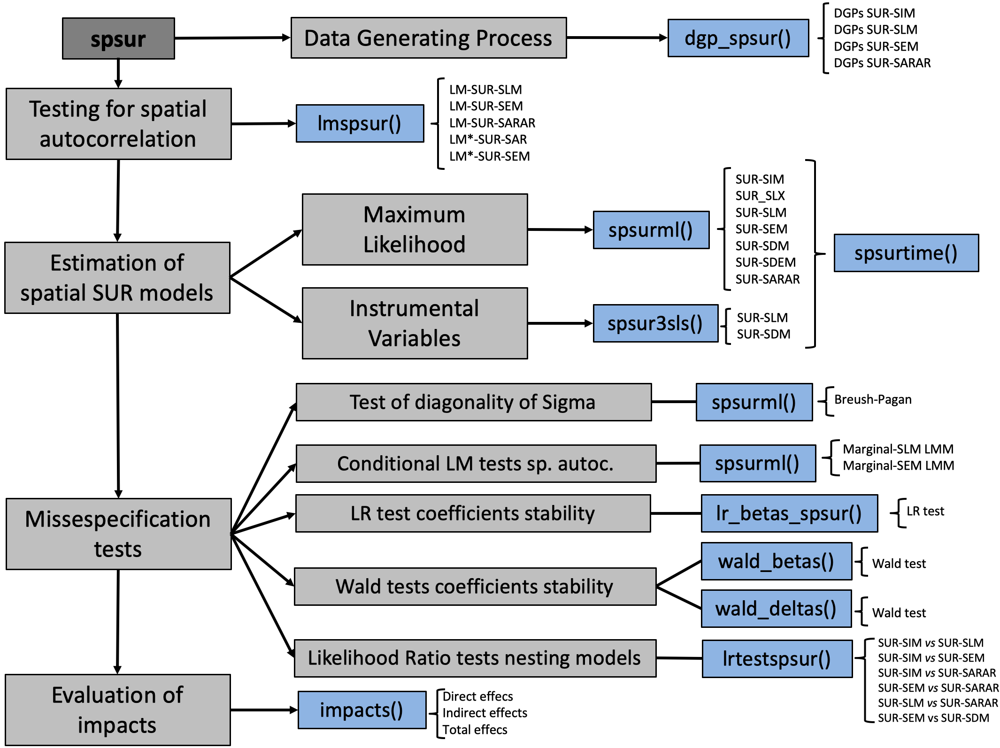

---
author:
  - name: 
date: "`r Sys.Date()`"
title: 
  formatted: "\\pkg{spsur}: an \\proglang{R} package for spatial seemingly unrelated regressions"
  plain: "spsur: an R package for spatial seemingly unrelated regressions"
  short: "spsur: an R package"
bibliography: ["bibliosure.bib"]
output: 
  bookdown::pdf_book:
    base_format: rticles::jss_article
link-citations: yes
linkcolor: red
keywords: 
  formatted: [spatial seemingly unrelated regression models, lagrange                multipliers test, maximum likelihood, instrumental                     variables, panel data]
  plain:     [spatial seemingly unrelated regression models, lagrange                multipliers test, maximum likelihood, instrumental                     variables, panel data]
abstract: >
  In recent decades, several methodological improvements have been suggested to specify, estimate and validate Seemingly Unrelated Regression (SUR) models in a spatial framework. These new procedures allow us testing for the presence of spatial dependence, and estimate spatial models using different algorithms. Furthermore, new misspecification tests, singularly in a maximum likelihood framework, have also been developed. Unfortunately, no standard, friendly software is easily avaliable. This is the deficit that the \pkg{spsur} R package pretends to fill. The new package allows for the estimation of the most popular spatial econometric models by maximum likelihood or instrumental variable procedures. Moreover, \pkg{spsur} implements a collection of Lagrange Multipliers and Likelihood Ratios to test for misspecifications in the SUR. Additional functions allow for the estimation of the so-called *spatial impacts* (direct, indirect and total impacts) and also obtains random data sets, of a SUR nature, with the features decided by the user. An important aspect of \pkg{spsur} is that it operates both in a pure cross-sectional setting or in panel data sets. We include well-known examples in the applied literature on spatial data to illustrate the main functionalities of the new \proglang{R} package. 
preamble: >
  \usepackage[utf8]{inputenc}
  \usepackage{amsmath,amsfonts,amsthm,bm,mathtools}
---


```{r setup, echo=FALSE}
knitr::opts_chunk$set(cache = TRUE,  collapse=TRUE, comment = "#>")
```


# Introduction

Seemingly unrelated regression models (SUR from now on) are a type of multivariate econometric formulation very popular since the seminal papers of @Zellner1962, @Malinvaud1970 or @Theil1971. SUR have been used in many research areas in economics and others fields [for instance, see @Fiebig2007], especially in the topics of consumption, production and environmental economics, but also on economic growth, health economics, real estate or competition between local agents. Distinct mechanisms may result in the type of dependence that lies behind SUR models such as omitted variables, unobserved effects or common factors, with a dfferent impact for each equation but uniform among the individuals. It is clear that if the errors are connected, a SUR framework assures efficiency gains by estimating the system jointly rather than processing each equation separately. These gains explain the relevant position that SUR models occupy in the applied research agenda. Spatial econometrics is, surprisingly, an exception: the applied literature is very short in spite of a quite extensive methodological research.

@Anselin1988a introduced the term *spatial SUR* in reference to a model made of *'an equation for each time period, which is estimated for a cross section of spatial units'* (p. 141). The approach of Anselin focuses on the problem of serial dependence in the errors of an equation, which is perfectly natural if the same agents intervene in every period. According to usual practice at the end of the eighties, the proposal of Anselin allows for a very limited heterogeneity. In fact, the regression coefficients are assumed to be the same across individuals, and unobserved effects are excluded. These constraints have been overcomed in the more recent works of @Mur2010 and @Anselin2016, where spatial and nonspatial parameters can take on different values in different cross-section.

Our case assumes that the model may contain *G* equations, with spatial structure. Additionally, it is assumed that the cross-sectional dimension (*N*, number of individuals) is large, and that the time dimension (*Tm*, number of periods) may increase. @Rey1999, @Egger2004, @LeGallo2006, @Fingleton2007, @Moscone2007, @LeGallo2008, @Lauridsen2010, @Kakamu2012 or @Bech2012 are well-known examples in this line. If the number of individuals is small and they are observed for a long time period (finite *N* and large *Tm*), the inference should be based on the time dimension, for example, specifying an equation for each spatial unit. @Arora1977, @Hordijk1977 and @White1982 follow the last approach.

A significant contribution is @Wang2007, who allow for greater heterogeneity among the individuals by introducing unobserved random effects. They extend the equation of the errors by including a mechanism of error components 'a la KKP', from @Kapoor2007, where the unobserved effects are intermingled with the random term of the spatial errors. This scheme is different from the proposal of @Baltagi2003, BSK, where the error is the sum of a spatial error mechanism plus an unobserved individual effect. Another point of interest in the work of Wang and Kockelman is that they built a standard SUR model, with *G* equations, *Tm* cross-sections and *N* individuals. @Baltagibresson extend the results of Wang and Kockelman by developing a collection of misspecification tests, under a maximum-likelihood, ML, framework, whereas @Baltagipirotte introduce generalized method of moments, GMM, in a spatial SUR with spatial errors, SEM,  also 'a la KKP'. Finally @Lopez2014 address the problem of selecting the best specification for spatial SUR models, using a battery of Lagrange Multipliers obtained in a ML framework. @Lundberg2006, @Zhou2009, @Cotteleer2012, @Izon2016 and @Lopez2017 present nice examples in this direction.

From the discussion above, it is clear that there is a growing interest in the case of seemingly unrelated regressions in a spatial context, although the lack of specific software has slowed its adoption in applied research. Our purpose is to introduce a new \proglang{R} package, called \pkg{spsur}, to fill this gap. The preferred framework is a large *N* and an increasing *Tm*. The core of the package lies in ML estimation because, at this time, we value exactitude and reliability over quickness. There is no need to recall that the hypothesis of normality plays a key role in this approach, which may be difficult to admit in some cases. For that reason, and also to allow for speed of calculus in large samples, the ML approach is completed with a module devoted to IV procedures.

Among the limitations, let us note that we rely explicitly on the assumptions of linearity and dynamic relations are not allowed. This version of the package can remove unobserved individual effects from the equations, which are not estimated. Finally, we require the user to specify the weighting matrix, which is assumed exogenous, known, time invariant and constant across equations.

Second Section introduces notation and reviews some basic results in the literature on spatial SUR models, using the approach of Anselin. Section 3 presents the structure and some of the main functions included in \pkg{spsur}. Section 4 focusses on misspecification tests included in \pkg{spsur}. Section 5 is devoted to the issue of spatial multipliers whereas Section 6 presents the general case of a SUR model with *G* equations, *Tm* time periods and *N* individuals. Section 7 introduces an additional functionality that allows for simulation experiments. Finally, Section 8 concludes with a brief summary and prospects for the future.

# SUR and Spatial SUR models{#SecSUR}

The SUR model consist of several equations, possibly with different regressors, where the error terms are correlated among equations. We focus on the Anselin's case with a single equation, *G*=1, several time periods, *Tm*, and *N* individuals in the cross-section; we assume that *N*>*Tm* (note that the discussion is almost similar if *Tm*=1 and *G*>1). Our baseline model, without spatial effects, is the following:
\begin{equation}
{{\bf y}_t}={{\bf X}_t} {\boldsymbol{\beta} }_t+{\boldsymbol{\varepsilon}}_t\ ; \ \ \ \ \ \
E[{\boldsymbol \varepsilon}_t]=0\ ;\ \ \ \ \ E[{\boldsymbol \varepsilon}_t {\boldsymbol \varepsilon'}_s]= \sigma_{ts} {\bf I}_N  \ \ \ \ \ \ t,s=1,...,Tm
 (\#eq:baseline)
\end{equation}
where \({\bf y_t}\), \({\bf u}_t\) and \({\boldsymbol \varepsilon}_t\) are *N*$\times$*1* vectors, \({\bf X}_t\) is a *N*$\times p_t$ matrix, with $p_t$ the number of regressors that appear in the t-th equation and \(\boldsymbol{\beta}_t\) the \((p_t \times 1)\) vector of coefficients. We call this model as SUR-SIM, from spatially independent model following the terminology in @Lopez2014.

The singular aspect of \@ref(eq:baseline) is that the SUR structure appears because there is intra-individual serial dependence; inter-individual serial dependence is excluded. The serial dependence in the errors is not parameterized, but estimated in the (*Tm*$\times$*Tm*) sampling covariance matrix, \(\boldsymbol \Sigma\)=\((\sigma_{ts})\).

The equation of \@ref(eq:baseline) may be enough in some circumstances but not in a spatial setting where a potential problem, often present in applied research, is the existence of spatial dependence. The spatial mechanisms may have different forms [@Elhorst2014]. A general SUR model that include most of the possible spatial effects of interest is:

\begin{equation}
{\bf y}_t=\lambda_t {\bf W}_t^y {\bf y}_t+ {\bf X}_t {\boldsymbol \beta}_t+ {\bf W}_t^x {\bf X}_t^* {\boldsymbol \gamma}_t + {\bf u}_t;\ {\bf u}_t=\rho_t {\bf W}_t^u {\bf u}_t +{\boldsymbol \varepsilon}_t\ ; \ \  E[{\boldsymbol \varepsilon}_t]=0\ ;\ \ E[{{\boldsymbol \varepsilon}_t} {{\boldsymbol \varepsilon'}_s}]=\sigma_{ts}{\bf I}_N
 (\#eq:GNM)
\end{equation}

where \({\bf X}_t^*\) is the matrix of regressors excluded the intercept term; \({\bf W}_t^y\), \({\bf W}_t^x\), \({\bf W}_t^u\) are (*N*$\times$*N*) weighting matrices. The model in \@ref(eq:GNM) is often referred to as a General Nesting Model, SUR-GNM. Several constrained specifications emerge from this equation, such as:

1. The SUR-SIM, spatially independent model, \(\lambda_t = \rho_t = \gamma_t = 0, (\forall t)\).
2. The SUR-SLX, spatial lags in Xs model, where \(\lambda_t = \rho_t = 0, (\forall t)\).
3. The SUR-SLM, spatial lag model, where \(\rho_t=\gamma_t = 0, (\forall t)\).
4. The SUR-SEM, spatial error model, where \(\lambda_t=\gamma_t = 0, (\forall t)\).
5. The SUR-SDM, spatial Durbin model, where \(\rho_t = 0, (\forall t)\).
6. The SUR-SDEM, spatial Durbin error model, where \(\lambda_t= 0, (\forall t)\).
7. The SUR-SARAR, spatial lag model with autoregresive errors, where \(\gamma_t = 0, (\forall t)\).

In the applied literature, it is usual to assume that the weighting matrices are the same ${\bf W}_t^x$ = ${\bf W}_t^u$ = ${\bf W}_t^{\varepsilon}$ = ${\bf W}$. The user should supply this matrix, based on apriori knowledge, which, in any case, must conform to he requisites described in @Kelejian2004: the terms on the main diagonal are zero and the row and column sums of \(\textbf W\) are uniformly bounded in absolute value, the same as \(\textbf A_{t}^{-1} =\mathop{\left({\bf I}_N -\lambda _{t} {\bf W}\right)}\nolimits^{-1}\) and \(\textbf B_{t}^{-1} =\mathop{\left({\bf I}_N -\rho _{t} {\bf W}\right)}\nolimits^{-1}\) which must exist.

The model of \@ref(eq:GNM), for the case of *G*=1, can be expressed using obvious matrix notation:

\begin{equation}
\begin{array}{ll}
\ \ \ \ \ \ \ \ \ \ \ \ \ \ \ \ \ {\bf Ay}={\bf X}{\boldsymbol \beta} + ({\bf I}_{Tm} \otimes {\bf W}){\bf X^*} {\boldsymbol \gamma} +{\bf u}; \ \ {\bf Bu}={\boldsymbol \varepsilon}; \ \ {\boldsymbol \varepsilon} \sim N(0,{\boldsymbol \Omega} )
\\
\\
{{\bf y}=\mathop{\left[\begin{array}{c} {\mathop{\bf y}\nolimits_{1}  } \\ {\mathop{\bf y}\nolimits_{2} } \\ {\cdots } \\ {\mathop{\bf y}\nolimits_{Tm} } \end{array}\right]}\limits_{TmN\times1} ;
{\bf X} =\mathop{\left[\begin{array}{cccc} {\mathop{\bf X}\nolimits_{1} } & {0} & {\cdots } & {0} \\ {0} & {\mathop{\bf X}\nolimits_{2} } & {\cdots } & {0} \\ {\cdots } & {\cdots } & {\cdots } & {\cdots } \\ {0} & {0} & {\cdots } & {\mathop{\bf X}\nolimits_{Tm} } \end{array}\right]}\limits_{TmN\times p} ;\, \, {\boldsymbol \beta} =\mathop{\left[\begin{array}{c} {\mathop{{\boldsymbol \beta}}\nolimits_{1} } \\ {\mathop{{\boldsymbol \beta}}\nolimits_{2} } \\ {\cdots } \\ {\mathop{{\boldsymbol \beta}}\nolimits_{Tm} } \end{array}\right]}\limits_{p\times 1} ;{\bf u}=\mathop{\left[\begin{array}{c} {\mathop{{\bf u}}\nolimits_{1} } \\ {\mathop{{\bf u}}\nolimits_{2} } \\ {\cdots } \\ {\mathop{{\bf u}}\nolimits_{Tm} } \end{array}\right]}\limits_{TmN\times1} ;\, \, {\boldsymbol \varepsilon} =\mathop{\left[\begin{array}{c} {\mathop{{\boldsymbol \varepsilon}}\nolimits_{1} } \\ {\mathop{{\boldsymbol \varepsilon}}\nolimits_{2} } \\ {\cdots } \\ {\mathop{{\boldsymbol \varepsilon}}\nolimits_{Tm} } \end{array}\right]}\limits_{TmN\times1} }
\end{array}
 (\#eq:pool)
\end{equation}

where \(p=\sum p_t\), \({\bf A}={\bf I}_{TmN}-{\boldsymbol \Lambda} \otimes {\bf W}\) with \({\boldsymbol \Lambda}=diag(\lambda_1,\dots,\lambda_{Tm})\); \({\bf B}={\bf I}_{TmN}- {\boldsymbol \Gamma} \otimes {\bf W}\) with \({\boldsymbol \Gamma}=diag(\rho_1,\dots,\rho_{Tm})\) and \({\boldsymbol \Omega}={\boldsymbol \Sigma} \otimes {\bf I}_{TmN}\), being \(\otimes\) the Kronecker product. Moreover, \({\bf X}^*\) is a *NTm* $\times$ *(p-Tm)* that omits the columns of the intercepts because these terms cannot be spatially lagged. Assuming that the errors are normally distributed, the log-likelihood function of \@ref(eq:GNM) can be written as:

\begin{multline}
l({\bf y};{\boldsymbol \eta})=-\frac{NTm}{2} \ln (2\pi)-\frac{N}{2} \ln |{\bf \Sigma}|+Tm\sum _{t=1}^{Tm}\ln|{\bf B}_t| +Tm\sum _{t=1}^{Tm}\ln|{\bf A}_t| \\
-\frac{\left({\bf Ay}-{\bf \bar{X}}[{\boldsymbol \beta} \ {\boldsymbol \gamma}]' \right)'{\bf B}'\mathop{{\bf \Omega}}\nolimits^{-1} {\bf B}\left({\bf Ay}-{\bf  \bar{X}}[{\boldsymbol \beta} \ {\boldsymbol \gamma}]' \right)}{2}
 (\#eq:Lik)
\end{multline}

where \(\bar{\textbf X}=[\textbf X,\bf W {\bf X}^*]\) is a *NTm* $\times$ (*2p-Tm*).

The vector of parameters is \({\boldsymbol \eta}'=\left[{\boldsymbol \beta}';{\boldsymbol \gamma}';\lambda_{1}; \dots ;\lambda_{Tm};\rho_{1};\dots ;\rho_{Tm} ;\mathop{\sigma }\nolimits_{ij} \right]\), where there are *P= (2p-Tm)+Tm+Tm(Tm+1)/2* unknown coefficients @Wang2007 and @Lopez2014 use numerical optimization techniques to solve the maximum likelihood estimates. Note that the presence of the log of the Jacobian terms, \(\ln|{\bf B}_t|\) and \(\ln|{\bf A}_t|\), forces the spatial parameters, \(\lambda_t\) and \(\rho_t\), to lie inside the so-called *stability interval* (if the weighting matrix is row-standardized, a rough approximation is -1,+1). Under the assumption that the spatial SUR model is correctly specified (including normality), the ML estimators are consistent, efficient and asymptotically normally distributed [@Davidson1993].

## Testing for spatial effects {#testing}

The estimation of spatial SUR models can be complex for strong spatial dependence mechanisms, so it is advisable to avoid needless efforts. This is the purpose of the Lagrange Multipliers presented below. As usual in the spatial econometrics literature, our starting point is the SUR-SARAR model.

The first Multiplier is a global test for the presence of spatial effects in the SUR:

\begin{equation}
H_0 :\lambda_t =\rho_t =0 \ \ (\forall t)  \ \ \ \ vs  \ \  \ \ H_A: No  \ \ H_0
(\#eq:HpLMSARAR)
\end{equation}

obtained as:

\begin{equation}
\mathop{{\rm LM}}\nolimits_{{\rm SARAR}}^{{\rm SUR}} =
{\mathop{{\bf g}'}\nolimits_{({\boldsymbol\eta})_{\left|\mathop{H}\nolimits_{0} \right. }}}
\left[\mathop{{\bf I}}\nolimits_{({\boldsymbol\eta})_{\left|\mathop{H}\nolimits_{0} \right. }} \right]^{-1}
{\mathop{{\bf g}}\nolimits_{({\boldsymbol\eta})_{\left|\mathop{H}\nolimits_{0} \right. }}}
\mathop{\sim }\limits_{as} \mathop{\chi }\nolimits^{2} (2Tm)
(\#eq:LMSARAR)
\end{equation}


where \(\mathop{{\bf g}}\nolimits_{({\boldsymbol\eta})_{\left|\mathop{H}\nolimits_{0} \right. }}\)  is the score vector of order (*P*x*1*), evaluated under the null hypothesis. \(\mathop{\bf I}\nolimits_{({\boldsymbol \eta} )_{\left|\mathop{H}\nolimits_{0} \right. }}\) is the (*P*x*P*) information matrix of the SUR-SARAR model also under the null of \@ref(eq:HpLMSARAR); more details in @Mur2010.

If we change the model of the alternative, from the SUR-SARAR to the SUR-SLM, we can test for the significance of the spatial lags:

\begin{equation}
H_0 :\lambda_t =0 \ \ (\forall t)  \ \ \ \ vs  \ \  \ \ H_A: No  \ \ H_0
(\#eq:HpLMSLM)
\end{equation}

The model of the null hypothesis continues to be the SUR-SIM, and it is implicitly assumed that the \(\rho\) parameters are zero. The discussion is entirely similar to the test of \@ref(eq:LMSARAR) in the SARAR case, just changing this model by the SLM. The corresponding Lagrange Multiplier is called \({\rm LM}_{\rm SLM}^{\rm SUR}\).


Similarly, a SEM model can be placed in the alternative, assuming that the \(\lambda\) parameters are zero. We can test for the presence of spatial structure in the errors:

\begin{equation}
H_0 :\rho_t =0 \ \ (\forall t)  \ \ \ \ vs  \ \  \ \ H_A: No  \ \ H_0
(\#eq:HpLMSEM)
\end{equation}

The Lagrange Multiplier associated to the hypothesis of \@ref(eq:HpLMSEM) is called \({\rm LM}_{\rm SEM}^{\rm SUR}\).

@Bera1993 show that the last two *raw* Multipliers, \({\rm LM}_{\rm SLM}^{\rm SUR}\) and \({\rm LM}_{\rm SEM}^{\rm SUR}\), are oversized in case of misspecification of the alternative hypothesis. This lack of robustness complicates the identification of the correct specification. Let us note that this problem is not specific of a spatial setting but extends to other cases where there are groups of parameters whose scores are not orthogonal. The solution, as suggested in @Anselin1996, is to *robustify* the *raw* Multipliers to obtain the so-called robust Lagrange Multipliers, denoted as \({\rm LM}_{\rm SLM}^{\rm *SUR}\) and \({\rm LM}_{\rm SEM}^{\rm *SUR}\) respectively. The size of the robust Multipliers is more balanced at the cost of a small decrease in power; in any case, they are very popular among practitioners in spatial data analysis.


## The IV estimation for spatial SUR models {#the-iv-estimation-method-for-spatial-sur}

The ML approach offers an adequate framework for solving the inference of spatial SUR models. However, as the size of the cross-section, *N*, increases they become highly demanding in terms of computational effort due to the presence of the Jacobian matrices in the likelihoods. Under some circumstances, it may be reasonable to use other algorithms, such as Instrumental Variables, IV.

 @Durbin1954 and @Sargan1958 introduced the IV approach as a method to deal with problems of endogeneity. This is the typical situation in a spatial model that includes lags of the explained variable among the regressors. For example, in the SUR-SLM case is inmediate to conclude that \(E\left[\bar{{\bf y}}' {\bf u}\right]=tr\left[{\boldsymbol \Delta}^{'-1} \left({\bf I}_{TmN} \otimes \textbf{W}' \right)  {\boldsymbol \Omega} \right] \neq 0\), being \({\boldsymbol \Delta}={\bf I}_{Tm} \otimes {\boldsymbol \Lambda} \otimes {\bf W}\) and  \(\bar{{\bf y}}\) the spatial lag of the explained variable, \(\bar{{\bf y}} = \left[{\bf I}_{Tm} \otimes {\bf W} \right] {\bf y}\). @Kelejian1998 and @Kelejian1999 adapt the IV procedure to a spatial setting, advocating for the use of the so-called *spatial instrumental variables*, which is the approach implemented in \pkg{spsur}.

As known, a good instrument, say \({\bf Z}\), should combine two properties:

* the instrument must be orthogonal with the error term, 
$E\left[{\bf Z}^{'} {\bf u}\right]=0$
* the instrument should be highly correlated with the endogenous regressor 
$E\left[{\bf Z}^{'} \bar{{\bf y}} \right] \neq 0$

Kelejian and Prucha show that if the \({\bf X}\) variables are really exogenous, the spatial lags of these variables are good candidates to become IV for the spatial lag of the explained variable. However, our problem is not standard because we are working in a multivariate SUR framework, which lead us to a Three-Stage Least-Squares approach using spatial instrumental variables. The procedure is as follows:

1. List the instruments in matrix $\bf H$. By default, \pkg{spsur} sets \({\bf H}=[{\bf X},\left( {\bf I}_{Tm} \otimes  {\bf W}\right){\bf X}^*], \left( {\bf I}_{Tm} \otimes {\bf W}^{2} \right){\bf X}^*]\) for the SUR-SLM and \({\bf H}=\left[{\bf X},\left( {\bf I}_{Tm} \otimes {\bf W}\right){\bf X}^*,\left( {\bf I}_{Tm} \otimes {\bf W}^{2} \right){\bf X}^*, \left( {\bf I}_{Tm} \otimes {\bf W}^{3} \right){\bf X}^*\right]\) for the SUR-SDM. This means that, in the SLM, $\bf X$ variables instrument themselves,  $\bf WX^*$ and $\bf W^2X^*$  serves as instrument for $\bf Wy$; in the SDM case, $\bf X$ and $\bf WX^*$ instrument themselves and $\bf W^2X^*$, $\bf W^3X^*$  instrument $\bf Wy$.

2. Solve a Least-Squares, LS, regresion of the explained variable on the list of instruments to obtain an approximation to the *optimal instruments*, \(\hat{{\bf y}} = {\bf H}\left( {\bf H'H} \right)^{-1} {\bf H'} {{\bf y}}\)

3. Substitute the spatial lag of the explained variable, \({\bf Wy}\), for its estimates \({\bf W\hat{y}}\) in the corresponding SUR equation. In this moment, the endogeneity problem has been corrected.

4. The errors of the SUR model are not standard because they are correlated among the *Tm* equations. However, LS produces unbiased and consistent estimates of the \(\beta\), \(\theta\) and \(\lambda\) parameters. Accordingly, the second stage is to solve a LS regression with this group of variables.

5. Using the LS residuals of the previous step, we obtain a consistent estimate of the covariance matrix of the SUR equations, \({\bf \hat{\Sigma}}_{g,h} = \frac{ \sum\limits_{t=1}^{Tm} \hat{{\bf u}'}_{tg}\hat{{\bf u}}_{th}} {Tm}\), being \(\hat{{\bf u}}_{tg}\) the \((N \times 1)\) vector of LS residuals of the g-th equation in time period t (from now on we will use two subscrits for time and equation, respectively). This estimate is consistent with *Tm*.

6. The last step is a Feasible Generalized Least-Squares estimate of the \(\beta\), \(\theta\) and \(\lambda\) parameters with the aim of improving their efficiency; that is:

\begin{equation}
  \hat{{\boldsymbol \eta}}_{3sls}^{*}=\left[{\bf \hat{X}}'\left({\bf \hat{\Sigma}}^{-1} \otimes\ {\bf I}_{TmN} \right) {\bf \hat{X}}\right]^{-1} \left[{\bf \hat{X}}'\left({\bf \hat{\Sigma}}^{-1} \otimes\ {\bf I}_{TmN}\right) {\bf y} \right]
(\#eq:3sls)
\end{equation}

being \({\boldsymbol \eta}^{*}=\left[{\boldsymbol \beta}; {\boldsymbol \theta}; {\boldsymbol \lambda}\right]'\) and \(\bf \hat{X}\) the corresponding matrix of regressors of the third step described above.

In sum, the \code{spsur3sls()} function consists in a Three-Stages Least-Squares, 3SLS, algorithm based on spatial instrumental variables. This estimation procedure is almost linear, which expedites the computational effort. On the negative side, let us note that the estimation of the \(\lambda\) parameters is not restricted by the Jacobian term, which allows for estimates of \(\lambda\) outside the *stability interval*: \(\dfrac{1}{\lambda_{t}^{-}} < \lambda_{t} < \dfrac{1}{\lambda_{t}^{+}}\), being \({\lambda_{t}^{-}}\) and \({\lambda_{t}^{+}}\) the greatest negative and positive eigenvalues, respectively, of the weighting matrix. Moreover, the parameters associated with the spatial errors, \(\rho\)s, cannot be estimated using this algorithm.

## Software review {#software-review}

The aim of \pkg{spsur} is to stimulate the use of spatial SUR models in applied research, by offering a friendly software easily accessible. As  said, at present the user has very limited options, which has slowed the spreading of spatial SUR models.

In the field of quantitative analysis for spatial data, we can cite several \proglang{R} specialized packages. Probably, the most popular are \pkg{spdep} [@spdep] and \pkg{spml} [@spml]. The \pkg{spdep} is an \proglang{R} package with high functionalities for econometric analysis of cross-sectional data whereas \pkg{spml} is more focused in the case of spatial panels. On the other hand, the \proglang{R} package \pkg{systemfit} [@systemfit] is devoted to SUR models, but do not incorporate spatial effects. That is, none of the three packages have specific utilities to solve inference of spatial SUR models.

Indeed, to our knowledge, the closest antecedent of \pkg{spsur} is the beta version of \pkg{Spacestat} [@AnselinSpaceStat], called \pkg{SpaceStat v.May91}, which had limited functionalities and required \proglang{Windows 98} (see [video YouTube](https://www.youtube.com/watch?v=6pM0tDWqt3o\&t=53s)). Of course, nowadays it would be very difficult doing applied research using \pkg{SpaceStat v.May91}.

There is a second alternative in \proglang{Python}; it is the library \pkg{pysal} [@Rey2007]. The module \code{spreg.sur} provides SUR estimation of models with no spatial effects; the output includes several diagnostic measures among which appear the *raw* Lagrange Multpliers. Moreover, the codes \code{spreg.sur_error} and \code{spreg.sur_lag} provides the estimation of spatial SUR models with spatial errors and with spatial lags of the explained variable, respectively. The SUR-SEM model is estimated by ML whereas the SUR-SLM is estimated using spatial instrumental variables throug 3SLS. Finally, there is some code in MATLAB, related to the work of [@Lopez2014], but the source is not free software and the codes are not fully integrated.

# Introducing the spsur package {#intro-spsur}

\pkg{spsur} is an open-source software for the \proglang{R} computing platform [@R2018]. \pkg{spsur} depends on the packages \pkg{Formula}, \pkg{MASS}, \pkg{Matrix}, \pkg{methods}, \pkg{numDeriv}, \pkg{minqa}, \pkg{sparseMVN}, \pkg{spdep} and \pkg{stats}. The package can be freely dowloaded from CRAN and a development version is available in the link [Github-spsur](https://www.github.com/rominsal/spSUR).
The users will find a complete helping documentation and a vignette to guide them through the functionalities of the package.

\pkg{spsur} is made of 10 different functions which allow for a thoroughful analysis of a spatial SUR specification. Figure 1 shows the main functionalities of the package. \pkg{spsur} includes one function to evaluate the Lagrange Multipliers for the presence of spatial correlation in a SUR-SIM model (\code{lmtestspsur()}); two functions to estimate spatial SUR models, by maximum likelihood (\code{spsurml()}) or using instrumental variables (\code{spsur3sls()}) for the general case of *G*>1 (including both *Tm*=1 and *Tm*>1), and a third one designed to deal with pure spatial panels (\code{spsurtime()}) for *G*=1 and *Tm*>1; four additional functions allow to improve the specification (\code{lrtestspsur()}; \code{wald_betas()}, \code{wald_deltas()} and \code{lr_betas_spsur()}); another function obtains the spatial impacts of the regressors (\code{impacts()}). Finally \code{dgp_spsur()} allows the user to solve Monte Carlo experiments using spatial SUR models.

```{r Figure1, echo=FALSE, out.width = "75%", fig.pos = 'h',fig.cap="\\label{Fig1} Main functionatities of spsur package"}

```

## Datasets and baseline models {#Datasets-and-baseline-models}

Two main data sets have been included in the package with the aim of showing the functionalities of \pkg{spsur},
namely, \code{spc} and \code{NCOVR}. Each data set consists of the corresponding data frame plus a weighting matrix that must be row-standardized; if the matrix is not row-standardized, then \pkg{spsur} does it.

*Example 1:* The first dataset, \code{spc}, constitutes a classical example taken from @Anselin1988a p. 203-211, for 25 counties in South-West Ohio and two time periods, 1981 and 1983; the associated weighting matrix is \code{Wspc}. This is a Phillips-Curve problem where the explained variable measures the changes in wage rates (WAGE), whereas the regressors are unemployment rate (UN), net-migration rate (NMR) and a dummy variable (SMSA) with a value of 1 for metropolitan counties.

The SUR model estimated by Anselin is:
\begin{equation}
\begin{array}{ll}
WAGE_{83} = \beta_{10} + \beta_{11} \ UN_{83} + \beta_{12} \  NMR_{83} + \beta_{13} \ SMSA + \varepsilon_{83} \\
WAGE_{81} = \beta_{20} + \beta_{21} \ UN_{80} + \beta_{22} \ NMR_{80} + \beta_{23} \ SMSA+ \varepsilon_{81}
\end{array}
(\#eq:Anselin0)
\end{equation}

The package is installed from the CRAN repository and the data set loaded as usual,

```{r install}
# install.packages("spsur")
```
```{r cargadatos}
library(spsur)
data("spc", package = "spsur")
```

We use the \pkg{Formula} package [@Formula to especify the multiequational SUR model of \@ref(eq:Anselin0):

```{r spcformula}
spcformula <- WAGE83 | WAGE81 ~ UN83 + NMR83 + SMSA | UN80 + NMR80 + SMSA
```

Note that in the left side of the formula, two dependent variables have been included separated by the symbol |. In the right side appear the independent variables for each equation, separated again by a vertical bar |, and keeping the same order that in the left side.

*Example 2:* The second data set (\code{NCOVR}) comes from GeoDa Data and Lab collection and refers to homicide rates for 3,085 continental U.S. counties for four time periods (1960, 1970, 1980 and 1990), whose full description can be found in [GeoDa](https://geodacenter.github.io/data-and-lab/ncovr/). This data set includes a high number of socio-economic characteristics of the counties. The matrix $\textbf W$ is included in \pkg{spsur}. This data set has been used by @Baller2001 and collected via a non-gridded sampling design. 

To illustrate the functionalities of \pkg{spsur}, we build a SUR model with three equations and different number of regressors in each equation:
\begin{equation}
\begin{array}{lll}
HR_{80} = \beta_{10} + \beta_{11} \ PS_{80} + \beta_{12} \ UE_{80} + \varepsilon_{HR} \\
DV_{80} = \beta_{20} + \beta_{21} \ PS_{80} + \beta_{22} \ UE_{80} + \beta_{23} \  SOUTH + \varepsilon_{DV} \\
FP_{79} = \beta_{30} + \beta_{31} \ PS_{80}+ \varepsilon_{FP}
\end{array}
(\#eq:NCOVR)
\end{equation}
\(HR_{80}\) is homicide rates per 100,000 in 1980, \(PS_{80}\) measures the population structure in 1980, \(UE_{80}\) the unemployment rate, \(DV_{80}\) is the divorce rate, \(FP_{79}\) is the percentage of families below poverty in 1980 whereas SOUTH is a dummy variable for Southern counties. Note that the model of \@ref(eq:NCOVR) has three equations but only one cross-section. To input this model into \proglang{R} we should write:

```{r NCOVRformula}
data(NCOVR, package = "spsur")
NCOVRformula <- HR80 | DV80 | FP79 ~ PS80 + UE80 | PS80 + UE80 + SOUTH | PS80
```
### The LM tests in spsur package {#lmtests}

The function \code{lmtestspur()} computes 5 Lagrange Multipliers, LM, for omitted spatial dependence in a SUR-SIM model. The syntax of this function is:

\code{lmtestspsur(Form = NULL, data = NULL, W = NULL, X = NULL,Y = NULL, time = NULL, G = NULL, N = NULL, Tm = NULL, print_table = TRUE)}

Note that, as the examples below show, most of the argument with \code{NULL} default can be omitted from the syntaxis, if they are not needed, so that the final expressions simplify to a great deal. The simplest way to obtain the LMs is through a formula, \code{Form}, previously defined by the user, a data frame, \code{data}, and a weighting matrix, \code{W}, such as:
```{r LMspc}
LMs.spc <- lmtestspsur(Form = spcformula, data = spc, W = Wspc)
```
```{r, echo=FALSE}
rm(LMs.spc)
```

\code{spc} contains information for only 25 spatial units and, therefore, the power of the LM tests is very low. Similarly, for the homicide rates case of \@ref(eq:NCOVR), we obtain:
```{r LMNCOVR}
LMs.NCOVR <- lmtestspsur(Form = NCOVRformula, data = NCOVR, W = W)
```
```{r,echo=FALSE}
rm(LMs.NCOVR)
```

There is a second way to compute the LMs, based on matrices instead of formulas. In first place, it is necessary to create the requiered matrices; for example, according to model \@ref(eq:NCOVR) we should write:
```{r}
Y <- as.matrix(c(NCOVR$HR80,NCOVR$DV80,NCOVR$FP79))
Intercep <- matrix(1,ncol = 1,nrow = 3085)
X1 <- cbind(Intercep,NCOVR$PS80,NCOVR$UE80)
X2 <- cbind(Intercep,NCOVR$PS80,NCOVR$UE80,NCOVR$SOUTH)
X3 <- cbind(Intercep,NCOVR$PS80)
X <- as.matrix(Matrix::bdiag(X1,X2,X3))
```
```{r,echo=FALSE}
rm(X1,X2,X3)
```

The last matrix, \(\bf X\) it is block-diagonal. Then, the user introduces these matrices as arguments in \code{lmtestspsur()}. The number of individuals (*N*), equations (*G*) and time periods (*Tm*) must also be specified,
```{r LMNCOVR2, results="hide"}
LMs.NCOVR.matrix <- lmtestspsur(Y = Y, X = X, G = 3, Tm = 1, N = 3085, W = W)
```
```{r,echo=FALSE}
rm(LMs.NCOVR.matrix) 
```
In the example above, all the LMs reject their respective null hypotheses, which clearly discards the SUR-SIM model.

### Maximum Likelihood estimation of spatial SUR models {#ml}

If the LM tests reject their associated null hypothesis, a spatial SUR model must be estimate. The function \code{spsurml()} obtains the ML estimation of the different models listed in Section \@ref(SecSUR). The syntax of this fuction is:

\code{spsurml(Form = NULL, data = NULL, R = NULL, r = NULL, W = NULL, X = NULL, Y = NULL, G = NULL, N = NULL, Tm = NULL, p = NULL, demean = FALSE, type = "sim", cov = TRUE, control = list(tol = 0.001, maxit = 200, trace = TRUE))}

Similarly, most of the argument with \code{NULL} default can be omitted from the syntaxis, if they are not needed. Once again, the simplest way to estimate a spatial SUR is by using a formula, a data frame and a weighting matrix, which are the arguments that appear in \code{Form}, \code{data} and \code{W}. The second way implies the use of matrices, similar as before.

To estimate a SUR-SLM model with the data set of Example 1, the syntax is:
```{r spcsurslm}
spcsur.slm <- spsurml(Form = spcformula, data = spc, type = 'slm', W = Wspc)
```
The output of \code{spsurml()} includes details about the iteration process and time of computation. Let us also note that the user can configure the optimization process using the \code{control} list, as an additional argument to the function. In this way, the tolerance of the convergence process can be set to \code{tol}; the same as the number of maximum iterations, \code{maxit}, whereas \code{trace} allows the user hide intermediate results.

Consistent with the conventions in the \proglang{R} environment, the \code{summary()} method prints the output equation by equation.
```{r}
summary(spcsur.slm)
```
The summary includes basic information for each equation such as estimated coefficients, standard deviations, etc. Moreover, in a SUR context, the matrices  of covariances and of correlations of the residuals among the *Tm* equations are of special interest for the user. The summary also reports the value of maximum log likelihood of the model, some measures of goodness of fit, the Breusch-Pagan test of diagonality,  [@BP1980] and the corresponding marginal LM tests, for omitted spatial errors in SLM or SDM models or omitted lags of the explained variable in SEM or SDEM models (more details in Section \@ref(marginal) below). The marginal multipliers are printed in the output simply as \(LMM\).

The syntax for other spatial specifications is very similar, just changing the argument \code{type}. For example:
```{r todos, eval = FALSE}
spcSUR.sim <- spsurml(Form = spcformula, data = spc, type = 'sim', W = Wspc)
spcSUR.slx <- spsurml(Form = spcformula, data = spc, type = 'slx', W = Wspc)
spcSUR.sem <- spsurml(Form = spcformula, data = spc, type = 'sem', W = Wspc)
spcSUR.sarar <- spsurml(Form = spcformula, data = spc, type = 'sarar', W = Wspc)
spcSUR.sdm <- spsurml(Form = spcformula, data = spc, type = 'sdm', W = Wspc)
spcSUR.sdem <- spsurml(Form = spcformula, data = spc, type = 'sdem', W = Wspc)
```
For reasons of space, we skip the output for these other models, and continue using the SUR-SLM case.

As said before, the control options can be used to customize the iteration process. In the case below, the convergence process will stop if the difference in the estimated likelihood between two consecutive iterations is smaller than \code{tol=0.1} or the number of iterations reaches the value \code{maxit=20}. The  controls also advises to hidden the intermediate results, with the argument \code{trace}.
```{r, results='hide'}
mlcontrol <- list(tol = 0.1, maxit = 20, trace = FALSE)
NCOVRSUR.slm <- spsurml(Form = NCOVRformula, data = NCOVR,
                      type = 'slm', W = W, control = mlcontrol, cov = FALSE)
```
```{r, echo=FALSE}
rm(NCOVRSUR.slm,mlcontrol)
```

The second way to estimate a SUR-SLM model uses arguments based on matrices such as, for example:
```{r, results='hide', collapse=TRUE, cache = TRUE}
mlcontrol <- list(tol = 0.1, maxit = 20, trace = FALSE)
NCOVRSUR.slm.matrix <- spsurml(Y = Y, X = X, G = 3, Tm = 1, N = 3085,
                             W = W, type = 'slm', control = mlcontrol, 
                             cov = FALSE)
```
```{r, echo=FALSE}
rm(NCOVRSUR.slm.matrix,mlcontrol,X,Y)
```
The output of the funtion \code{spsurml()} is an object of an \code{spsur} class.

### 3SLS estimation {#threesls}

The function \code{spsur3sls()} estimates spatial SUR models by spatial IVs in a 3SLS framework. The syntax of this fuction is very similar to \code{spsurml()}.

\code{spsur3sls(Form = NULL, data = NULL, R = NULL, b = NULL, W = NULL,X = NULL, Y = NULL, G = NULL, N = NULL, Tm = NULL, p = NULL, demean = FALSE, type = "slm", maxlagW = 2)}

The main differences between the two are: (i) the argument \code{type} now only supports two spatial SUR models: \code{slm} and \code{sdm} and (ii) a new argument is needed, \code{maxlagW}, to set the maximum order of spatial lags of the regressors to obtain the IVs. The default value is \code{maxlagW=2} for SUR-SLM models and \code{maxlagW=3} for the SDM variant.

The 3SLS algorithm is especially adequate in cases of large datasets or when \code{spsur3sls()} has to deal with very dense Jacobians. Our *Example 2* includes 3,085 US counties and it is a good candidate for \code{spsur3sls()}. The code to estimate a SUR-SLM model for the SUR of \@ref(eq:NCOVR) is,
```{r slm3sls}
NCOVRSUR.slm.3sls <-spsur3sls(Form = NCOVRformula, data = NCOVR, type = "slm", W = W)
summary(NCOVRSUR.slm.3sls)
```
```{r, echo = FALSE}
rm(NCOVRSUR.slm.3sls)
```
A great advantage of \code{spsur3sls()} is the serious reduction of computing time, compared with ML methods. In the case of \code{NCOVR}, with 3,085 observations and 3 equations, the estimation took less than a second. The ML estimation, using the function \code{spsurml()} for the same problem, required of almost 10 minutes (using a Intel Core i7 2.93 GHz).

Like in the case of \code{spsurml()}, the output of the funtion \code{spsur3sls()} is an object of the \code{spsur} class.

## Spatial panel SUR models {#panel}

It is not unusual, in applied work, to have data for only one equation, $G$=1, such as in @Anselin1988a. We refer to this case as an *Spatial panel SUR* with, for example, a SLM structure: 
 \begin{equation}
  {\begin{array}{ll}  {\mathop{{\bf y}}}_{t} = \mathop{\lambda}_{t} {\bf W} \mathop{{\bf y}}_{t} +\mathop{{\bf x}}_{t} {\boldsymbol \beta}_{t} +\mathop{{\boldsymbol \varepsilon}}_{t}; {t=1,2,\ldots ,Tm}
 \\ {} \\
  {E\left[\mathop{{\boldsymbol \varepsilon}}_{t} \right]=0} \ \ {E\left[\mathop{{\boldsymbol \varepsilon}}_{\mathop{t}} \mathop{{\boldsymbol \varepsilon'}}_{\mathop{s}} \right]=\mathop{\sigma}_{t,s} {\bf I}_{N}}
  \end{array}}
  (\#eq:Anselin1)
 \end{equation}

Now \({\bf y}_t\) and \({\boldsymbol \varepsilon}_t\) are (*N*$\times$*1*) vectors and \(\textbf{x}_{t}\) in a \((N \times p_{t})\) matrix where \(p_{t}\) is the number of regressors in the t-th cross-section. The spatial parameters, \(\lambda\)s, as well as the \(\beta\)s are allowed to change from cross-section to cross-section. The SUR structure appears because there is serial dependence in the error terms of each individual in the sample; serial dependence among differente individuals is not allowed. The serial dependence is estimated in the (*Tm*$\times$*Tm*) \({\bf \Sigma}\) covariance matrix by the function \code{spsurtime()}. An important constraint to mention is that the serial dependence is assumed to be uniform for all individuals in the sample.

The syntax of \code{spsurtime()} combines arguments of \code{spsurml()} and \code{spsur3sls()} and it is quite transparent:

\code{spsurtime(Form, data, time, type = "sim", method = "ml", maxlagW = 2,  W = NULL, cov = TRUE, demean = FALSE, trace = TRUE, R = NULL, b = NULL)}

The spatial models supported by \code{spsurtime()} are the seven specifications listed in Section \@ref(SecSUR), SUR-SIM, SUR-SLX, SUR-SLM, SUR-SEM, SUR-SDM, SUR-SDEM and SUR-SARAR. Moreover, the user can decide if the estimation algorithm is ML, which is the default, or 3SLS following the same treatment described in Section \@ref(intro-spsur).

Finally, this function also allows to demean the data with the purpose of removing potential unobserved effects in the sample. We use the most popular transformation, which simply subtracts the time sampling average of each individual from the corresponding observation, using the *demeaning* \(\bf Q\) matrix: \({\bf Q}= {\bf Q}^{+} \otimes {\bf I}_{N}\), where \({\bf Q}^{+}=\left({\bf I}_{Tm}-\dfrac{1}{Tm}{\bf J}_{Tm}\right)\), with \({\bf J}_{Tm}={\boldsymbol \tau}_{Tm}{\boldsymbol \tau}_{Tm}^{'}\) and \({\boldsymbol \tau}_{Tm}\) a (*Tm*$\times$*1*)\) vector of *1s*. Note that the \(\bf Q\) matrix needs the data to be ordered, first, by time and second by individuals. If this is not the case, the data are routinely sorted by \code{spsurtime()}, according to the argument \code{time}.

*Demeaning* the data can produce strange results, in spatial SUR panels, if the time dimension, *Tm*, is very large and *N*, number of spatial units, is finite in which case we have a problem of high-dimensionality:  we need to estimate \(\dfrac{Tm \times (Tm-1)}{2}\) covariance terms with *N*$\times$*Tm* observations. Moreover, in the general case where *G*>1, if *Tm* is very small and *N* is finite *demeaning* can produce problems of singularity in the covariance matrix because it inflates the correlations among the error terms by a proportionality factor of order \(O(\dfrac{1}{Tm})\), [@Hsiao2003]. Thus, our advice is using *demeaning* for large *N* and moderate values of *Tm* in the spatial panel case and avoid *demeaning* if *Tm* is very small and *N* is moderate, in both cases.

### A case of example

In this example we employ, once more, the data set \code{NCOVR}. We should remind that this data frame has not a panel data structure. So, the first question is to reshape \code{NCOVR}. This is the purpose of the indices *index_time* and *index_indiv*. The panel equation explains the homicides rates, HR, in each county in function of the population structure, PS, and the unemployment rate, UE; the equation has a SLM structure, which is estimated by 3sls.

```{r ex_spsurtime}
data(NCOVR,package="spsur")
N <- nrow(NCOVR)
Tm <- 4
index_time <- rep(1:Tm, each = N)
index_indiv <- rep(1:N, Tm)
pHR <- c(NCOVR$HR60, NCOVR$HR70, NCOVR$HR80, NCOVR$HR90)
pPS <- c(NCOVR$PS60, NCOVR$PS70, NCOVR$PS80, NCOVR$PS90)
pUE <- c(NCOVR$UE60, NCOVR$UE70, NCOVR$UE80, NCOVR$UE90)
pNCOVR <- data.frame(indiv = index_indiv, time = index_time,
                      HR = pHR, PS = pPS, UE = pUE)
rm(NCOVR,pHR,pPS,pUE,index_time,index_indiv)
form_pHR <- HR ~ PS + UE
pHR_slm <- spsurtime(Form = form_pHR, data = pNCOVR, W = W,
                     time = pNCOVR$time, type = "slm", method = "3sls")
summary(pHR_slm)
```

```{r,echo=FALSE}
rm(pHR_slm,pNCOVR)
```

The output reported by \code{spsurtime()} is quite detailed. Note that the ML estimation of the SUR-SLM panel equation takes almost 4 minutes while the 3sls requires of only 0.28 seconds.

# Misspecification tests and other utilities {#misspecification}

The estimation of spatial SUR models needs of a series of assumptions that are critical to guarantee the good properties of the (ML, 3SLS) estimates. Some of the tests required to build the spatial structure of the model have been presented in Section \@ref(testing). Below we add a series of misspecification tests, implemented in  \pkg{spsur}, that may help to improve the specification.

## Testing for the diagonality of the covariance matrix {#diagonality}

The problem is well known in the econometric literature: if the \textbf{$\bf \Sigma$} matrix is diagonal, the SUR structure collapses to a set of non-related equations that can be estimated separately. The null and alternative hypotheses are:

\begin{equation}
\begin{array}{ll}
H_0: {\bf \Sigma} = diag(\sigma_{11},...,\sigma_{TmTm}) \\
H_A: no \ \ H_0
\end{array}
(\#eq:BP1)
\end{equation}

@BP1980 obtained a simple Lagrange Multiplier test, that is become very popular: \(\mathop{LM}\nolimits_{\boldsymbol \Sigma }^{} =N\sum _{t=1}^{Tm}\sum _{j=1}^{t-1}\mathop{r}\nolimits_{ij}^{2} = \chi^2_{Tm(Tm-1)/2}\). The correlation coefficients, \(\mathop{r}\nolimits_{ij}\), are obtained from the ML residuals corresponding to the *Tm* time periods, as said, estimated separately. Note that in the general case of *G*>1, *Tm*>1 and *N*>1, the covariance matrix is of order (*G*$\times$*G*). The LM test of diagonality is implement in the function \code{spsurml()} and printed routinely.

## Marginal Lagrange Multipliers {#marginal}

The purpose of the Marginal Lagrange Multipliers is to check if there remains correlation in the error terms, *once we have estimated* a SUR-SLM model or if a spatial lag of the explained variable has been omitted, *once we have estimated* a SUR-SEM model [@anselinbera1998]. The null hypothesis for the first case is the same as that in \@ref(eq:HpLMSLM), but now the hypothesis is tested in a SUR-SLM, not in a SUR-SIM model. The model of the alternative is a SUR-SARAR equation. Similarly, the null and alternative hypotheses of the second case are the same as those that appear in \@ref(eq:HpLMSEM), which are tested in a SUR-SEM ML estimation. The model of the alternative is, once again, a SUR-SARAR.

Both tests are printed routinely in the output of the \code{spsurml()} function, denoted as \(LMM\). There is no risk of confusion: if we have estimated a SUR-SLM model (or a SUR-SDM)  with \code{spsurml()}, \(LMM\) tests for omitted spatial errors and for omitted spatial lags in case of having estimated a SUR-SEM model (or a SUR-SDEM).

## Likelihood Ratio tests {#LRtests}

The models listed in Section \@ref(SecSUR) are related in a nesting sequence of restrictions. Given that \code{spsurml()} operates in a ML framework, we can easily obtain the corresponding Likelihood Ratios, LR, to compare all the competing models. This is the purpose of the function \code{lrtestspsur()}, whose use is very simple. In case of Example 1, the syntax to obtain the LR test is:

```{r LRtest, cache = TRUE}
LRtests <- lrtestspsur(Form = spcformula, data = spc, W = Wspc)
```
```{r,echo=FALSE}
rm(LRtests)
```
The output of the function only shows the value of the corresponding LRs and their associated pvalues, obtained from a \(\chi^2\) distribution with degrees of freedom equal to the number of restrictions in the respective null hypothesis. \code{lrtestspsur()} does not show the estimated models, although they are computed by the function.

The last LR in the example above, COMFAC, is known as the *Common Factor* test and occupies a relevant position into a *Gets*, General to specific, selection strategy of spatial models because the two most popular specifications, SLM and SEM, are not nested and cannot be directly related. The COMFAC offers the possibility of, indirectly, compare the two specifications through a spatial Durbin equation [@Mur2006].

## Testing for linear restrictions on the parameters {#linear}

As described before, the functions \code{spsurml()} and \code{spsur3sls()} solve ML and 3SLS estimation of the spatial SUR models. Now we are interested in a strategy to test linear restrictions on the parameters of the model, which shoul rely on the asymptotic properties of both algorithms.

@Lee2004 showed that, in a pure cross-sectional setting, the ML estimates of the SLM model are $\sqrt{N}$-*consistent*. Under mild regularity conditions, they are also asymptotically normally distributed. These conclusions can be extended to other spatial specifications, such as those computed in \pkg{spsur}. As indicated in @Elhorst2014, the ML estimates maintain their good properties in a panel data framework, which now can be consistent with *N*, *Tm* or with both simultaneously (the exception is the recovery of the unobserved effects, that requires of a fixed *N*). In a SUR context, @Kmenta1974 showed that the ML algorithm is also consistent, efficient and asymptotically normally distributed, with *Tm*. Similarly, @Schmidt1990 demonstrates the asymptotic good properties of the 3SLS estimates in multivariate models with endogenous regressors, assuming that all instruments are orthogonal with all error terms.

That is, in both cases it is possible to sustain the asymptotic normality, with *Tm* and/or *N*, of the corresponding estimates. In the case of ML, under the standard conditions described in @Lee2004 and @Elhorst2014, we can write that:

\begin{equation}
\hat{{\boldsymbol \eta}} \underset{as}{\sim}  N \left({\boldsymbol \eta}; {\bf V}({\boldsymbol \eta}) \right)
(\#eq:Normal)
\end{equation}

where \({\boldsymbol \eta}\) is the vector of parameters included in the spatial SUR model, as defined in \@ref(eq:Lik) and \({\bf V}({\boldsymbol \eta})\) the corresponding covariance matrix of the ML estimates, obtained from the *Information Matrix* as described in @Lopez2014. A similar result can be stated for the case of the 3SLS estimates, under the conditions of orthogonality stated previouly (the details on the covariance matrix can be found in Chapter 7 of @Wooldridge2010). Let us note that the $\rho$ and $\sigma$ parameters are excluded from the inference in the 3SLS approach.

 Using the asymptotic distribution of \@ref(eq:Normal), it is immediate to test for any kind of linear restriction on the vector of parameters of the model, such as exclusion restrictions or across-equation linear restrictions. The procedure is as usual. First we need to write down the ($r \times p$) matrix $\bf R$, with rank *r*, that captures the linear restrictions:

 \begin{equation}
 H_0:\, \mathop{\ \ \ \textbf{R} {\boldsymbol \eta}} = \textbf{b} \ \ \ \textit{vs} \ \ \ H_{A} :\, \mathop{\ \ \ \textbf{R} {\boldsymbol \eta}} \neq  \textbf{b}
 (\#eq:Linrest)
 \end{equation}

The Wald statistic for testing \@ref(eq:Linrest) is

\begin{equation}
W = \left( \textbf{R} \hat{{\boldsymbol \eta}} -  \textbf{b} \right)' \left(\textbf{R} \hat{{\bf V}}\textbf{R}'\right)^{-1} \left(\textbf{R}\hat{{\boldsymbol \eta}} -  \textbf{b} \right)  \underset{as}{\sim} \chi_r^2
(\#eq:Waldlin)
\end{equation}

With slight variations, we obtain a similar result for the 3SLS algorithm.

As a complement to the Wald tests, \pkg{spsur} offers the possibility to test linear restrictions on the \(\beta\) parameters through a Likelihood Ratio. Of course, this option is restricted to ML estimates and it is a bit more costly than the Wald test because we need to estimate two models, the model of the null hypothesis and the model of the alternative hypothesis.

### Illustration {#illustration}

\pkg{spsur} includes two functions to test linear restrictions on the parameters of the model. The first, is the function \code{wald_betas()}, directed at testing linear restrictions on the \(\beta\) parameters whereas the second, \code{wald_deltas()}, evaluates linear restrictions on the spatial coefficients  (\(\lambda\) or \(\rho\) parameters). Both functions operate with the Wald statistic of \@ref(eq:Waldlin). As said before, the linear restrictions on the \(\beta\) parameters can also be evaluated through a LR test using the function \code{lr_betas_spsur()}.

\code{wald_betas()} operates with the \(\beta\) parameters. The function needs three arguments. The first is an object of \code{spsur} class obtained with the functions \code{spsurml()} or \code{spsur3sls()}, the second is a matrix that must reflect the restrictions on the \(\beta\) parameters and the third is a vector with the values of the restrictions, under the null hypothesis. Let us assume that we need to test whether the two intercepts, in the two equations of the SUR-SLM model of Example 1, are equal:

\begin{equation}
H_0: \beta_{10}=\beta_{20} \ \ \ \ vs \ \ \ \ H_A: \beta_{10} \neq \beta_{20}
(\#eq:examlinbeta)
\end{equation}

The code for this problem is:

```{r waldbeta2}
R1 <- matrix(c(1,0,0,0,-1,0,0,0), nrow = 1)
b1 <- matrix(0, ncol = 1)
Wald_beta <- wald_betas(results = spcsur.slm, R = R1, b = b1)
```
```{r, echo=FALSE}
rm(Wald_beta)
```

If, as in the example above, the \code{wald_betas()} leads to accept the restrictions, the user, probably, would want to estimate the constrained version of the corresponding model, such as:

\begin{equation}
\begin{array}{ll}
WAGE_{83} = \beta_{0} + \beta_{11} \ UN_{83} + \beta_{12} \  NMR_{83} + \beta_{31} \ SMSA + \lambda_{1} WAGE_{83} + \varepsilon_{83} \\
WAGE_{81} = \beta_{0} + \beta_{21} \ UN_{80} + \beta_{22} \ NMR_{80} + \beta_{32} \ SMSA +  \lambda_{2} WAGE_{81} + \varepsilon_{81}
\end{array}
(\#eq:AnselinR)
\end{equation}

\code{spsurml()} and \code{spsur3sls()} provide restricted ML and 3SLS estimation for the spatial SUR models through the optional arguments \code{R=R1} and \code{b=b1} in the description of the functions. The code, for the example that we are considering is,

```{r estrest}
R1 <- matrix(c(1,0,0,0,-1,0,0,0),nrow=1)
b1 <- matrix(0, ncol = 1)
spcSUR.slm.restricted <- spsurml(Form = spcformula, data = spc, type = "slm",
                                W = Wspc, R = R1, b = b1, 
                                control=list(tol=0.01,maxit=200,trace=FALSE))
```

Note that in the output only the intercept is in the first equation but is the same for all the equations.

```{r}
summary(spcSUR.slm.restricted)
```

The purpose of the function, \code{wald_deltas()}, is to obtain a Wald test to evaluate linear restrictions on the spatial parameters of the model, \(\lambda\) or \(\rho\) parameters. The use of the function is totally analogous to \code{wald_betas()}, and extends to ML and 3SLS algorithms. For example, in the SUR-SLM of \@ref(eq:AnselinR) the user may be interested in testing if the \(\lambda\) parameters of the two equations are equal, that is:

\begin{equation}
H_0: \lambda_1=\lambda_2 \ \ \ \ vs \ \ \ \ H_A: \lambda_1 \neq \lambda_2
(\#eq:examlindelta)
\end{equation}

```{r walddeltas}
R2 <- matrix(c(1,-1), nrow = 1)
b2 <- matrix(0, ncol = 1)
Wald_lambda <- wald_deltas(results=spcSUR.slm.restricted, R = R2, b = b2)
```
```{r, echo = FALSE}
rm(spcSUR.slm.restricted, Wald_lambda)
```

\code{lr_betas_spsur()} operates only with objects produced by \code{spsurml()}, which correspond to ML estimates of spatial SUR models. For the previous example, the code is simply:

```{r LR_betas}
R1 <- matrix(c(1,0,0,0,-1,0,0,0), nrow = 1)
b1 <- matrix(0, ncol = 1)
LR_SMSA <- lr_betas_spsur(Form = spcformula, data = spc, W = Wspc,
                           type = "slm", R = R1, b = b1, trace = FALSE,
                           printmodels = FALSE)
```
```{r, echo=FALSE}
rm(LR_SMSA)
```

# Direct, Indirect and Total impacts {#impacts}

According to @LeSage2009, a major difference between times series models and spatial models consists in the interpretation of the $\beta$ parameters. In a time series model, the $\beta$ parameters have a unequivocal meaning: they measure the expected increase in the explained variable as a consequence of a unitary change in a given regressor. This impact is constant across time, $\dfrac{\partial y_{t}}{\partial x_{t}} = \beta_{k}$, and its significance can be checked by a simple tratio.

Things are not so clear in a spatial setting because of the feed-back effects. In fact, a change in a regressor, in a given location, will induce a chain of reactions that will spill over into the space, depending on the weights matrix, $\bf W$. Consider, for example, the reduced form of a SUR-SARAR model:

\begin{equation}
{\bf y}={\bf A}^{-1}{\bf X}{\boldsymbol \beta}+{\bf A}^{-1}{\bf B}^{-1}{\boldsymbol \varepsilon}={\bf I}_{Tm}\otimes\left[{\bf I}_{N}+{\boldsymbol \Lambda} \otimes {\bf W}+{\boldsymbol \Lambda}^{2}\otimes {\bf W}^{2}+\ldots \right] {\bf X} {\boldsymbol \beta}+{\bf A}^{-1}{\bf B}^{-1}{\boldsymbol \varepsilon}
(\#eq:reducedform)
\end{equation}

The expression above shows that a change in the value of a regressor, in certain point in space, will impact the explained variable in the same location and also in other points of space. Note that \({\bf A}\) is a block-diagonal matrix whose non-zero matrices are \({\bf A}_{t}={\bf I}_{N}-\lambda_{t}\textbf{W}; t=1,2, \ldots Tm\). The inverse of \({\bf A}_{t}\) admits a power expansion on the weights matrix, \textbf{W}, and the spatial parameters \(\lambda_{t}\), which lead us to the result in \@ref(eq:reducedform).

Turning to the general case of *G*>1 and *Tm*>1 and using the notation in @LeSage2009, we may write the g-th equation of \@ref(eq:reducedform), in period t, as:

\begin{equation}
{\mathop{{\bf y}}\nolimits_{tg} }=\mathop{\left[\begin{array}{c} {\mathop{y}\nolimits_{tg1} } \\ {\mathop{y}\nolimits_{tg2} } \\ {\cdots } \\ {\mathop{y}\nolimits_{tgN} } \end{array}\right]} = \sum_{h=1}^{p_{q}} \mathop{\left[\begin{array}{cccc} {\mathop{S}\nolimits^{h}_{tg}({\bf W})_{11}} & {\mathop{S}\nolimits^{h}_{tg}({\bf W})_{12}} & {\cdots } & {\mathop{S}\nolimits^{h}_{tg}({\bf W})_{1N}} \\ {\mathop{S}\nolimits^{h}_{tg}({\bf W})_{21}} & {\mathop{S}\nolimits^{h}_{tg}({\bf W})_{22}} & {\cdots } & {\mathop{S}\nolimits^{h}_{tg}({\bf W})_{2N}} \\ {\cdots } & {\cdots } & {\cdots } & {\cdots } \\ {\mathop{S}\nolimits^{h}_{tg}({\bf W})_{N1}} & {\mathop{S}\nolimits^{h}_{tg}({\bf W})_{N2}} & {\cdots } & {\mathop{S}\nolimits^{h}_{tg}({\bf W})_{NN}} \end{array}\right]} \mathop{\left[\begin{array}{c} {\mathop{x}\nolimits_{tg1} } \\ {\mathop{x}\nolimits_{tg2} } \\ {\cdots } \\ {\mathop{x}\nolimits_{tgN} } \end{array}\right]}+ {\mathop{{\bf A}}\nolimits_{g}^{-1}} {\mathop{{\bf B}}\nolimits_{g}^{-1}} \mathop{\left[\begin{array}{c} {\mathop{\varepsilon}\nolimits_{tg1} } \\ {\mathop{\varepsilon}\nolimits_{tg2} } \\ {\cdots } \\ {\mathop{\varepsilon}\nolimits_{tgN} } \end{array}\right]}
 (\#eq:Efectos1)
\end{equation}

being \({\mathop{{\bf S}}\nolimits^{h}_{tg}({\bf W})}= {\mathop{\beta}\nolimits_{h}} {\mathop{{\bf A}}\nolimits_{g}^{-1}}\) and \({\mathop{S}\nolimits^{h}_{tg}({\bf W})_{ij}}\) its \(i,j-th\) element. From above, it is clear that the value of the partial derivative of \(y\) with respect to \(x_{h}\) depends on the point in space that we are impacting; that is: \(\dfrac{\partial y_{itg}}{\partial x_{h_{jtg}}} = {\mathop{S}\nolimits^{h}_{tg}({\bf W})_{ij}}\). Moreover, it is evident, form \@ref(eq:Efectos1), that a shock in a point will also spread out through the space, but the discussion about spatial multipliers excludes the case of impacting the error terms.

Specifically, *for each equation* and every regressor, we can evaluate three effects, such as:

\begin{equation}
\begin{array}{c} {\mathop{{\bf M}}\nolimits_{Total_{g}^{h}}} = \dfrac{1}{N} \tau^{'}_{N} {\bf S}^{h}_{.g} \tau_{N} \ \ \ \\
{\mathop{{\bf M}}\nolimits_{Direct_{g}^{h}}} = \dfrac{1}{N} tr {\bf S}^{h}_{.g}\\
{\mathop{{\bf M}}\nolimits_{Indirect_{g}^{h}}} = {\mathop{{\bf M}}\nolimits_{Total_{g}^{h}}} -{\mathop{{\bf M}}\nolimits_{Direct_{g}^{h}}} \\
\\ h=1,\ldots p_{g}; g=1 \ldots G \end{array}
(\#eq:Efectos3)
\end{equation}

being \(\tau_{N}\) a *N*$\times$*1* unitary vector and \({\bf S}^{h}_{.g}= \sum_{t=1}^{Tm} {\bf S}^{h}_{tg}({\bf W})\).

Under the assumption that the spatial parameters and the weighting matrices are constant across time, the partial derivatives in \@ref(eq:Efectos1) are also constant. Futhermore, it is important to recall that the models in \pkg{spsur} have no time dynamics, so the impact of a modification in a regressors must be absorved in the same time period.

Finally, we can aggregate the multipliers in \@ref(eq:Efectos3) to obtain overall measures for each variable:

\begin{equation}
\begin{array}{c} {\mathop{{\bf M}}\nolimits_{Total_{\bullet}^{h}}} = \sum_{g=1}^{G} {\mathop{{\bf M}}\nolimits_{Total_{g}^{h}}} \\  {\mathop{{\bf M}}\nolimits_{Direct_{\bullet}^{h}}} = \sum_{g=1}^{G} {\mathop{{\bf M}}\nolimits_{Direct_{g}^{h}}}  \\  {\mathop{{\bf M}}\nolimits_{Indirect_{\bullet}^{h}}} = \sum_{g=1}^{G} {\mathop{{\bf M}}\nolimits_{Indirect_{g}^{h}}} \\ \\ h=1,\ldots p_{g} \end{array}
(\#eq:Efectos4)
\end{equation}

The multipliers of \@ref(eq:Efectos4) should be accompanied by measures of statistical significance to be useful for the user. @LeSage2009 suggest two possibilities. First is the *Bayesian Markov Chain Monte Carlo* method, MCMC, which draws samples of parameters from their posterior distribution and computes random sequences of multipliers, to calibrate the estimates. However, to our knowledge, there are no results available for spatial SUR models using MCMC. The second alternative is bootstrapping. In the case of \pkg{spsur}, we prefer a parametric bootstrap, which means that:

* We estimate the spatial SUR model by ML.
* We draw *B* samples of random vectors of the parameters in our spatial SUR, \({\boldsymbol \eta}\), using a multivariate normal distribution, \(N \left(\hat{{\boldsymbol \eta}}; \hat{{\bf V}}(\hat{{\boldsymbol \eta}})\right)\), where \(\hat{{\boldsymbol \eta}}\) is the ML estimation of the parameters and \(\hat{{\bf V}}(\hat{{\boldsymbol \eta}})\) their corresponding estimated covariance matrix. Let denote by \({\boldsymbol \eta}_b\) the b-th draw.
* We re-evaluate the effects using the boostrapped vectors \({\boldsymbol \eta}_b\), maintaining the data of the regressors. In this way, a sequence of values: \({\mathop{M}\nolimits_{Total_{g}^{h^{(b)}}}}\), \({\mathop{M}\nolimits_{Direct_{g}^{h^{(b)}}}}\) and \({\mathop{M}\nolimits_{Indirect_{g}^{h^{(b)}}}}\) for \(b=1, \ldots B\) is obtained.
 * Finally, we calculate the corresponding measure of dispersion as the standard deviation of the series of estimated multipliers:

  \begin{equation}
  {\mathop{\sigma}\nolimits_{M_{Effect_{g}^{h}}}} = \sqrt{ \dfrac{1}{B} \sum_{b=1}^B \left( \mathop{M}\nolimits_{Effect_{g}^{h^{(b)}}} - \overline{\mathop{M}\nolimits_{Effect_{g}^{b}}} \right)^{2}}
  \end{equation}

with  *Effect=Total, Direct, Indirect*.


### A case of example {#Example-effects}


The discussion about the multipliers is solved quite easily in \pkg{spsur} through the function \code{impacts()}, which has only two arguments: an object of class \code{spsur} and the number of simulations to estimate the significance measures, \code{nsim}, whose default value is 1000.

Below we continue with the case of *Example 1* where a SUR-SLM model was specified for the data frame \code{spc}. Let us recall that this is a spatial Phillips curve explaining unemployment, \code{UN}, through net migration, \code{NMR}, and a dummy variable, \code{SMSA}, for metropolitan counties. The code is very simple

```{r impacts.slm}
spcsur.slm.impacts <- impacts(spcsur.slm)
```
```{r, echo = FALSE}
rm(spcsur.slm.impacts)
```

The output of the function are three tables of impacts for each regressor, with their respective measures of statistical significance. As indicated, the user can specify the number of draws for the measures of significance. See the help of the function for more examples using the database \code{NCOVR}.

# A general case: G, Tm and N bigger than 1 {#general-case}

The framework of the previous Sections can be generalized quite easily to a case where the user has data for more than one single equation; that is, *G*>1. The equivalent to the GNM model of expression \@ref(eq:GNM) is:
\begin{equation}
\left.\begin{array}{lll}
{\mathop{{\bf y}}\nolimits_{tg} =\mathop{\lambda }\nolimits_{g} {\bf W} \mathop{{\bf y}}\nolimits_{tg} +\mathop{{\bf X}}\nolimits_{tg} {\boldsymbol \beta}_{g}+{\bf W} {\bf X}_{tg}^* {\boldsymbol \gamma}_{g}+\mathop{{\bf u}}\nolimits_{tg} } \\
{\mathop{{\bf u}}\nolimits_{tg} =\mathop{\rho }\nolimits_{g} {\bf W} \mathop{{\bf u}}\nolimits_{tg} +\mathop{{\boldsymbol \varepsilon}}\nolimits_{tg} }\\
\begin{array}{cc} {E\left[\mathop{{\boldsymbol \varepsilon}}\nolimits_{tg} \right]=0} & {E\left[\mathop{{\boldsymbol \varepsilon}}\nolimits_{\mathop{tg}} \mathop{{\boldsymbol \varepsilon}'}\nolimits_{\mathop{sh}} \right]=}
\end{array}\left\{\begin{array}{cc} {\mathop{\sigma}\nolimits_{gh} {\bf I}_{N}} & {\mathop{t} = \mathop{s}} \\ {{\bf 0}_{N} } & {\mathop{t} \ne \mathop{s} }
\end{array}\right.
\end{array}\right\}
(\#eq:sure)
\end{equation}
for *g=1*,$\ldots$*G*; *t=1*,$\ldots$*Tm*. The SUR nature of the model appears in the form of *contemporaneous* correlation among the errors of the different equations, corresponding to the same individual. This correlation is zero for errors belonging to equations of different individuals and/or different time periods. Serial correlation is only allowed in Anselin's approach (treated with the  function \code{spsurtime()}, as shown before). If we stack the *G* vectors of errors corresponding to period t in a (*NG*$\times$*1*) vector \({\boldsymbol \varepsilon}_{t}\), its covariance matrix can be written as \(E\left[\mathop{{\boldsymbol \varepsilon}}\nolimits_{t} \mathop{{\boldsymbol \varepsilon}}\nolimits_{t}^{'} \right]= {\boldsymbol \Sigma} \otimes \mathop{{\bf I}}\nolimits_{N}\); this is a (*NG*$\times$*NG*) matrix. In continuation, we can stack these *Tm* vectors into a general (*TmNG*$\times$*1*) vector by ordering the observations, first, by time period, then by equation and finally by individuals. Using obvious matrix notation, we obtain:

\begin{equation}
 \begin{array}{l} \left. \begin{array}{l} {\, \begin{array}{ll} {\bf Ay}={\bf X}{\boldsymbol \beta} +({\bf I}_{Tm} \otimes {\bf I}_{G} \otimes {W}) {\bf X}^* {\boldsymbol \gamma}+{\bf u} & {} \\ {{\bf Bu}={\boldsymbol \varepsilon};\, \, {{\boldsymbol \varepsilon} \sim (0,{\boldsymbol \Omega })} } \end{array}} \end{array}\right\} \\ {} \\

  {\bf y}=\mathop{\left[\begin{array}{c} {\mathop{{\bf y}}\nolimits_{1} } \\ {\mathop{{\bf y}}\nolimits_{2} } \\ {\cdots } \\ {\mathop{{\bf y}}\nolimits_{Tm} } \end{array}\right]}\limits_{TmGN\times1} ;

  \, \, \, {\bf X}=\mathop{\left[\begin{array}{c} {\mathop{{\bf X}}\nolimits_{1} } \\ {\mathop{{\bf X}}\nolimits_{2} } \\ {\cdots } \\ {\mathop{{\bf X}}\nolimits_{Tm} } \end{array}\right]}\limits_{TmGN\times p} ;

 \, \, \, {\bf X}^*=\mathop{\left[\begin{array}{c} {\mathop{\bf X}^*_{1}} \\ {\mathop{\bf X}^*_{2}} \\ {\cdots } \\ {\mathop{\bf X}^*_{Tm}} \end{array}\right]}\limits_{TmGN\times (p-G)} ;

  \, \, \, {\bf u}=\mathop{\left[\begin{array}{c} {\mathop{{\bf u}}\nolimits_{1} } \\ {\mathop{{\bf u}}\nolimits_{2} } \\ {\cdots } \\ {\mathop{{\bf u}}\nolimits_{Tm} } \end{array}\right]}\limits_{TmGN\times 1} ;

 \, \, \, {\boldsymbol \varepsilon}  =\mathop{\left[\begin{array}{c} {\mathop{{\boldsymbol \varepsilon}}\nolimits_{1} } \\ {\mathop{{\boldsymbol \varepsilon}}\nolimits_{2} } \\ {\cdots } \\ {\mathop{{\boldsymbol \varepsilon}}\nolimits_{Tm} } \end{array}\right]}\limits_{TmGN\times 1};\\ {} \\

 \mathop{{\bf X}}\nolimits_{t} =\mathop{\left[\begin{array}{cccc} {\mathop{{\bf X}}\nolimits_{1t} } & {0} & {\cdots } & {0} \\ {0} & {\mathop{{\bf X}}\nolimits_{2t} } & {\cdots } & {0} \\ {\cdots } & {\cdots } & {\cdots } & {\cdots } \\ {0} & {0} & {\cdots } & {\mathop{{\bf X}}\nolimits_{Gt} } \end{array}\right]}\limits_{GN\times p} ;


 \mathop{{\bf X}}^*_{t} =\mathop{\left[\begin{array}{cccc} \mathop{{\bf X}}^*_{1t} & {0} & {\cdots } & {0} \\ {0} & \mathop{{\bf X}}^*_{2t} & {\cdots } & {0} \\ {\cdots } & {\cdots } & {\cdots } & {\cdots } \\ {0} & {0} & {\cdots } & \mathop{{\bf X}}^*_{Gt} \end{array}\right]}\limits_{GN\times (p-G)};

{\boldsymbol \beta} =\mathop{\left[\begin{array}{c} {\mathop{{\boldsymbol \beta}}\nolimits_{1} } \\ {\mathop{{\boldsymbol \beta}}\nolimits_{2} } \\ {\cdots } \\ {\mathop{{\boldsymbol \beta}}\nolimits_{G} } \end{array}\right]}\limits_{p\times 1} ;

{\boldsymbol \gamma} =\mathop{\left[\begin{array}{c} {\mathop{{\boldsymbol \gamma}}\nolimits_{1} } \\ {\mathop{{\boldsymbol \gamma}}\nolimits_{2} } \\ {\cdots } \\ {\mathop{{\boldsymbol \gamma}}\nolimits_{G} } \end{array}\right]}\limits_{(p-G)\times 1} ;
 \end{array}
  (\#eq:sac)
 \end{equation}

where \({\bf A}={\bf I}_{Tm} \otimes \left[{\bf I}_{GN} -{\boldsymbol \Lambda} \otimes {\bf W}\right] = {\bf I}_{Tm} \otimes diag\left\{{\bf A}_{g}; g=1,2,..,G\right\}\), and \({\bf B}={\bf I}_{Tm} \otimes \left[{\bf I}_{GN} -{\boldsymbol \Upsilon } \otimes {\bf W}\right]=diag \left\{{\bf B}_{g} ;g=1,2,..,G\right\}\), \({\boldsymbol \Lambda}\) and \({\boldsymbol \Upsilon}\) are two (*G*$\times$*G*) diagonal matrices containing the spatial parameters \({\lambda}_{g}\) and \({\rho}_{g}\), respectively.
 Moreover \({\boldsymbol \Omega} ={\bf I}_{Tm} \otimes {\boldsymbol \Sigma} \otimes {\bf I}_{N}\). The same as before, we allow for a different number of regressors in the right hand side of each equation, \(p_{g}\), where the total number of \(\beta\) parameters is: \(p=\Sigma_{g=1}^{G} p_{g}\) and *p-G* is the total number of \(\gamma\) parameters.

  Assuming that the errors are normally distributed, the log-likelihood function of the spatial GNM-SUR model of \@ref(eq:sac) can be written as:

\begin{align}
 l({\bf y};{\boldsymbol \eta}) =& -\frac{NTmG}{2} \ln \left(2\pi \right)-\frac{NTm}{2} \ln \left|{\boldsymbol \Sigma} \right|+Tm\left\{\sum _{g=1}^{G}\ln \left|{\bf B}_{g} \right| +\sum _{g=1}^{G}\ln \left|{\bf A}_{g} \right| \right\} \\
 & -\frac{\left\{{\bf Ay}-[{\bf X};{\bf X}^*] {\boldsymbol \Pi} \right\}'{\bf B}'\mathop{{\boldsymbol \Omega} }\nolimits^{-1} {\bf B}\left\{{\bf Ay}-[{\bf X};{\bf X}^*]{\boldsymbol \Pi} \right\}}{2}
(\#eq:llsac)
 \end{align}

 where \({\boldsymbol \eta}'=\left[{\boldsymbol \Pi}'; \mathop{\lambda }\nolimits_{1} ;\cdots ;\mathop{\lambda }\nolimits_{G} ;\mathop{\rho }\nolimits_{1} ;\cdots ;\mathop{\rho }\nolimits_{G} ;\mathop{\sigma }\nolimits_{ij} \right]\)  is the vector parameters of the model, being \({\boldsymbol \Pi}=[{\boldsymbol \beta}; {\boldsymbol \gamma}]'\).  The discussion that continues from this point is totally analogous to the spatial SUR panel analyzed so far, thus we leave it now to avoid repetitions.

The example below shows the case of a SUR-SLM model, for \code{NCOVR}, where *G*=3, *Tm*=4 and *N*=3,085, including the reshaping of a database into a classical panel:  

```{r example_general}
data(NCOVR,package="spsur")
N <- nrow(NCOVR)
Tm <- 4
index_time <- rep(1:Tm, each = N)
index_indiv <- rep(1:N, Tm)
pHR <- c(NCOVR$HR60, NCOVR$HR70, NCOVR$HR80, NCOVR$HR90)
pPS <- c(NCOVR$PS60, NCOVR$PS70, NCOVR$PS80, NCOVR$PS90)
pUE <- c(NCOVR$UE60, NCOVR$UE70, NCOVR$UE80, NCOVR$UE90)
pDV <- c(NCOVR $DV60, NCOVR$DV70, NCOVR$DV80, NCOVR$DV90)
pFP <- c(NCOVR$FP59, NCOVR$FP70, NCOVR$FP80, NCOVR$FP90)
pSOUTH <- rep(NCOVR$SOUTH, Tm)
pNCOVR <- data.frame(indiv = index_indiv, time = index_time,
                      HR = pHR, PS = pPS, UE = pUE, DV = pDV,
                      FP = pFP, SOUTH = pSOUTH)
rm(NCOVR,pHR,pPS,pUE,pDV,pFP,pSOUTH,index_time,index_indiv)
pform <- HR | DV | FP ~ PS + UE | PS + UE + SOUTH | PS
```
The estimation of a SLM model with *G*=3, *Tm*=4 and *N*=3,085 can be done as usual using the \code{spsurml()} function (to prevent overflows of memory we set \code{cov} argument equals to \code{FALSE}). The last sentence of the code just print the vector of estimates of the $\lambda$ and $\beta$ parameters  and the correlation matrix among the residuals of the three equations:

```{r}
 psur_slm <- spsurml(Form = pform, data = pNCOVR, W = W,
                     type = "slm", cov = FALSE, 
                  control = list(tol = 0.1, maxit = 200, trace = FALSE))
psur_slm$deltas; psur_slm$betas; psur_slm$Sigma_corr
```
```{r, echo=FALSE}
rm(pNCOVR,psur_slm)
```


# How to generate random spatial SUR datasets

This section describes an additional functionality included in \pkg{spsur}, which offers the possibility of generate random data sets with the dimensions and spatial structure decided by the user. This is the purpose of \code{dgp_spsur()}. The function has great flexibility to accomodate the necessities of the user and may be of interest in two different situations: (i) as part of a larger simulation experiment where the user needs random data sets with specific features (SUR nature, spatial structure, etc.) or (ii) with the aim of showing specific properties of spatial SUR models and inferential procedures related to them.

\code{dgp_spsur()} is a Data Generating Process where the user decides the dimensions of the required data set, specificies the values of the parameters that intervene in the corresponding SUR model and selects the distribution function from which the regressors and the random terms are to be drawn. The syntax of the function is the following:

\code{dgp_spsur <- function(Sigma, Tm = 1, G, N, Betas, Thetas = NULL, durbin = FALSE, rho = NULL, lambda = NULL, p = NULL, W = NULL, X = NULL, pdfU = "nvrnorm", pdfX = "nvrnorm")}

The dimensions of the data set are defined by the arguments \code{Tm}, \code{N} and \code{G}. Then the user specifies the SUR structure, begining by the covariance matrix among the residuals of the *G* equations, which is the core of the SUR model, with the argument \code{Sigma}. Of course, a (*N*$\times$*N*) spatial weighting matrix should be uploaded in the argument \code{W}.

In continuation, the user should think in the parameters that intervene in the equations of the SUR. This is the purpose of the arguments \code{Betas}, \code{Thetas}, \code{rho} and \code{lambda} which are defined through row vectors of the adequate dimensions. A fundamental piece of information is the argument \code{p} that defines the number of regressors (that is, *x* variables) that appear in each equation; if \code{p} is a scalar, every equation has the same number of regressors whereas if we need a model with different number of regressor in each equation, \code{p} must be a (1 $\times$ *G*) vector. In  both cases, \code{Betas} is a row vector of order (\(1 \times G^{*}\)), where \(G^{*}\) is *pG* in the first case and \(\Sigma_{1}^{G}p_g\) in the second case.

Note that, depending on the values given to these arguments, the type of spatial model is unequivocally determined. For example, if \code{Thetas=NULL}, \code{rho=NULL} but \code{lambda} is not \code{NULL}, the user is specifying a SUR-SLM model or a SUR-SDEM model in the case of \code{lambda=NULL} but \code{Thetas} and \code{rho} different from \code{NULL}.

There are two possibilities to build the matrix $\textbf{X}$ of regressors. In Monte Carlo experiments is very usual to maintain fixed the values of the regressors and repeatedly draw random matrices of error terms, to simulate the explained variable. If this is the case, the user should upload the required $\textbf{X}$ matrix in the argument \code{X}, which must be consistent with the dimensions of the SUR model. If \code{X=NULL} the user prefers to randomly draw this matrix using the function \code{dgp_spsur()}. This is the purpose of the argument \code{pdfX}. By default, \code{dgp_spsur()} uses a multivariate standard Normal distribution to draw the observations of the regressors; the alternative is a Uniform distribution, in the interval \(\left[0,1\right]\), for each regressor. In both cases, the regressors are generated independently.

Finally, the argument \code{dfU} informs which multivariate probability distribution function should be used to draw the values of the error terms. \code{dgp_spsur()} offers two possibilities, the multivariate Normal, which is the default, and the log-Normal distribution which means to exponentiate the sample drawn from the multivariate Normal distribution. In both cases, the covariance matrix matches the \({\bf \Sigma}\) matrix uploaded previously. The log-Normal should be taken as a clear departure from the assumption of normality.

The output of \code{dgp_spsur()} is a vector, called \({\bf Y}\), of order (*TmNG*$\times$*1*), with the values generated for the explained variable in the *G* equations of the spatial SUR model. If the argument \code{X} is set to \code{NULL} the user will receive another matrix, called \({\bf XX}\), of order (*TmNG*$\times \Sigma_{g=1}^{G}p_g)$, with the values generated for the regressors of the SUR.

The example below shows the random generation of 3 variables, with a SUR structure, for 500 individuals and 1 cross-section, using a SUR-SDM model. Each equation contains 3 regressors, as specified in \code{p}. The weighting matrix, \code{W}, is obtained randomly applying the *5 nearest neighbors* criteria, after having drawn the lattitude and longitude of each point in space

```{r dgpsur, results='hide'}
Tm <- 2; G <- 3; N <- 500
Sigma <- matrix(0.3, ncol = G, nrow = G)
diag(Sigma) <- 1
Betas <- c(1,2,3,1,-1,0.5,1,-0.5,2)
Thetas <- c(1,-1,0.5,-0.5,1,0)
lambda <- 0.5
co <- cbind(runif(N,0,1),runif(N,0,1))
W <- spdep::nb2mat(spdep::knn2nb(spdep::knearneigh(co, k = 5,longlat = FALSE)))
DGP <- dgp_spsur(Sigma = Sigma, Betas = Betas, Thetas = Thetas,
                 lambda = lambda, Tm = Tm, G = G, N = N, p = 3, W = W)
```

As said, the output of this function is a list with the data (explained variable and regressors) in matrix form. Next code estimates a SDM model for the simulated data:

```{r}
sdm_sim <- spsurml(Y = DGP$Y, X = DGP$X, type = "sdm", G = G, 
                   Tm = Tm, N = N, p = 3, W = W, 
                   control = list(tol = 0.01, maxit = 200, 
                                  trace = FALSE))
summary(sdm_sim)
```


```{r, echo = FALSE}
rm(sdm_sim,DGP)
```


# Conclusions and Directions for Future Research

This article introduces a new R package, \pkg{spsur}, directed at estimating and solving inference on spatial SUR models. Our intention was to fill a gap in the applied spatial econometrics literature, in the sense that there are few papers which use spatial SUR models as a useful research technique. Our impression is that the lack of an efficient, friendly software has slowed its adoption in this field

The package consist of 10 inter-related functions. \code{lmtestspsur()} test for the existence of spatial effects in a model specified without spatial mechanisms, or SUR-SIM model. Then, assuming that some of these tests are positive, three functions \code{spsurml()}, \code{spsur3sls()} and  \code{spsurtime()} allow to estimate, by ML or 3SLS, the prefered spatial specification. Four additional functions, \code{wald_betas()}, \code{wald_deltas()}, \code{lr_betas_spsur()} and \code{lrtestspsur()} can be used to improve the specification. The function \code{impacts()} is useful to obtain the spatial multipliers of the variables in the model selected, that come with a collection of measures of statistical significance. Finally, the function \code{dgp_sur()} is intented to be used in Monte Carlo experiments, involving spatial SUR models, or to illustrate specific features of this type of data.

Of course, this is only the first, basic version of the package that should be improved in the future. A list of actions already in the desk of the coauthors are (i) the extension of 3SLS to the treatment of endogenous regressors, others than the spatial lag of the explained variable,  and the use of external instruments, (ii) a more efficient treatment of the unobserved effects, which allowed for their estimation and, at the same time, enlarge the options to demean the data, (iii) the introduction of time dynamics in a strictly stationary framework.

# References
