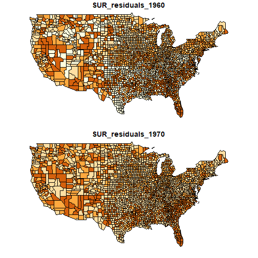
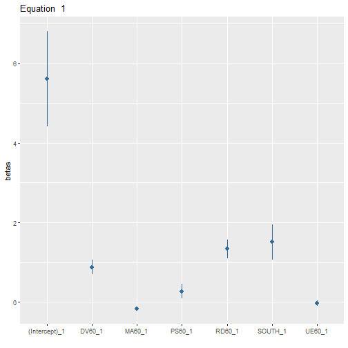
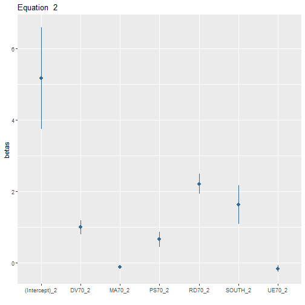
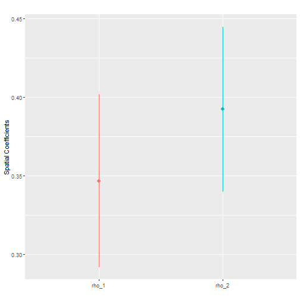
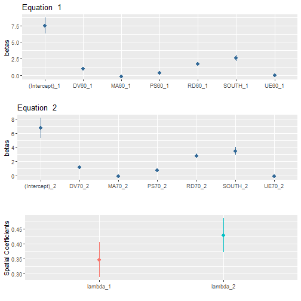
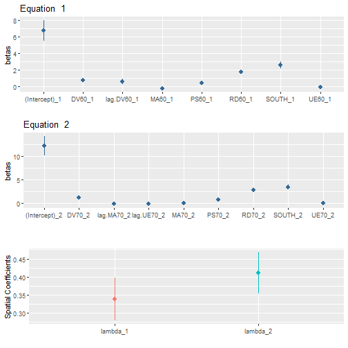
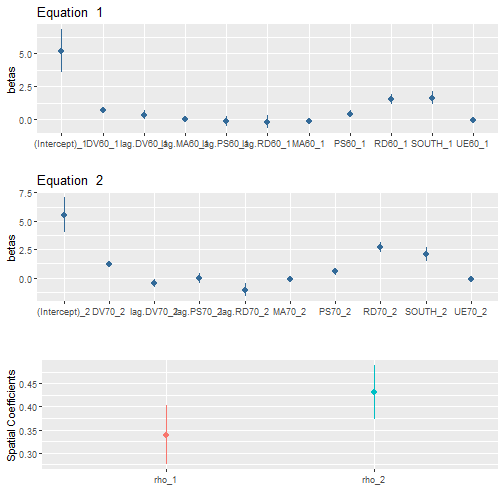
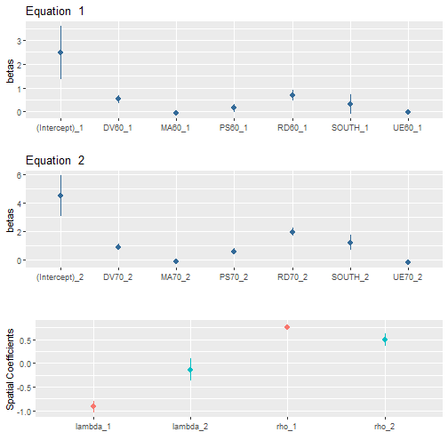
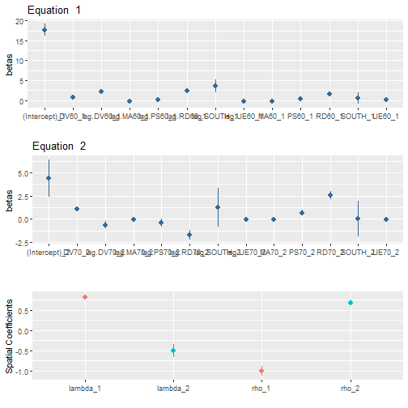

Load packages:


```r
library(spsur)
library(sf)
library(dplyr)
```

# Introduction

The purpose of this vignette is to show the functionalities of the new R-package **spsur** (@spsur_jss_forthcoming). In the vignette the reader will find information about the following aspects:

* Description of the dataset NCOVR, employed to illustrate the use of the package.
* Estimation of SUR models without spatial effects (the so called SUR-SIM models).
* Testing for various forms of spatial autocorrelation in the SUR-SIM model.
* In case of misspecification of the SUR-SIM model, estimation of SUR models with spatial effects, by ML or IV.
* Misspecification tests in a estimated spatial SUR model.
* Measures of spatial interaction for a spatial SUR model, the so-called Direct/Indirect/Total effects.
* Estimation of a spatial SUR panel data model, with 1 equation and several cross-sections.
* Generation of random data sets with the required spatial SUR structure.

# The data set NCOVR

Throughout the vignette we use the dataset NCOVR (National Consortium on Violence Research) to illustrate the capabilities of the package. The same data were employed by @Baller2001 to analyze the incidence of homicides rates in the US counties. The dataset can be freely dowloaded from
**https://geodacenter.github.io/data-and-lab/ncovr/**

There are three dimensions to consider in a SUR model: N, number of individuals, Tm, number of time periods and G, number of equations. Typically, in a spatial setting N will be large and Tm moderate with a small number of equations. NCOVR fits very well with the above description: it contains 3085 spatial units (counties), for 4 different cross-sections (1960, 1970, 1980, 1990) and 69 variables. According to @Baller2001, the main variables of interest are:

* HR: homicide rate per 100000 inhabitants
* RD: resource deprivation 
* PS: population structure 
* MA: median age
* DV: divorce rate (% males over 14 divorced)
* UE: unemployment rate 
* SOUTH: dummy variable for Southern counties (South = 1)

**spsur** deals with datasets from large to very small, especially in what respects to the number of spatial units. In this case, the dimensions of NCOVR make it a large dataset.

First, we can read the NCOVR dataset as a simple feature (sf) object (named NCOVR.sf),


```r
data(NCOVR, package = "spsur")
```

The first three observations in NCOVR appear below:


```r
NCOVR <- st_drop_geometry(NCOVR.sf)
knitr::kable(
  head((NCOVR[1:3, 1:6])),
  caption = 'First observations of NCOVR dataset' )
```


Table: First observations of NCOVR dataset

|NAME              |STATE_NAME |FIPS  | SOUTH|     HR60|     HR70|
|:-----------------|:----------|:-----|-----:|--------:|--------:|
|Lake of the Woods |Minnesota  |27077 |     0| 0.000000| 0.000000|
|Ferry             |Washington |53019 |     0| 0.000000| 0.000000|
|Stevens           |Washington |53065 |     0| 1.863863| 1.915158|

Whereas the geometry of the USA counties is shown in Figure  \@ref(fig:plotgeom):


```r
plot(st_geometry(NCOVR.sf))
```


Following @Baller2001, we consider a **W** matrix based on the criterion of 10 nearest-neighbourhood, which is inmediate to obtain using the **spdep** package, @BivandPedesma2013. The resulting weighting matrix can be obtained using *lwncovr* object. Note that this matrix is non-symmetric.


```r
# Obtain coordinates of centroids
co <- sf::st_coordinates(sf::st_centroid(NCOVR.sf))
lwncovr <- spdep::nb2listw(spdep::knn2nb(spdep::knearneigh(co, k = 10,longlat = TRUE)))
```

Figure \@ref(fig:quantilemap) shows the Quantile map for the Homicide Rate in the year 1960. Apparently there exist a strong structure of positive spatial autocorrelation. We observe a big cluster of the type High-High in the South East and South West counties, which evolves to Low-Low as we move to the North.


```r
q <- quantile(NCOVR.sf$HR60)
NCOVR.sf$qm <- (NCOVR.sf$HR60 > q[2]) + (NCOVR.sf$HR60 > q[3]) +(NCOVR.sf$HR60 >= q[4]) + 1
plot(NCOVR.sf["qm"], pal = c("#FFFEDE","#FFDFA2", "#FFA93F", "#D5610D"),
     main = "")
```


@Baller2001 specify a single linear model to explain the case of HR in the year 1960 with the results shown in the Table below, identical to those in Table 1 of @Baller2001.

\begin{equation}
HR_{60} = \beta_{0}+\beta_{1}RD_{60}+\beta_{2}PS_{60}+\beta_{3}MA_{60}+\beta_{4}DV_{60} +\beta_{5}UE_{60} +\beta_{6}SOUTH+\epsilon_{60} 
(\#eq:ols)
\end{equation}


```r
formula_60 <- HR60 ~ RD60 + PS60 + MA60 + DV60 + UE60 + SOUTH
lm_60 <- lm(formula = formula_60, data = NCOVR.sf)
summary(lm_60)
```

```
#> 
#> Call:
#> lm(formula = formula_60, data = NCOVR.sf)
#> 
#> Residuals:
#>     Min      1Q  Median      3Q     Max 
#> -14.026  -2.217  -0.635   1.393  88.312 
#> 
#> Coefficients:
#>             Estimate Std. Error t value Pr(>|t|)
#> (Intercept)  8.12591    0.63465  12.804  < 2e-16
#> RD60         1.79824    0.12341  14.571  < 2e-16
#> PS60         0.35871    0.09216   3.892 0.000101
#> MA60        -0.23047    0.01932 -11.931  < 2e-16
#> DV60         1.16002    0.09483  12.233  < 2e-16
#> UE60        -0.06195    0.03515  -1.762 0.078138
#> SOUTH        2.63862    0.23325  11.312  < 2e-16
#>                
#> (Intercept) ***
#> RD60        ***
#> PS60        ***
#> MA60        ***
#> DV60        ***
#> UE60        .  
#> SOUTH       ***
#> ---
#> Signif. codes:  
#> 0 '***' 0.001 '**' 0.01 '*' 0.05 '.' 0.1 ' ' 1
#> 
#> Residual standard error: 4.743 on 3078 degrees of freedom
#> Multiple R-squared:  0.2966,	Adjusted R-squared:  0.2952 
#> F-statistic: 216.3 on 6 and 3078 DF,  p-value: < 2.2e-16
```

Figure \@ref(fig:quantilemap) points to the existence of cross-sectional dependence in the spatial distribution of HR60 but the model in \@ref(eq:ols) does not contain elements of spatial interaction. The consequence is a scattermap of the LS residuals, \@ref(fig:quantilemap) ,  with a strong structure of clusters, similar to that of HR60 in Figure \@ref(fig:residualquantilemap).


```r
q <- quantile(lm_60$residuals)
NCOVR.sf$qmr <- (lm_60$residuals > q[2]) + (lm_60$residuals > q[3]) + (lm_60$residuals >= q[4]) + 1
plot(NCOVR.sf["qmr"], pal = c("#FFFEDE","#FFDFA2", "#FFA93F", "#D5610D"), main = "")
```


The battery of LM tests for omitted spatial structure, supplied by **spdep** @BivandPedesma2013, confirms the misspecification of \@ref(eq:ols). According to these results, the most adequate specification is a spatial lag model. Similar results are obtained for the years 1970, 1980 and 1990, which we omit for reasons of space.


```r
print(spdep::lm.LMtests(model=lm_60,listw = lwncovr,test="all"))
```

```
#> 
#> 	Lagrange multiplier diagnostics for spatial
#> 	dependence
#> 
#> data:  
#> model: lm(formula = formula_60, data =
#> NCOVR.sf)
#> weights: lwncovr
#> 
#> LMerr = 208.32, df = 1, p-value < 2.2e-16
#> 
#> 
#> 	Lagrange multiplier diagnostics for spatial
#> 	dependence
#> 
#> data:  
#> model: lm(formula = formula_60, data =
#> NCOVR.sf)
#> weights: lwncovr
#> 
#> LMlag = 232.36, df = 1, p-value < 2.2e-16
#> 
#> 
#> 	Lagrange multiplier diagnostics for spatial
#> 	dependence
#> 
#> data:  
#> model: lm(formula = formula_60, data =
#> NCOVR.sf)
#> weights: lwncovr
#> 
#> RLMerr = 1.1473, df = 1, p-value = 0.2841
#> 
#> 
#> 	Lagrange multiplier diagnostics for spatial
#> 	dependence
#> 
#> data:  
#> model: lm(formula = formula_60, data =
#> NCOVR.sf)
#> weights: lwncovr
#> 
#> RLMlag = 25.19, df = 1, p-value = 5.196e-07
#> 
#> 
#> 	Lagrange multiplier diagnostics for spatial
#> 	dependence
#> 
#> data:  
#> model: lm(formula = formula_60, data =
#> NCOVR.sf)
#> weights: lwncovr
#> 
#> SARMA = 233.51, df = 2, p-value < 2.2e-16
```

The previous discussion is an example of the traditional approach in spatial econometrics, where we process the data cross-section by cross-section, perhaps in a panel framework. We stop here this analysis in favour of a multivariate approach using SUR models, which is the purpose of **spsur**.

# A single SUR model

We begin by introducing dependence in the errors of the same county across time, as in expression \@ref(eq:sur) below. Note that time dependence in the errors of different counties is not allowed. To simplify we consider only two cross-sections, 1960 and 1970.

\begin{equation}
HR_{60} = \beta_{10}+\beta_{11}RD_{60}+\beta_{12}PS_{60}+\beta_{13}MA_{60}+\beta_{14}DV_{60} +\beta_{15}UE_{60} +\beta_{16}SOUTH+\epsilon_{60}\\
HR_{70} = \beta_{20}+\beta_{21}RD_{70}+\beta_{22}PS_{70}+\beta_{23}MA_{70}+\beta_{24}DV_{70} +\beta_{25}UE_{70} +\beta_{26}SOUTH+\epsilon_{70} \\
Corr(\epsilon_{60},\epsilon_{70}) \neq 0 \\
 (\#eq:sur)
 \end{equation}

The package **Formula** is used to build the model in **spsur**


```r
formula_sur <- HR60 | HR70 ~ RD60 + PS60 + MA60 + DV60 + UE60 + SOUTH |  RD70 + PS70 + MA70 + DV70 + UE70 + SOUTH
```

The function `spsurml()` estimates a pure SUR model without spatial effects, which we call SUR-SIM. The *key argument* to estimate this model is *type = "sim"*, which declares the type of spatial specification desired by the user.


```r
sur.sim <- spsurml(formula = formula_sur, type = "sim", data = NCOVR.sf)
```

```
#> Initial point:  
#> log_lik:  -18908.66 
#> Iteration:  1  log_lik:  -18908.64 
#> Iteration:  2  log_lik:  -18908.64 
#> Time to fit the model:  0.12  seconds
#> Time to compute covariances:  0.05  seconds
```

```r
summary(sur.sim)
```

```
#> Call:
#> spsurml(formula = formula_sur, data = NCOVR.sf, type = "sim")
#> 
#>  
#> Spatial SUR model type:  sim 
#> 
#> Equation  1 
#>                Estimate Std. Error  t value
#> (Intercept)_1  7.934600   0.628650  12.6216
#> RD60_1         1.704134   0.122195  13.9461
#> PS60_1         0.336554   0.091928   3.6610
#> MA60_1        -0.222449   0.019157 -11.6119
#> DV60_1         1.111576   0.093760  11.8555
#> UE60_1        -0.063549   0.034323  -1.8515
#> SOUTH_1        2.764987   0.232276  11.9039
#>                Pr(>|t|)    
#> (Intercept)_1 < 2.2e-16 ***
#> RD60_1        < 2.2e-16 ***
#> PS60_1        0.0002533 ***
#> MA60_1        < 2.2e-16 ***
#> DV60_1        < 2.2e-16 ***
#> UE60_1        0.0641472 .  
#> SOUTH_1       < 2.2e-16 ***
#> ---
#> Signif. codes:  
#> 0 '***' 0.001 '**' 0.01 '*' 0.05 '.' 0.1 ' ' 1
#> R-squared: 0.2964 
#>   Equation  2 
#>                Estimate Std. Error t value
#> (Intercept)_2  8.457736   0.760008 11.1285
#> RD70_2         2.775541   0.147823 18.7761
#> PS70_2         0.772452   0.116483  6.6315
#> MA70_2        -0.186988   0.022532 -8.2988
#> DV70_2         1.162703   0.103180 11.2687
#> UE70_2        -0.223708   0.048739 -4.5899
#> SOUTH_2        3.768599   0.284478 13.2474
#>                Pr(>|t|)    
#> (Intercept)_2 < 2.2e-16 ***
#> RD70_2        < 2.2e-16 ***
#> PS70_2        3.606e-11 ***
#> MA70_2        < 2.2e-16 ***
#> DV70_2        < 2.2e-16 ***
#> UE70_2        4.522e-06 ***
#> SOUTH_2       < 2.2e-16 ***
#> ---
#> Signif. codes:  
#> 0 '***' 0.001 '**' 0.01 '*' 0.05 '.' 0.1 ' ' 1
#> R-squared: 0.3609 
#>   
#> Variance-Covariance Matrix of inter-equation residuals:                    
#>  22.459968  7.288907
#>   7.288907 34.553637
#> Correlation Matrix of inter-equation residuals:                    
#>  1.0000000 0.2616441
#>  0.2616441 1.0000000
#> 
#>  R-sq. pooled: 0.3503 
#>  Breusch-Pagan: 211.2  p-value: (7.54e-48)
```

The signs of the variables are as expected and, more interesting, the SUR estimation detects a strong positive dependence between the errors for the year 1960 and those of the year 1970, 0.2616 according to the data in the *Correlation Matrix of inter-equation residuals*. The Breusch-Pagan diagonality test that appears at the end of the Table confirms that this dependence is statistically significant and should not be avoided.

Figure \@ref(fig:residualsurquantilemap) shows the quantile maps of the SUR residuals corresponding to the years 1960 and 1970. The maps reveal that time dependence was only part of the problem. Indeed, there remain a strong spatial structure in the SUR residuals which is apparently stable across time.


```r
res <- residuals(sur.sim)
q <- quantile(res[[1]])
NCOVR.sf$SUR_residuals_1960 <- (res[[1]] > q[2]) + (res[[1]] > q[3]) + (res[[1]] >= q[4]) + 1
q <- quantile(res[[2]])
NCOVR.sf$SUR_residuals_1970 <- (res[[2]]>q[1]) + (res[[2]]>q[3]) + (res[[2]] >= q[4]) + 1
plot(NCOVR.sf[c("SUR_residuals_1960","SUR_residuals_1970")],
     pal = c("#FFFEDE","#FFDFA2", "#FFA93F", "#D5610D"))
```



The battery of Lagrange Multipliers that appear below are obtained with the function `lmtestspsur()`. The output is a list of 5 elements each one of the class `htest`. They are the traditional LM misspecification tests [@anselinbera1998] for omitted spatial elements, adapted to a SUR framework by [@Mur2010]. All the Multipliers are statistically significant, both the raw and robust LMs as well as the joint LM for SARMA processes.


```r
lmtest.sur <- lmtestspsur(formula = formula_sur, 
                          listw = lwncovr, data = NCOVR.sf)
print(lmtest.sur)
```

```
#> [[1]]
#> 
#> 	LM-SUR-SLM
#> 
#> data:  NCOVR.sf
#> LM-stat = 407.3, df = 2, p-value < 2.2e-16
#> 
#> 
#> [[2]]
#> 
#> 	LM-SUR-SEM
#> 
#> data:  NCOVR.sf
#> LM-stat = 381.32, df = 2, p-value < 2.2e-16
#> 
#> 
#> [[3]]
#> 
#> 	LM*-SUR-SLM
#> 
#> data:  NCOVR.sf
#> LM-stat = 37.893, df = 2, p-value =
#> 5.909e-09
#> 
#> 
#> [[4]]
#> 
#> 	LM*-SUR-SEM
#> 
#> data:  NCOVR.sf
#> LM-stat = 11.917, df = 2, p-value = 0.002584
#> 
#> 
#> [[5]]
#> 
#> 	LM-SUR-SARAR
#> 
#> data:  NCOVR.sf
#> LM-stat = 419.21, df = 4, p-value < 2.2e-16
```

The conclusion is that the simple SUR model of expression \@ref(eq:sur) is misspecified due of the omission of relevant spatial elements. The problem for the user is the identification of the elements of spatial structure that are missing from the equation. In fact, all the Multipliers are statistically significant, which would point to a SUR-SARAR specification.

As a way of example, the next Section estimates all the possible spatial configurations of a SUR model by using the function `spsurml()`.

# Estimation of spatial SUR models

As said, **spsur** is an R package whose main objective is to estimate and test SUR models with a given spatial structure. It is assumed that the same spatial structure appears in all time periods and equations. The catalog of spatial specification that this package can process are

* SUR-SLX. SUR model with lags of the X variables.
* SUR-SLM. SUR model with lags of the endogenous variables.
* SUR-SEM. SUR model with spatial errors.
* SUR-SDM. SUR model with lags of the endogenous and of the X variables, or Spatial Durbin.
* SUR-SDEM. SUR model with with lags of the X variables and spatial errors.
* SUR-SARAR. SUR model with lags of the of the endogenous variables and spatial errors.
* SUR-GNM. SUR model with lags of the of the endogenous variables, lags of the X variables and lags spatial errors. This specification nest the rest of models.

The common estimation procedure for the seven cases is maximum-likelihood, ML, whereas the SUR-SLM and SUR-SDM can also be estimated by Three Stage-Least-Squares, 3SLS. @BivandPiras2015 offer an excellent revision of estimation methods in spatial econometrics, whereas @Lopez2020 focus specifically in the comparison of ML against 3SLS. First, we discuss the maximum likelihood approach and finish the Section with a few comments in relation to 3SLS.

## SUR-SLX model {#model-surslx}

The SUR-SLX model includes spatial lags of of the X variables, assumed to be exogenous. The user should specify the argument *type = "slx"* in the function `spsurml()`


```r
sur.slx <- spsurml(formula = formula_sur, listw = lwncovr, 
                   type = "slx",data = NCOVR.sf)
```

```
#> Initial point:  
#> log_lik:  -18855.05 
#> Iteration:  1  log_lik:  -18855.03 
#> Iteration:  2  log_lik:  -18855.03 
#> Time to fit the model:  0.14  seconds
#> Time to compute covariances:  0.03  seconds
```

```r
summary(sur.slx)
```

```
#> Call:
#> spsurml(formula = formula_sur, data = NCOVR.sf, listw = lwncovr, 
#>     type = "slx")
#> 
#>  
#> Spatial SUR model type:  slx 
#> 
#> Equation  1 
#>                Estimate Std. Error t value
#> (Intercept)_1  9.404828   0.853987 11.0128
#> RD60_1         1.391044   0.198872  6.9947
#> PS60_1         0.356695   0.139140  2.5636
#> MA60_1        -0.165999   0.029995 -5.5343
#> DV60_1         0.677292   0.127589  5.3084
#> UE60_1         0.069895   0.045621  1.5321
#> SOUTH_1       -0.525968   0.854098 -0.6158
#> lag.RD60_1     0.584993   0.258440  2.2636
#> lag.PS60_1     0.177608   0.188824  0.9406
#> lag.MA60_1    -0.105561   0.039854 -2.6487
#> lag.DV60_1     1.028709   0.186037  5.5296
#> lag.UE60_1    -0.356007   0.070416 -5.0558
#> lag.SOUTH_1    3.210259   0.913464  3.5144
#>                Pr(>|t|)    
#> (Intercept)_1 < 2.2e-16 ***
#> RD60_1        2.941e-12 ***
#> PS60_1         0.010384 *  
#> MA60_1        3.255e-08 ***
#> DV60_1        1.145e-07 ***
#> UE60_1         0.125560    
#> SOUTH_1        0.538038    
#> lag.RD60_1     0.023636 *  
#> lag.PS60_1     0.346946    
#> lag.MA60_1     0.008102 ** 
#> lag.DV60_1    3.342e-08 ***
#> lag.UE60_1    4.411e-07 ***
#> lag.SOUTH_1    0.000444 ***
#> ---
#> Signif. codes:  
#> 0 '***' 0.001 '**' 0.01 '*' 0.05 '.' 0.1 ' ' 1
#> R-squared: 0.3111 
#>   Equation  2 
#>                Estimate Std. Error t value
#> (Intercept)_2 12.602327   1.089181 11.5705
#> RD70_2         2.522825   0.221812 11.3737
#> PS70_2         0.647317   0.171823  3.7673
#> MA70_2        -0.086290   0.030895 -2.7930
#> DV70_2         1.107498   0.134853  8.2127
#> UE70_2        -0.078082   0.067052 -1.1645
#> SOUTH_2       -0.470890   1.062144 -0.4433
#> lag.RD70_2     0.211881   0.306704  0.6908
#> lag.PS70_2     0.191860   0.234513  0.8181
#> lag.MA70_2    -0.231245   0.045318 -5.1028
#> lag.DV70_2     0.278746   0.200030  1.3935
#> lag.UE70_2    -0.335257   0.097691 -3.4318
#> lag.SOUTH_2    4.365239   1.145596  3.8105
#>                Pr(>|t|)    
#> (Intercept)_2 < 2.2e-16 ***
#> RD70_2        < 2.2e-16 ***
#> PS70_2        0.0001665 ***
#> MA70_2        0.0052380 ** 
#> DV70_2        2.614e-16 ***
#> UE70_2        0.2442653    
#> SOUTH_2       0.6575362    
#> lag.RD70_2    0.4896967    
#> lag.PS70_2    0.4133196    
#> lag.MA70_2    3.448e-07 ***
#> lag.DV70_2    0.1635134    
#> lag.UE70_2    0.0006035 ***
#> lag.SOUTH_2   0.0001401 ***
#> ---
#> Signif. codes:  
#> 0 '***' 0.001 '**' 0.01 '*' 0.05 '.' 0.1 ' ' 1
#> R-squared: 0.3729 
#>   
#> Variance-Covariance Matrix of inter-equation residuals:                    
#>  21.989906  6.870219
#>   6.870219 33.899543
#> Correlation Matrix of inter-equation residuals:                    
#>  1.0000000 0.2516297
#>  0.2516297 1.0000000
#> 
#>  R-sq. pooled: 0.3631 
#>  Breusch-Pagan: 195.3  p-value: (2.18e-44)
```

By default, *type = "slx"*  implies that lags of all the X variables appearing in the equations are included as additional regressors. However, `spsurml()´allows the user to decide the lags of which X variables should be added. In this case, the user activates the argument *Durbin = *. Suppose, by example, that we only want to include the spatial lag of $RD_{60}$ in the fist equation of \@ref(eq:sur) and the spatial lags of the $DV_{70}$ and $MA_{70}$ in the second equation. Then, we would write:


```r
formulaD <-  ~ DV60 |  MA70 + UE70 
sur.slx2 <- spsurml(formula = formula_sur, listw = lwncovr, 
                    type = "slx", Durbin = formulaD, 
                    data = NCOVR.sf)
```

```
#> Initial point:  
#> log_lik:  -18884.72 
#> Iteration:  1  log_lik:  -18884.68 
#> Iteration:  2  log_lik:  -18884.68 
#> Time to fit the model:  0.08  seconds
#> Time to compute covariances:  0.02  seconds
```

```r
summary(sur.slx2)
```

```
#> Call:
#> spsurml(formula = formula_sur, data = NCOVR.sf, listw = lwncovr, 
#>     type = "slx", Durbin = formulaD)
#> 
#>  
#> Spatial SUR model type:  slx 
#> 
#> Equation  1 
#>                Estimate Std. Error  t value
#> (Intercept)_1  7.448268   0.646136  11.5274
#> RD60_1         1.818289   0.124973  14.5495
#> PS60_1         0.431162   0.094674   4.5542
#> MA60_1        -0.224768   0.019122 -11.7541
#> DV60_1         0.793588   0.123881   6.4060
#> UE60_1        -0.081763   0.034481  -2.3712
#> SOUTH_1        2.720467   0.231839  11.7343
#> lag.DV60_1     0.673003   0.171295   3.9289
#>                Pr(>|t|)    
#> (Intercept)_1 < 2.2e-16 ***
#> RD60_1        < 2.2e-16 ***
#> PS60_1        5.360e-06 ***
#> MA60_1        < 2.2e-16 ***
#> DV60_1        1.604e-10 ***
#> UE60_1          0.01776 *  
#> SOUTH_1       < 2.2e-16 ***
#> lag.DV60_1    8.626e-05 ***
#> ---
#> Signif. codes:  
#> 0 '***' 0.001 '**' 0.01 '*' 0.05 '.' 0.1 ' ' 1
#> R-squared:   0.3 
#>   Equation  2 
#>                Estimate Std. Error t value
#> (Intercept)_2 12.555608   1.066183 11.7762
#> RD70_2         2.703380   0.148060 18.2587
#> PS70_2         0.753631   0.115894  6.5028
#> MA70_2        -0.093202   0.029255 -3.1858
#> DV70_2         1.196064   0.103131 11.5975
#> UE70_2        -0.098783   0.065843 -1.5003
#> SOUTH_2        3.727983   0.283123 13.1674
#> lag.MA70_2    -0.214336   0.041967 -5.1073
#> lag.UE70_2    -0.249813   0.089822 -2.7812
#>                Pr(>|t|)    
#> (Intercept)_2 < 2.2e-16 ***
#> RD70_2        < 2.2e-16 ***
#> PS70_2        8.506e-11 ***
#> MA70_2         0.001451 ** 
#> DV70_2        < 2.2e-16 ***
#> UE70_2         0.133594    
#> SOUTH_2       < 2.2e-16 ***
#> lag.MA70_2    3.366e-07 ***
#> lag.UE70_2     0.005432 ** 
#> ---
#> Signif. codes:  
#> 0 '***' 0.001 '**' 0.01 '*' 0.05 '.' 0.1 ' ' 1
#> R-squared: 0.3685 
#>   
#> Variance-Covariance Matrix of inter-equation residuals:                    
#>  22.346127  7.150743
#>   7.150743 34.141588
#> Correlation Matrix of inter-equation residuals:                    
#>  1.0000000 0.2588858
#>  0.2588858 1.0000000
#> 
#>  R-sq. pooled: 0.3563 
#>  Breusch-Pagan: 206.8  p-value: (6.98e-47)
```

## SUR-SLM model {#model-surslm}

The specification of the SLM-SUR model that we want to estimate is standard,

\begin{equation} 
HR_{60} = \rho_{60}WHR_{60} + \beta_{10}+\beta_{11}RD_{60}+\beta_{12}PS_{60}+\beta_{13}MA_{60}+\beta_{14}DV_{60} +\beta_{15}UE_{60} +\beta_{16}SOUTH+\epsilon_{60} \\
HR_{70} = \rho_{60}WHR_{70} + \beta_{20}+\beta_{21}RD_{70}+\beta_{22}PS_{70}+\beta_{23}MA_{70}+\beta_{24}DV_{70} +\beta_{25}UE_{70} +\beta_{26}SOUTH+\epsilon_{70}\\
Corr(\epsilon_{60},\epsilon_{70}) \neq 0
(\#eq:surslm)
\end{equation}

which can be estimated by maximum likelihood using the argument *type = "slm"* in the function `spsurml()`.

A severe handicap of ML is the evaluation of the Jacobian term, which is highly time consuming. We offer some flexibility to the user with the arguments *method =* and *control=* imported from **spatialreg**, @BivandPedesma2013. The argument *method =* is used to select the method to evaluate the Jacobian. The options are *eigen*, *Matrix*, *LU*, *Chebyshev* and *MC*. The default is *eigen* and *Matrix* required the **W** matrix to be symmetric. *control=* adds a list of functionalities to expedite the calculus, which can be consulted in the documentation of **spatialreg**.


```r
control <- list(fdHess = TRUE)
sur.slm <- spsurml(formula = formula_sur, listw = lwncovr, 
                   method = "LU", type = "slm", control = control, 
                   data = NCOVR.sf)
```

```
#> sparse matrix LU decomposition
#> Initial point:   log_lik:  -18771.95  rhos:  0.335 0.375 
#> Iteration:  1   log_lik:  -18761.92  rhos:  0.346 0.392 
#> Iteration:  2   log_lik:  -18761.91  rhos:  0.347 0.392 
#> Iteration:  3   log_lik:  -18761.91  rhos:  0.347 0.392 
#> Time to fit the model:  10  seconds
#> Computing numerical covariances... 
#> Time to compute covariances:  2.5  seconds
```

```r
summary(sur.slm)
```

```
#> Call:
#> spsurml(formula = formula_sur, data = NCOVR.sf, listw = lwncovr, 
#>     type = "slm", method = "LU", control = control)
#> 
#>  
#> Spatial SUR model type:  slm 
#> 
#> Equation  1 
#>                Estimate Std. Error t value
#> (Intercept)_1  5.607039   0.611284  9.1726
#> RD60_1         1.334302   0.118840 11.2277
#> PS60_1         0.274533   0.089149  3.0795
#> MA60_1        -0.166818   0.018620 -8.9593
#> DV60_1         0.879740   0.091235  9.6426
#> UE60_1        -0.030516   0.033559 -0.9093
#> SOUTH_1        1.505887   0.225400  6.6810
#> rho_1          0.346704   0.028108 12.3345
#>                Pr(>|t|)    
#> (Intercept)_1 < 2.2e-16 ***
#> RD60_1        < 2.2e-16 ***
#> PS60_1         0.002083 ** 
#> MA60_1        < 2.2e-16 ***
#> DV60_1        < 2.2e-16 ***
#> UE60_1         0.363211    
#> SOUTH_1       2.582e-11 ***
#> rho_1         < 2.2e-16 ***
#> ---
#> Signif. codes:  
#> 0 '***' 0.001 '**' 0.01 '*' 0.05 '.' 0.1 ' ' 1
#> R-squared: 0.3396 
#>   Equation  2 
#>                Estimate Std. Error t value
#> (Intercept)_2  5.163757   0.729968  7.0739
#> RD70_2         2.202376   0.141982 15.5116
#> PS70_2         0.648888   0.111547  5.8172
#> MA70_2        -0.121944   0.021633 -5.6369
#> DV70_2         0.987289   0.099166  9.9559
#> UE70_2        -0.169083   0.047060 -3.5929
#> SOUTH_2        1.622783   0.272704  5.9507
#> rho_2          0.392398   0.026755 14.6661
#>                Pr(>|t|)    
#> (Intercept)_2 1.673e-12 ***
#> RD70_2        < 2.2e-16 ***
#> PS70_2        6.286e-09 ***
#> MA70_2        1.808e-08 ***
#> DV70_2        < 2.2e-16 ***
#> UE70_2        0.0003295 ***
#> SOUTH_2       2.817e-09 ***
#> rho_2         < 2.2e-16 ***
#> ---
#> Signif. codes:  
#> 0 '***' 0.001 '**' 0.01 '*' 0.05 '.' 0.1 ' ' 1
#> R-squared: 0.4151 
#>   
#> Variance-Covariance Matrix of inter-equation residuals:                    
#>  21.095545  5.362846
#>   5.362846 31.653826
#> Correlation Matrix of inter-equation residuals:                    
#>  1.0000000 0.2075329
#>  0.2075329 1.0000000
#> 
#>  R-sq. pooled: 0.3994 
#>  Breusch-Pagan: 132.9  p-value: (9.65e-31)
```

The `plot()` function allows the user to plot both beta and spatial coefficients for all equations of the spsur model. The argument *viewplot* is used to choose between interactive or non-interactive plots.


```r
# Interactive plot
plot(sur.slm)
```



The `print()` function is used to print short tables including the values of beta and spatial coefficients as well as p-values of significance test for each coefficient. This can be used as an alternative to `summary()` when a brief output is needed. The *NA* values indicate that the coefficient has not been fitted in the corresponding equation.


```r
print(sur.slm)
```

```
#>             coeff_1 pval_1 coeff_2 pval_2
#> (Intercept)  5.6070  0.000  5.1638      0
#> RD60         1.3343  0.000      NA     NA
#> PS60         0.2745  0.002      NA     NA
#> MA60        -0.1668  0.000      NA     NA
#> DV60         0.8797  0.000      NA     NA
#> UE60        -0.0305  0.363      NA     NA
#> SOUTH        1.5059  0.000  1.6228      0
#> RD70             NA     NA  2.2024      0
#> PS70             NA     NA  0.6489      0
#> MA70             NA     NA -0.1219      0
#> DV70             NA     NA  0.9873      0
#> UE70             NA     NA -0.1691      0
#> rho          0.3467  0.000  0.3924      0
```


## SUR-SEM model {#model-sursem}

The corresponding specification is the following: 

\begin{equation}
HR_{60} = \beta_{10}+\beta_{11}RD_{60}+\beta_{12}PS_{60}+\beta_{13}MA_{60}+\beta_{14}DV_{60} +\beta_{15}UE_{60} +\beta_{16}SOUTH+u_{60} \ ; \\ u_{60}=\lambda_{60}W u_{60}+\epsilon_{60}\\
\\
HR_{70} = \beta_{20}+\beta_{21}RD_{70}+\beta_{22}PS_{70}+\beta_{23}MA_{70}+\beta_{24}DV_{70} +\beta_{25}UE_{70} +\beta_{26}SOUTH+u_{70} ; \\ u_{70}=\lambda_{70}W u_{70}+\epsilon_{70} \\
\\
Corr(\epsilon_{60},\epsilon_{70}) \neq 0
(\#eq:sursem)
\end{equation}

The model is estimated by ML, with *method = "LU"* and calculating the analytical Hessian (option *fdHess = TRUE* in the argument control) in place of using the numerical approximation. The results appear below.


```r
sur.sem <- spsurml(formula = formula_sur, listw = lwncovr, 
                   method = "LU", type = "sem", 
                   control = control, data = NCOVR.sf)
```

```
#> sparse matrix LU decomposition
#> Initial point:   log_lik:  -18780  lambdas:  0.333 0.408 
#> Iteration:  1  log_lik:  -18770.25  lambdas:  0.347 0.428 
#> Iteration:  2  log_lik:  -18770.23  lambdas:  0.348 0.429 
#> Iteration:  3  log_lik:  -18770.23  lambdas:  0.348 0.429 
#> Time to fit the model:  13.81  seconds
#> Computing numerical covariances... 
#> Time to compute covariances:  3.06  seconds
```

```r
summary(sur.sem)
```

```
#> Call:
#> spsurml(formula = formula_sur, data = NCOVR.sf, listw = lwncovr, 
#>     type = "sem", method = "LU", control = control)
#> 
#>  
#> Spatial SUR model type:  sem 
#> 
#> Equation  1 
#>                 Estimate Std. Error  t value
#> (Intercept)_1  7.5045154  0.6128069  12.2461
#> RD60_1         1.6575708  0.1191356  13.9133
#> PS60_1         0.3200992  0.0893764   3.5815
#> MA60_1        -0.2056675  0.0186661 -11.0182
#> DV60_1         0.9408534  0.0914611  10.2869
#> UE60_1         0.0024792  0.0336388   0.0737
#> SOUTH_1        2.6238095  0.2259711  11.6113
#> lambda_1       0.3475733  0.0303355  11.4576
#>                Pr(>|t|)    
#> (Intercept)_1 < 2.2e-16 ***
#> RD60_1        < 2.2e-16 ***
#> PS60_1        0.0003443 ***
#> MA60_1        < 2.2e-16 ***
#> DV60_1        < 2.2e-16 ***
#> UE60_1        0.9412509    
#> SOUTH_1       < 2.2e-16 ***
#> lambda_1      < 2.2e-16 ***
#> ---
#> Signif. codes:  
#> 0 '***' 0.001 '**' 0.01 '*' 0.05 '.' 0.1 ' ' 1
#> R-squared: 0.3369 
#>   Equation  2 
#>                Estimate Std. Error t value
#> (Intercept)_2  6.733361   0.728904  9.2376
#> RD70_2         2.803254   0.141775 19.7725
#> PS70_2         0.732532   0.111391  6.5762
#> MA70_2        -0.132271   0.021602 -6.1231
#> DV70_2         1.110862   0.099021 11.2185
#> UE70_2        -0.146826   0.046986 -3.1249
#> SOUTH_2        3.462542   0.272318 12.7151
#> lambda_2       0.429273   0.028909 14.8489
#>                Pr(>|t|)    
#> (Intercept)_2 < 2.2e-16 ***
#> RD70_2        < 2.2e-16 ***
#> PS70_2        5.223e-11 ***
#> MA70_2        9.744e-10 ***
#> DV70_2        < 2.2e-16 ***
#> UE70_2         0.001787 ** 
#> SOUTH_2       < 2.2e-16 ***
#> lambda_2      < 2.2e-16 ***
#> ---
#> Signif. codes:  
#> 0 '***' 0.001 '**' 0.01 '*' 0.05 '.' 0.1 ' ' 1
#> R-squared: 0.4175 
#>   
#> Variance-Covariance Matrix of inter-equation residuals:                    
#>  21.203673  5.402139
#>   5.402139 31.566164
#> Correlation Matrix of inter-equation residuals:                  
#>  1.000000 0.208809
#>  0.208809 1.000000
#> 
#>  R-sq. pooled: 0.3998 
#>  Breusch-Pagan: 134.5  p-value: (4.23e-31)
```


```r
# Non-interactive plot
if (require(gridExtra)) {
  pl <- plot(sur.sem, viewplot = FALSE) 
  grid.arrange(pl$lplbetas[[1]], pl$lplbetas[[2]], 
               pl$pldeltas, nrow = 3)
}
```



## SUR-SDEM model {#model-sursdem} 

The specification of a spatial Durbin model with spatial errors and a SUR framework is the following 

\begin{equation}
HR_{60} = \beta_{10}+\beta_{11}RD_{60}+\beta_{12}PS_{60}+\beta_{13}MA_{60}+\beta_{14}DV_{60} +\beta_{15}UE_{60} +\beta_{16}SOUTH+u_{60} +\theta_{1}WDV_{60}\ ; \\ u_{60}=\lambda_{60}W u_{60}+\epsilon_{60}\\
\\
HR_{70} = \beta_{20}+\beta_{21}RD_{70}+\beta_{22}PS_{70}+\beta_{23}MA_{70}+\beta_{24}DV_{70} +\beta_{25}UE_{70} +\beta_{26}SOUTH+u_{70}+\theta_{2}WMA_{70}+\theta_{3}WUE_{70} ; \\ u_{70}=\lambda_{70}W u_{70}+\epsilon_{70} \\
\\
Corr(\epsilon_{60},\epsilon_{70}) \neq 0
(\#eq:sursdem)
\end{equation}

Note that the specificaction above, in spite of its name, does not include lags of the endogenous variables; only lags of the X variables combined with spatial errors. The model is estimated by ML, with *method = "LU"* and *fdHess = TRUE* in the argument control. To shorten the output, we use the argument *Durbin=* to restrict the spatial lags of the X variables that we want to see in the SUR equations. The results appear below.


```r
formulaD <-  ~ DV60 |  MA70 + UE70 
sur.sdem <- spsurml(formula = formula_sur, listw = lwncovr, 
                   method = "LU", type = "sdem", Durbin = formulaD,
                   control = control, data = NCOVR.sf)
```

```
#> sparse matrix LU decomposition
#> Initial point:   log_lik:  -18764.39  lambdas:  0.324 0.392 
#> Iteration:  1  log_lik:  -18756.13  lambdas:  0.337 0.409 
#> Iteration:  2  log_lik:  -18756.11  lambdas:  0.338 0.41 
#> Iteration:  3  log_lik:  -18756.11  lambdas:  0.338 0.41 
#> Time to fit the model:  11.95  seconds
#> Computing numerical covariances... 
#> Time to compute covariances:  3  seconds
```

```r
summary(sur.sdem)
```

```
#> Call:
#> spsurml(formula = formula_sur, data = NCOVR.sf, listw = lwncovr, 
#>     type = "sdem", Durbin = formulaD, method = "LU", control = control)
#> 
#>  
#> Spatial SUR model type:  sdem 
#> 
#> Equation  1 
#>                Estimate Std. Error  t value
#> (Intercept)_1  6.753198   0.630626  10.7087
#> RD60_1         1.774281   0.122014  14.5417
#> PS60_1         0.416248   0.092215   4.5139
#> MA60_1        -0.207519   0.018651 -11.1262
#> DV60_1         0.762641   0.121494   6.2772
#> UE60_1        -0.015030   0.033819  -0.4444
#> SOUTH_1        2.626739   0.225833  11.6313
#> lag.DV60_1     0.651886   0.168599   3.8665
#> lambda_1       0.337726   0.030428  11.0990
#>                Pr(>|t|)    
#> (Intercept)_1 < 2.2e-16 ***
#> RD60_1        < 2.2e-16 ***
#> PS60_1        6.484e-06 ***
#> MA60_1        < 2.2e-16 ***
#> DV60_1        3.682e-10 ***
#> UE60_1        0.6567495    
#> SOUTH_1       < 2.2e-16 ***
#> lag.DV60_1    0.0001115 ***
#> lambda_1      < 2.2e-16 ***
#> ---
#> Signif. codes:  
#> 0 '***' 0.001 '**' 0.01 '*' 0.05 '.' 0.1 ' ' 1
#> R-squared: 0.3382 
#>   Equation  2 
#>                Estimate Std. Error t value
#> (Intercept)_2 12.159198   1.029354 11.8125
#> RD70_2         2.745663   0.142555 19.2604
#> PS70_2         0.711354   0.111258  6.3937
#> MA70_2        -0.094813   0.028296 -3.3508
#> DV70_2         1.126964   0.099349 11.3435
#> UE70_2        -0.093728   0.063881 -1.4672
#> SOUTH_2        3.396315   0.272058 12.4838
#> lag.MA70_2    -0.194266   0.040755 -4.7667
#> lag.UE70_2    -0.219844   0.087180 -2.5217
#> lambda_2       0.410148   0.029237 14.0283
#>                Pr(>|t|)    
#> (Intercept)_2 < 2.2e-16 ***
#> RD70_2        < 2.2e-16 ***
#> PS70_2        1.738e-10 ***
#> MA70_2        0.0008107 ***
#> DV70_2        < 2.2e-16 ***
#> UE70_2        0.1423681    
#> SOUTH_2       < 2.2e-16 ***
#> lag.MA70_2    1.916e-06 ***
#> lag.UE70_2    0.0117034 *  
#> lambda_2      < 2.2e-16 ***
#> ---
#> Signif. codes:  
#> 0 '***' 0.001 '**' 0.01 '*' 0.05 '.' 0.1 ' ' 1
#> R-squared: 0.4197 
#>   
#> Variance-Covariance Matrix of inter-equation residuals:                    
#>  21.153836  5.383611
#>   5.383611 31.434494
#> Correlation Matrix of inter-equation residuals:                    
#>  1.0000000 0.2087737
#>  0.2087737 1.0000000
#> 
#>  R-sq. pooled: 0.4017 
#>  Breusch-Pagan: 134.5  p-value: (4.32e-31)
```


```r
# Non-interactive plot
if (require(gridExtra)) {
  pl <- plot(sur.sdem, viewplot = FALSE) 
  grid.arrange(pl$lplbetas[[1]], pl$lplbetas[[2]], 
               pl$pldeltas, nrow = 3)
}
```



## SUR-SDM model {#model-sursdm} 

To estimate a full spatial Durbin model set the argument type to *type = "sdm"*. Moreover, the same as in other previous cases, we can restrict the list of lags of the X variables that we want to appear in the equations, by using the argument *Durbin =*.


```r
formulaD <-  ~ RD60 + PS60 + MA60 + DV60 |  RD70 + PS70 + DV70 
sur.sdm <- spsurml(formula = formula_sur, listw = lwncovr,
                   type = "sdm", method = "LU", 
                   Durbin = formulaD, data = NCOVR.sf)
```

```
#> sparse matrix LU decomposition
#> Initial point:   log_lik:  -18758.67  rhos:  0.325 0.41 
#> Iteration:  1   log_lik:  -18748.26  rhos:  0.338 0.43 
#> Iteration:  2   log_lik:  -18748.24  rhos:  0.339 0.43 
#> Iteration:  3   log_lik:  -18748.24  rhos:  0.339 0.43 
#> Time to fit the model:  9.75  seconds
#> Time to compute covariances:  16.67  seconds
```

```r
summary(sur.sdm)
```

```
#> Call:
#> spsurml(formula = formula_sur, data = NCOVR.sf, listw = lwncovr, 
#>     type = "sdm", Durbin = formulaD, method = "LU")
#> 
#>  
#> Spatial SUR model type:  sdm 
#> 
#> Equation  1 
#>                Estimate Std. Error t value
#> (Intercept)_1  5.201209   0.823810  6.3136
#> RD60_1         1.532098   0.193832  7.9043
#> PS60_1         0.405662   0.135846  2.9862
#> MA60_1        -0.175128   0.029229 -5.9915
#> DV60_1         0.698312   0.125316  5.5724
#> UE60_1        -0.038033   0.033872 -1.1229
#> SOUTH_1        1.625201   0.263590  6.1656
#> lag.RD60_1    -0.209570   0.254599 -0.8231
#> lag.PS60_1    -0.135340   0.181434 -0.7459
#> lag.MA60_1     0.012344   0.038860  0.3176
#> lag.DV60_1     0.345669   0.183290  1.8859
#> rho_1          0.338781   0.032763 10.3403
#>                Pr(>|t|)    
#> (Intercept)_1 2.917e-10 ***
#> RD60_1        3.172e-15 ***
#> PS60_1         0.002836 ** 
#> MA60_1        2.197e-09 ***
#> DV60_1        2.619e-08 ***
#> UE60_1         0.261537    
#> SOUTH_1       7.466e-10 ***
#> lag.RD60_1     0.410462    
#> lag.PS60_1     0.455728    
#> lag.MA60_1     0.750762    
#> lag.DV60_1     0.059353 .  
#> rho_1         < 2.2e-16 ***
#> ---
#> Signif. codes:  
#> 0 '***' 0.001 '**' 0.01 '*' 0.05 '.' 0.1 ' ' 1
#> R-squared: 0.3404 
#>   Equation  2 
#>                Estimate Std. Error t value
#> (Intercept)_2  5.536728   0.780199  7.0966
#> RD70_2         2.684812   0.210829 12.7345
#> PS70_2         0.569640   0.162032  3.5156
#> MA70_2        -0.128319   0.021950 -5.8459
#> DV70_2         1.157963   0.128915  8.9824
#> UE70_2        -0.143561   0.047563 -3.0184
#> SOUTH_2        2.076092   0.330381  6.2839
#> lag.RD70_2    -1.082892   0.291690 -3.7125
#> lag.PS70_2    -0.015655   0.217823 -0.0719
#> lag.DV70_2    -0.484365   0.185938 -2.6050
#> rho_2          0.430468   0.029709 14.4895
#>                Pr(>|t|)    
#> (Intercept)_2 1.423e-12 ***
#> RD70_2        < 2.2e-16 ***
#> PS70_2        0.0004419 ***
#> MA70_2        5.296e-09 ***
#> DV70_2        < 2.2e-16 ***
#> UE70_2        0.0025519 ** 
#> SOUTH_2       3.528e-10 ***
#> lag.RD70_2    0.0002071 ***
#> lag.PS70_2    0.9427092    
#> lag.DV70_2    0.0092100 ** 
#> rho_2         < 2.2e-16 ***
#> ---
#> Signif. codes:  
#> 0 '***' 0.001 '**' 0.01 '*' 0.05 '.' 0.1 ' ' 1
#> R-squared: 0.4217 
#>   
#> Variance-Covariance Matrix of inter-equation residuals:                    
#>  21.070408  5.327925
#>   5.327925 31.314143
#> Correlation Matrix of inter-equation residuals:                    
#>  1.0000000 0.2074203
#>  0.2074203 1.0000000
#> 
#>  R-sq. pooled: 0.4037 
#>  Breusch-Pagan: 132.7  p-value: (1.04e-30) 
#>  LMM: 125.07  p-value: (4.9e-29)
```


```r
# Non-interactive plot
if (require(gridExtra)) {
  pl <- plot(sur.sdm, viewplot = FALSE) 
  grid.arrange(pl$lplbetas[[1]], pl$lplbetas[[2]], 
               pl$pldeltas, nrow = 3)
}
```



## SUR-SARAR model {#model-sursarar}

The key argument to build a SARAR model from a single SUR specification, like that in of \@ref(eq:sur), is *type = "sarar"*.


```r
sur.sarar <- spsurml(formula = formula_sur, listw = lwncovr,
                     type = "sarar", method = "LU", 
                     control= control, 
                     data = NCOVR.sf)
```

```
#> sparse matrix LU decomposition
#> Initial point:   log_lik:  -18752.21  rhos:  0.648 0.366  lambdas:  -0.625 0.034 
#> Iteration:  1  log_lik:  -18725.08  rhos:  0.732 0.464  lambdas:  -0.835 -0.1 
#> Iteration:  2  log_lik:  -18722.89  rhos:  0.753 0.483  lambdas:  -0.898 -0.13 
#> Iteration:  3  log_lik:  -18722.69  rhos:  0.759 0.487  lambdas:  -0.916 -0.138 
#> Iteration:  4  log_lik:  -18722.67  rhos:  0.76 0.489  lambdas:  -0.922 -0.14 
#> Iteration:  5  log_lik:  -18722.66  rhos:  0.761 0.489  lambdas:  -0.923 -0.141 
#> Iteration:  6  log_lik:  -18722.66  rhos:  0.761 0.489  lambdas:  -0.924 -0.141 
#> Time to fit the model:  268.67  seconds
#> Computing numerical covariances... 
#> Time to compute covariances:  16.49  seconds
```

```r
summary(sur.sarar)
```

```
#> Call:
#> spsurml(formula = formula_sur, data = NCOVR.sf, listw = lwncovr, 
#>     type = "sarar", method = "LU", control = control)
#> 
#>  
#> Spatial SUR model type:  sarar 
#> 
#> Equation  1 
#>                Estimate Std. Error  t value
#> (Intercept)_1  2.474406   0.566119   4.3708
#> RD60_1         0.679803   0.110059   6.1767
#> PS60_1         0.154146   0.082567   1.8669
#> MA60_1        -0.080400   0.017244  -4.6625
#> DV60_1         0.520909   0.084493   6.1651
#> UE60_1        -0.035785   0.031076  -1.1515
#> SOUTH_1        0.324308   0.208755   1.5535
#> rho_1          0.761130   0.021654  35.1494
#> lambda_1      -0.923930   0.066419 -13.9106
#>                Pr(>|t|)    
#> (Intercept)_1 1.258e-05 ***
#> RD60_1        6.964e-10 ***
#> PS60_1          0.06196 .  
#> MA60_1        3.190e-06 ***
#> DV60_1        7.490e-10 ***
#> UE60_1          0.24956    
#> SOUTH_1         0.12035    
#> rho_1         < 2.2e-16 ***
#> lambda_1      < 2.2e-16 ***
#> ---
#> Signif. codes:  
#> 0 '***' 0.001 '**' 0.01 '*' 0.05 '.' 0.1 ' ' 1
#> R-squared: 0.4408 
#>   Equation  2 
#>                Estimate Std. Error t value
#> (Intercept)_2  4.510457   0.725557  6.2165
#> RD70_2         1.963636   0.141124 13.9143
#> PS70_2         0.600454   0.110880  5.4154
#> MA70_2        -0.109294   0.021503 -5.0828
#> DV70_2         0.919778   0.098566  9.3316
#> UE70_2        -0.168928   0.046771 -3.6118
#> SOUTH_2        1.225847   0.271067  4.5223
#> rho_2          0.489302   0.067616  7.2364
#> lambda_2      -0.141340   0.120773 -1.1703
#>                Pr(>|t|)    
#> (Intercept)_2 5.416e-10 ***
#> RD70_2        < 2.2e-16 ***
#> PS70_2        6.348e-08 ***
#> MA70_2        3.829e-07 ***
#> DV70_2        < 2.2e-16 ***
#> UE70_2        0.0003065 ***
#> SOUTH_2       6.232e-06 ***
#> rho_2         5.169e-13 ***
#> lambda_2      0.2419269    
#> ---
#> Signif. codes:  
#> 0 '***' 0.001 '**' 0.01 '*' 0.05 '.' 0.1 ' ' 1
#> R-squared: 0.4223 
#>   
#> Variance-Covariance Matrix of inter-equation residuals:                    
#>  18.095959  4.968457
#>   4.968457 31.277019
#> Correlation Matrix of inter-equation residuals:                    
#>  1.0000000 0.2088421
#>  0.2088421 1.0000000
#> 
#>  R-sq. pooled: 0.4397 
#>  Breusch-Pagan: 134.6  p-value: (4.14e-31)
```


```r
# Non-interactive plot
if (require(gridExtra)) {
  pl <- plot(sur.sarar, viewplot = FALSE) 
  grid.arrange(pl$lplbetas[[1]], pl$lplbetas[[2]], 
               pl$pldeltas, nrow = 3)
}
```




## SUR-GNM model {#model-surgnm}

This is the most general specification of a spatial SUR model. It needs to be chosen as *type = "gnm"*.


```r
sur.gnm <- spsurml(formula = formula_sur, listw = lwncovr,
                     type = "gnm", method = "LU", 
                     control= control, 
                     data = NCOVR.sf)
```

```
#> sparse matrix LU decomposition
#> Initial point:   log_lik:  -18720.37  rhos:  -0.691 0.543  lambdas:  0.685 -0.243 
#> Iteration:  1  log_lik:  -18687.23  rhos:  -0.918 0.646  lambdas:  0.773 -0.43 
#> Iteration:  2  log_lik:  -18683.36  rhos:  -0.993 0.67  lambdas:  0.798 -0.48 
#> Iteration:  3  log_lik:  -18682.97  rhos:  -1 0.676  lambdas:  0.802 -0.494 
#> Iteration:  4  log_lik:  -18682.96  rhos:  -1 0.678  lambdas:  0.802 -0.498 
#> Iteration:  5  log_lik:  -18682.96  rhos:  -1 0.678  lambdas:  0.802 -0.499 
#> Time to fit the model:  222.72  seconds
#> Computing numerical covariances... 
#> Time to compute covariances:  16.14  seconds
```

```r
summary(sur.gnm)
```

```
#> Call:
#> spsurml(formula = formula_sur, data = NCOVR.sf, listw = lwncovr, 
#>     type = "gnm", method = "LU", control = control)
#> 
#>  
#> Spatial SUR model type:  gnm 
#> 
#> Equation  1 
#>                Estimate Std. Error  t value
#> (Intercept)_1 17.651901   0.762369  23.1540
#> RD60_1         1.560001   0.178054   8.7614
#> PS60_1         0.378141   0.124111   3.0468
#> MA60_1        -0.180583   0.026829  -6.7309
#> DV60_1         0.746515   0.114364   6.5275
#> UE60_1         0.046688   0.041109   1.1357
#> SOUTH_1        0.524672   0.760930   0.6895
#> lag.RD60_1     2.396369   0.231176  10.3660
#> lag.PS60_1     0.153415   0.168387   0.9111
#> lag.MA60_1    -0.325003   0.035621  -9.1240
#> lag.DV60_1     2.125208   0.166425  12.7698
#> lag.UE60_1    -0.285175   0.063275  -4.5069
#> lag.SOUTH_1    3.655005   0.813904   4.4907
#> rho_1         -1.000000   0.064415 -15.5244
#> lambda_1       0.801995   0.020256  39.5936
#>                Pr(>|t|)    
#> (Intercept)_1 < 2.2e-16 ***
#> RD60_1        < 2.2e-16 ***
#> PS60_1         0.002323 ** 
#> MA60_1        1.840e-11 ***
#> DV60_1        7.222e-11 ***
#> UE60_1         0.256128    
#> SOUTH_1        0.490525    
#> lag.RD60_1    < 2.2e-16 ***
#> lag.PS60_1     0.362286    
#> lag.MA60_1    < 2.2e-16 ***
#> lag.DV60_1    < 2.2e-16 ***
#> lag.UE60_1    6.699e-06 ***
#> lag.SOUTH_1   7.229e-06 ***
#> rho_1         < 2.2e-16 ***
#> lambda_1      < 2.2e-16 ***
#> ---
#> Signif. codes:  
#> 0 '***' 0.001 '**' 0.01 '*' 0.05 '.' 0.1 ' ' 1
#> R-squared: 0.4652 
#>   Equation  2 
#>                Estimate Std. Error t value
#> (Intercept)_2  4.392553   1.013903  4.3323
#> RD70_2         2.567895   0.207117 12.3983
#> PS70_2         0.653214   0.159748  4.0890
#> MA70_2        -0.076940   0.028824 -2.6693
#> DV70_2         1.063181   0.126048  8.4347
#> UE70_2        -0.047130   0.063008 -0.7480
#> SOUTH_2        0.015769   0.986843  0.0160
#> lag.RD70_2    -1.721409   0.286070 -6.0174
#> lag.PS70_2    -0.390412   0.218014 -1.7908
#> lag.MA70_2    -0.034047   0.042236 -0.8061
#> lag.DV70_2    -0.628574   0.186622 -3.3682
#> lag.UE70_2    -0.097881   0.091563 -1.0690
#> lag.SOUTH_2    1.228598   1.064581  1.1541
#> rho_2          0.678373   0.035005 19.3793
#> lambda_2      -0.498914   0.083022 -6.0095
#>                Pr(>|t|)    
#> (Intercept)_2 1.499e-05 ***
#> RD70_2        < 2.2e-16 ***
#> PS70_2        4.387e-05 ***
#> MA70_2        0.0076220 ** 
#> DV70_2        < 2.2e-16 ***
#> UE70_2        0.4544940    
#> SOUTH_2       0.9872511    
#> lag.RD70_2    1.874e-09 ***
#> lag.PS70_2    0.0733806 .  
#> lag.MA70_2    0.4202118    
#> lag.DV70_2    0.0007614 ***
#> lag.UE70_2    0.2851110    
#> lag.SOUTH_2   0.2485177    
#> rho_2         < 2.2e-16 ***
#> lambda_2      1.968e-09 ***
#> ---
#> Signif. codes:  
#> 0 '***' 0.001 '**' 0.01 '*' 0.05 '.' 0.1 ' ' 1
#> R-squared: 0.4616 
#>   
#> Variance-Covariance Matrix of inter-equation residuals:                    
#>  17.453703  4.446821
#>   4.446821 29.261134
#> Correlation Matrix of inter-equation residuals:                    
#>  1.0000000 0.1967706
#>  0.1967706 1.0000000
#> 
#>  R-sq. pooled: 0.4726 
#>  Breusch-Pagan: 119.4  p-value: (8.36e-28)
```


```r
# Non-interactive plot
if (require(gridExtra)) {
  pl <- plot(sur.gnm, viewplot = FALSE) 
  grid.arrange(pl$lplbetas[[1]], pl$lplbetas[[2]], 
               pl$pldeltas, nrow = 3)
}
```




##  3SLS estimation of SUR-SLM and SUR-SDM models

We finish this Section by discussing briefly how to estimate a SUR-SLM model using a 3SLS approach (the same applies for the case of a SUR-SDM). The advantage of 3SLS over ML is time computing, because the first consists of a quasi-linear algorithm whereas the second may be highly non-linear and time consuming.

First is the obtaining of the spatial instruments using the information in the X variables, assumed to be exogenous. The matrix of instruments is $H=[X,WX,W^2X,W^3X,...,W^rX]$, with r=2 for the SUR-SLM case and r=3 in case of a SUR-SDM model. This defaults can be changed by using the argument *"maxlagW="* to the desired integer.


```r
sur.slm.3sls <- spsur3sls(formula = formula_sur, 
                          listw = lwncovr, 
                          type = "slm", maxlagW = 3,
                          data = NCOVR.sf)
```

```
#> Time to fit the model:  0.23  seconds
```

```r
summary(sur.slm.3sls)
```

```
#> Call:
#> spsur3sls(formula = formula_sur, data = NCOVR.sf, listw = lwncovr, 
#>     type = "slm", maxlagW = 3)
#> 
#>  
#> Spatial SUR model type:  slm 
#> 
#> Equation  1 
#>                 Estimate Std. Error t value
#> (Intercept)_1  3.7509397  0.7923766  4.7338
#> RD60_1         1.0353772  0.1450745  7.1369
#> PS60_1         0.2266163  0.0899011  2.5207
#> MA60_1        -0.1211682  0.0223284 -5.4266
#> DV60_1         0.6924647  0.1048947  6.6015
#> UE60_1        -0.0024122  0.0343363 -0.0703
#> SOUTH_1        0.6192046  0.3334205  1.8571
#> rho_1          0.6018009  0.0709495  8.4821
#>                Pr(>|t|)    
#> (Intercept)_1 2.253e-06 ***
#> RD60_1        1.065e-12 ***
#> PS60_1          0.01174 *  
#> MA60_1        5.962e-08 ***
#> DV60_1        4.410e-11 ***
#> UE60_1          0.94400    
#> SOUTH_1         0.06334 .  
#> rho_1         < 2.2e-16 ***
#> ---
#> Signif. codes:  
#> 0 '***' 0.001 '**' 0.01 '*' 0.05 '.' 0.1 ' ' 1
#> R-squared: 0.3442 
#>   Equation  2 
#>                Estimate Std. Error t value
#> (Intercept)_2  4.671722   0.896162  5.2130
#> RD70_2         2.109677   0.172504 12.2297
#> PS70_2         0.629421   0.113401  5.5504
#> MA70_2        -0.112285   0.023908 -4.6966
#> DV70_2         0.955288   0.104578  9.1347
#> UE70_2        -0.156897   0.048489 -3.2357
#> SOUTH_2        1.328137   0.421252  3.1528
#> rho_2          0.448768   0.061016  7.3550
#>                Pr(>|t|)    
#> (Intercept)_2 1.918e-07 ***
#> RD70_2        < 2.2e-16 ***
#> PS70_2        2.970e-08 ***
#> MA70_2        2.703e-06 ***
#> DV70_2        < 2.2e-16 ***
#> UE70_2         0.001220 ** 
#> SOUTH_2        0.001625 ** 
#> rho_2         2.159e-13 ***
#> ---
#> Signif. codes:  
#> 0 '***' 0.001 '**' 0.01 '*' 0.05 '.' 0.1 ' ' 1
#> R-squared: 0.4183 
#>   
#> Variance-Covariance Matrix of inter-equation residuals:                    
#>  20.922609  4.942321
#>   4.942321 31.470133
#> Correlation Matrix of inter-equation residuals:                    
#>  1.0000000 0.1929853
#>  0.1929853 1.0000000
#> 
#>  R-sq. pooled: 0.4029 
#>  Breusch-Pagan: 114.4  p-value: (1.04e-26)
```

As usual, we can activate the argument *"Durbin = "* to restrict the lags of the X variables in the equations of the SUR-SDM model. 


```r
formulaD <-  ~ RD60 |PS70 + DV70 
sur.sdm.3sls <- spsur3sls(formula = formula_sur, 
                          listw = lwncovr, type = "sdm",
                          Durbin = formulaD, data = NCOVR.sf)
```

```
#> Time to fit the model:  0.32  seconds
```

```r
summary(sur.sdm.3sls)
```

```
#> Call:
#> spsur3sls(formula = formula_sur, data = NCOVR.sf, listw = lwncovr, 
#>     type = "sdm", Durbin = formulaD)
#> 
#>  
#> Spatial SUR model type:  sdm 
#> 
#> Equation  1 
#>                  Estimate  Std. Error t value
#> (Intercept)_1  3.43518257  0.81264279  4.2272
#> RD60_1         1.30821880  0.18713336  6.9908
#> PS60_1         0.24819076  0.09037888  2.7461
#> MA60_1        -0.11687195  0.02251460 -5.1909
#> DV60_1         0.63711402  0.10833245  5.8811
#> UE60_1        -0.00048322  0.03443032 -0.0140
#> SOUTH_1        0.62526514  0.33369287  1.8738
#> lag.RD60_1    -0.53955617  0.24830201 -2.1730
#> rho_1          0.66514801  0.07793879  8.5342
#>                Pr(>|t|)    
#> (Intercept)_1 2.401e-05 ***
#> RD60_1        3.022e-12 ***
#> PS60_1         0.006048 ** 
#> MA60_1        2.159e-07 ***
#> DV60_1        4.290e-09 ***
#> UE60_1         0.988803    
#> SOUTH_1        0.061009 .  
#> lag.RD60_1     0.029820 *  
#> rho_1         < 2.2e-16 ***
#> ---
#> Signif. codes:  
#> 0 '***' 0.001 '**' 0.01 '*' 0.05 '.' 0.1 ' ' 1
#> R-squared: 0.3444 
#>   Equation  2 
#>                Estimate Std. Error t value
#> (Intercept)_2  4.886841   0.902717  5.4135
#> RD70_2         1.956217   0.187412 10.4381
#> PS70_2         0.432566   0.159071  2.7193
#> MA70_2        -0.107211   0.024385 -4.3966
#> DV70_2         1.182200   0.128762  9.1813
#> UE70_2        -0.132019   0.050236 -2.6280
#> SOUTH_2        1.090001   0.429844  2.5358
#> lag.PS70_2     0.214060   0.208198  1.0282
#> lag.DV70_2    -0.530377   0.195716 -2.7099
#> rho_2          0.504481   0.065870  7.6588
#>                Pr(>|t|)    
#> (Intercept)_2 6.415e-08 ***
#> RD70_2        < 2.2e-16 ***
#> PS70_2         0.006560 ** 
#> MA70_2        1.118e-05 ***
#> DV70_2        < 2.2e-16 ***
#> UE70_2         0.008610 ** 
#> SOUTH_2        0.011243 *  
#> lag.PS70_2     0.303917    
#> lag.DV70_2     0.006748 ** 
#> rho_2         2.168e-14 ***
#> ---
#> Signif. codes:  
#> 0 '***' 0.001 '**' 0.01 '*' 0.05 '.' 0.1 ' ' 1
#> R-squared: 0.422 
#>   
#> Variance-Covariance Matrix of inter-equation residuals:                    
#>  20.957885  4.651141
#>   4.651141 31.267681
#> Correlation Matrix of inter-equation residuals:                    
#>  1.0000000 0.1854865
#>  0.1854865 1.0000000
#> 
#>  R-sq. pooled: 0.4051 
#>  Breusch-Pagan: 101.8  p-value: (6.01e-24)
```

In the example above we have used the default in the argument *"maxlagW="*, 3 for a SUR-SDM.

# Testing for the specification

**spsur** includes a collection of test which may help the user to improve the specification. Some of them appear routinely as part of the output of the estimation of spatial SUR models whereas others require the intervention of the user. Below we discuss what we consider the most interest tests for the user.

## Routine tests

**spsur** deals with SUR models applied in a spatial setting and, thus, is important to control for the SUR nature of the system of equations and for the symptoms of spatial misspecification. In the first case we are refering to the well known Breusch-Pagan LM test (@BP1980) of diagonality of the covariance matrix of the SUR residuals. This test appears in the last line of the table of  results for any estimated SUR model. Furthermore, The value of the statistic can be recovered using the command `print()`.


```r
print(sur.sim$BP)
```

```
#> [1] 211.1929
```

```r
print(sur.slm$BP)
```

```
#> [1] 132.8706
```

```r
print(sur.slm.3sls$BP)
```

```
#> [1] 114.4465
```

The second issue is solved by using the Marginal Lagrange Multipliers, $LM(\lambda|\rho)$ and $LM(\rho|\lambda)$ (see @Lopez2014), which tests for omitted spatial structure, conditional to the estimated spatial SUR model . That is, the SUR-SLM and SUR-SDM models include spatial lags of the endogenous variables in the right hand side of the equations, but we may wonder if we need also of spatial errors. This is the purpose of the $LM(\lambda|\rho)$ Multiplier. Moreover, in the SUR-SEM and SUR-SDEM models, we may wonder if spatial errors are enough or we would need the introduction of lags of the endogeneous variables, which is the purpose of the $LM(\rho|\lambda)$ Multiplier.

The value of this test appears at the bottom of the table of estimation results for any of the four SUR models, indicated under the heading of *LMM* (the Marginal Multipliers makes no sense for the SUR-SLX and SUR-SARAR cases). This test can be viewed as a general measure of misspecification in what respects the spatial structure of the model. Finaly, note that the Marginal Multipliers are obtained, for reasons of calculus, only for the ML algorithm and under the option *fdHess = FALSE* which is the default (you may change it to *fdHess = TRUE*, using the argument *control=*); in fact, we need the analytical Hessian.

By way of example, in the case of the SUR-SLM, the Marginal Multiplier ($LM(\lambda|\rho)$ in this case) in the Table below clearly indicates that the spatial lags of the endogeous variables are not enough to model the spatial structure present in the data. The LMM test (last line) appears with a value of 30.856 which is highly significant. On other words, the user should consider a SUR-SARAR specification, better than just a SUR-SLM.


```r
control <- list(fdHess = FALSE)
sur.slm1 <- spsurml(formula = formula_sur, listw = lwncovr, 
                   method = "LU", type = "slm", 
                   data = NCOVR.sf)
```

```
#> sparse matrix LU decomposition
#> Initial point:   log_lik:  -18771.95  rhos:  0.335 0.375 
#> Iteration:  1   log_lik:  -18761.92  rhos:  0.346 0.392 
#> Iteration:  2   log_lik:  -18761.91  rhos:  0.347 0.392 
#> Iteration:  3   log_lik:  -18761.91  rhos:  0.347 0.392 
#> Time to fit the model:  9.2  seconds
#> Time to compute covariances:  14.87  seconds
```

```r
summary(sur.slm1)
```

```
#> Call:
#> spsurml(formula = formula_sur, data = NCOVR.sf, listw = lwncovr, 
#>     type = "slm", method = "LU")
#> 
#>  
#> Spatial SUR model type:  slm 
#> 
#> Equation  1 
#>                Estimate Std. Error t value
#> (Intercept)_1  5.607039   0.645054  8.6924
#> RD60_1         1.334302   0.124774 10.6937
#> PS60_1         0.274533   0.089298  3.0743
#> MA60_1        -0.166818   0.019299 -8.6439
#> DV60_1         0.879740   0.093117  9.4476
#> UE60_1        -0.030516   0.033560 -0.9093
#> SOUTH_1        1.505887   0.245808  6.1263
#> rho_1          0.346704   0.030623 11.3218
#>                Pr(>|t|)    
#> (Intercept)_1 < 2.2e-16 ***
#> RD60_1        < 2.2e-16 ***
#> PS60_1         0.002119 ** 
#> MA60_1        < 2.2e-16 ***
#> DV60_1        < 2.2e-16 ***
#> UE60_1         0.363218    
#> SOUTH_1       9.553e-10 ***
#> rho_1         < 2.2e-16 ***
#> ---
#> Signif. codes:  
#> 0 '***' 0.001 '**' 0.01 '*' 0.05 '.' 0.1 ' ' 1
#> R-squared: 0.3396 
#>   Equation  2 
#>                Estimate Std. Error t value
#> (Intercept)_2  5.163757   0.753889  6.8495
#> RD70_2         2.202376   0.151783 14.5100
#> PS70_2         0.648888   0.112132  5.7868
#> MA70_2        -0.121944   0.021879 -5.5735
#> DV70_2         0.987289   0.100403  9.8332
#> UE70_2        -0.169083   0.047105 -3.5895
#> SOUTH_2        1.622783   0.304557  5.3283
#> rho_2          0.392398   0.028424 13.8050
#>                Pr(>|t|)    
#> (Intercept)_2 8.132e-12 ***
#> RD70_2        < 2.2e-16 ***
#> PS70_2        7.526e-09 ***
#> MA70_2        2.603e-08 ***
#> DV70_2        < 2.2e-16 ***
#> UE70_2        0.0003339 ***
#> SOUTH_2       1.026e-07 ***
#> rho_2         < 2.2e-16 ***
#> ---
#> Signif. codes:  
#> 0 '***' 0.001 '**' 0.01 '*' 0.05 '.' 0.1 ' ' 1
#> R-squared: 0.4151 
#>   
#> Variance-Covariance Matrix of inter-equation residuals:                    
#>  21.095545  5.362846
#>   5.362846 31.653826
#> Correlation Matrix of inter-equation residuals:                    
#>  1.0000000 0.2075329
#>  0.2075329 1.0000000
#> 
#>  R-sq. pooled: 0.3994 
#>  Breusch-Pagan: 132.9  p-value: (9.65e-31) 
#>  LMM: 27.595  p-value: (1.5e-07)
```

## Linear restrictions on the $\beta$ parameters

**spsur** allows to tests linear restrictions on the $\beta$ parameters of a SUR model that has been previously estimated. The restrictions may refer to parameters of the same or of different equations and are solved through a Wald test, asymptotically distributed as a $\chi^2$ with degrees of freedom equal to the number of restrictions involved in the test. In this sense, the function `wald_betas()` offers a great flexibility; it requires the especification of three arguments:

1. The matrix of restrictions: A $(r \times K)$ matrix, being r the number of restrictions a K the total number of $\beta$ parameters in the models; R1 in the example below.
2. The value of the restrictions under the null hypothesis. This is a a $(r \times 1)$ vector; b1 in the example below.
3. The model where we wish to evaluate these restrictions</li>

For example, suppose that we want to test if the parameters associated with variable SOUTH in the two equations of the model \@ref(eq:surslm) are equal; so that
\begin{equation}
H_0:\beta_{16} = \beta_{26} \\ H_A:\beta_{16} \neq \beta_{26}
(\#eq:waldtest1)
\end{equation}

We should remind that there are six $\beta$ coefficients in each of the two equation of the SUR-SLM and that the SOUTH variable appears in position six and twelve, respectively. Then we write


```r
R1 <- matrix(c(0, 0, 0, 0, 0, 0, 1, 
               0, 0, 0, 0, 0, 0, -1), nrow = 1)
b1 <- matrix(0, ncol = 1)
waldbeta1 <- wald_betas(sur.slm, R1, b1)
print(waldbeta1)
```

```
#> 
#> 	Wald test on beta parameters
#> 
#> data:  NCOVR.sf
#> Wald test = 0.1349, df = 1, p-value = 0.7134
```

The test confirms our suspicious that both coefficients are not statistically different. Therefore, the user would be surely interested in the restricted version where the two coefficients are indeed the same. That is

\begin{equation}
HR_{60} = \beta_{10}+\beta_{11}RD_{60}+\beta_{12}PS_{60}+\beta_{13}MA_{60}+\beta_{14}DV_{60} +\beta_{15}UE_{60} +\beta_{16}SOUTH+\epsilon_{60}\\
HR_{70} = \beta_{20}+\beta_{21}RD_{70}+\beta_{22}PS_{70}+\beta_{23}MA_{70}+\beta_{24}DV_{70} +\beta_{25}UE_{70} +\beta_{16}SOUTH+\epsilon_{70} \\
Corr(\epsilon_{60},\epsilon_{70}) \neq 0
(\#eq:surr)
\end{equation}

**spsur** allows easily for the estimation of a linearly restricted model, in the $\beta$ coefficients, just by adding two new arguments *"R="* and *"b=* to the respective `spsurml()`function. For example, in the case of the SUR-SLM model analyzed so far, we obtain


```r
R1 <- matrix(c(0,0,0,0,0,0,1, 
               0,0,0,0,0,0,-1), nrow=1)
b1 <- matrix(0, ncol = 1)
sur.slm.r <- spsurml(formula = formula_sur, listw = lwncovr, 
                     type = "slm", R = R1, b = b1, 
                     control = control, data = NCOVR.sf)
```

```
#> neighbourhood matrix eigenvalues
#> Computing eigenvalues ...
#> 
#> Initial point:   log_lik:  -18772.12  rhos:  0.332 0.38 
#> Iteration:  1   log_lik:  -18761.97  rhos:  0.344 0.395 
#> Iteration:  2   log_lik:  -18761.96  rhos:  0.345 0.396 
#> Iteration:  3   log_lik:  -18761.96  rhos:  0.345 0.396 
#> Time to fit the model:  3.25  seconds
#> Time to compute covariances:  15.17  seconds
```

```r
summary(sur.slm.r)
```

```
#> Call:
#> spsurml(formula = formula_sur, data = NCOVR.sf, listw = lwncovr, 
#>     type = "slm", R = R1, b = b1, control = control)
#> 
#>  
#> Spatial SUR model type:  slm 
#> 
#> Equation  1 
#>                Estimate Std. Error t value
#> (Intercept)_1  5.589553   0.643020  8.6927
#> RD60_1         1.324746   0.121679 10.8872
#> PS60_1         0.271784   0.088911  3.0568
#> MA60_1        -0.166608   0.019291 -8.6366
#> DV60_1         0.879674   0.093130  9.4456
#> UE60_1        -0.030220   0.033526 -0.9014
#> SOUTH_1        1.548588   0.206526  7.4983
#> rho_1          0.344561   0.029626 11.6302
#>                Pr(>|t|)    
#> (Intercept)_1 < 2.2e-16 ***
#> RD60_1        < 2.2e-16 ***
#> PS60_1         0.002247 ** 
#> MA60_1        < 2.2e-16 ***
#> DV60_1        < 2.2e-16 ***
#> UE60_1         0.367413    
#> SOUTH_1        7.38e-14 ***
#> rho_1         < 2.2e-16 ***
#> ---
#> Signif. codes:  
#> 0 '***' 0.001 '**' 0.01 '*' 0.05 '.' 0.1 ' ' 1
#> R-squared: 0.3395 
#>   Equation  2 
#>                Estimate Std. Error t value
#> (Intercept)_2  5.174009   0.752255  6.8780
#> RD70_2         2.216878   0.146051 15.1788
#> PS70_2         0.653159   0.111392  5.8636
#> MA70_2        -0.121619   0.021870 -5.5611
#> DV70_2         0.987992   0.100358  9.8447
#> UE70_2        -0.171007   0.046542 -3.6743
#> SOUTH_2        1.548588   0.206526  7.4983
#> rho_2          0.395678   0.026460 14.9540
#>                Pr(>|t|)    
#> (Intercept)_2 6.670e-12 ***
#> RD70_2        < 2.2e-16 ***
#> PS70_2        4.764e-09 ***
#> MA70_2        2.794e-08 ***
#> DV70_2        < 2.2e-16 ***
#> UE70_2        0.0002406 ***
#> SOUTH_2       7.380e-14 ***
#> rho_2         < 2.2e-16 ***
#> ---
#> Signif. codes:  
#> 0 '***' 0.001 '**' 0.01 '*' 0.05 '.' 0.1 ' ' 1
#> R-squared: 0.4154 
#>   
#> Variance-Covariance Matrix of inter-equation residuals:                    
#>  21.100734  5.357723
#>   5.357723 31.640426
#> Correlation Matrix of inter-equation residuals:                  
#>  1.000000 0.207353
#>  0.207353 1.000000
#> 
#>  R-sq. pooled: 0.3995 
#>  Breusch-Pagan: 132.6  p-value: (1.08e-30) 
#>  LMM: 20.733  p-value: (5.28e-06)
```

The same technique applies for the other spatial SUR models estimated by `spsurml()`.

More complex hypotheses can be tested; for example, now including two restrictions:

\begin{equation}
H_0:\beta_{10}=\beta_{20} \ and \ \beta_{16}=\beta_{26} \\ \ H_A:\beta_{10} \neq \beta_{20} \ \text{and/or} \  \beta_{16} \neq \beta_{26}
\end{equation}


```r
# equal SOUTH coefficient
R21 <- matrix(c(0, 0, 0, 0, 0, 0, 1, 
                0, 0, 0, 0, 0, 0, -1), nrow = 1)
# equal intercept
R22 <- matrix(c(1, 0, 0, 0, 0, 0, 0, 
               -1, 0, 0, 0, 0, 0, 0), nrow = 1)
R2 <- rbind(R21, R22)
b2 <- matrix(c(0, 0), ncol = 1)
waldbeta2 <- wald_betas(sur.slm, R1, b1)
print(waldbeta2)
```

```
#> 
#> 	Wald test on beta parameters
#> 
#> data:  NCOVR.sf
#> Wald test = 0.1349, df = 1, p-value = 0.7134
```

The corresponding restricted model can be estimated as before


```r
sur.slm.r2 <- spsurml(formula = formula_sur, listw = lwncovr, 
                      type = "slm", R = R2, b = b2, 
                      control = control, data = NCOVR.sf)
```

```
#> neighbourhood matrix eigenvalues
#> Computing eigenvalues ...
#> 
#> Initial point:   log_lik:  -18772.2  rhos:  0.334 0.377 
#> Iteration:  1   log_lik:  -18762.08  rhos:  0.347 0.392 
#> Iteration:  2   log_lik:  -18762.07  rhos:  0.347 0.392 
#> Iteration:  3   log_lik:  -18762.07  rhos:  0.347 0.392 
#> Time to fit the model:  3.29  seconds
#> Time to compute covariances:  13.72  seconds
```

```r
summary(sur.slm.r2)
```

```
#> Call:
#> spsurml(formula = formula_sur, data = NCOVR.sf, listw = lwncovr, 
#>     type = "slm", R = R2, b = b2, control = control)
#> 
#>  
#> Spatial SUR model type:  slm 
#> 
#> Equation  1 
#>                Estimate Std. Error t value
#> (Intercept)_1  5.425115   0.528432 10.2664
#> RD60_1         1.319721   0.121020 10.9050
#> PS60_1         0.271542   0.088903  3.0543
#> MA60_1        -0.162075   0.016439 -9.8594
#> DV60_1         0.878181   0.093072  9.4355
#> UE60_1        -0.026715   0.032773 -0.8152
#> SOUTH_1        1.552410   0.206507  7.5175
#> rho_1          0.347421   0.028645 12.1286
#>                Pr(>|t|)    
#> (Intercept)_1 < 2.2e-16 ***
#> RD60_1        < 2.2e-16 ***
#> PS60_1         0.002265 ** 
#> MA60_1        < 2.2e-16 ***
#> DV60_1        < 2.2e-16 ***
#> UE60_1         0.415014    
#> SOUTH_1       6.382e-14 ***
#> rho_1         < 2.2e-16 ***
#> ---
#> Signif. codes:  
#> 0 '***' 0.001 '**' 0.01 '*' 0.05 '.' 0.1 ' ' 1
#> R-squared: 0.3396 
#>   Equation  2 
#>                Estimate Std. Error t value
#> (Intercept)_2  5.425115   0.528432 10.2664
#> RD70_2         2.225164   0.145013 15.3446
#> PS70_2         0.646736   0.110440  5.8560
#> MA70_2        -0.128144   0.016817 -7.6198
#> DV70_2         0.986829   0.100311  9.8377
#> UE70_2        -0.177428   0.044712 -3.9682
#> SOUTH_2        1.552410   0.206507  7.5175
#> rho_2          0.392281   0.025582 15.3340
#>                Pr(>|t|)    
#> (Intercept)_2 < 2.2e-16 ***
#> RD70_2        < 2.2e-16 ***
#> PS70_2        4.987e-09 ***
#> MA70_2        2.925e-14 ***
#> DV70_2        < 2.2e-16 ***
#> UE70_2        7.324e-05 ***
#> SOUTH_2       6.382e-14 ***
#> rho_2         < 2.2e-16 ***
#> ---
#> Signif. codes:  
#> 0 '***' 0.001 '**' 0.01 '*' 0.05 '.' 0.1 ' ' 1
#> R-squared: 0.4152 
#>   
#> Variance-Covariance Matrix of inter-equation residuals:                    
#>  21.095556  5.358574
#>   5.358574 31.653351
#> Correlation Matrix of inter-equation residuals:                  
#>  1.000000 0.207369
#>  0.207369 1.000000
#> 
#>  R-sq. pooled: 0.3994 
#>  Breusch-Pagan: 132.7  p-value: (1.07e-30) 
#>  LMM: 20.037  p-value: (7.6e-06)
```

Finally, the same technique applies for the 3SLS estimation algorithm. Assuming, for example, that we want to test that the intercepts of the two equations of the SUR-SLM estimated in Section 4.7 are the same

\begin{equation}
H_0:\beta_{10}=\beta_{20} \\ 
H_A:\beta_{10} \neq \beta_{20}
\end{equation}

The function,`wald_betas()`, and the arguments are the same. The only change is the estimated model that the user uploads, *sur.slm.3sls* in this occasion.


```r
R3 <- matrix(c(1, 0, 0, 0, 0, 0, 0, 
              -1, 0, 0, 0, 0, 0, 0), nrow = 1)
b3 <- matrix(0, ncol = 1)
waldbeta3 <- wald_betas(sur.slm.3sls, R = R3, b = b3)
print(waldbeta3)
```

```
#> 
#> 	Wald test on beta parameters
#> 
#> data:  NCOVR.sf
#> Wald test = 0.70158, df = 1, p-value =
#> 0.4023
```

The estimation of the restricted model, by 3SLS produces exactly the same results as with the ML algorithm.


```r
sur.slm.3sls.r <- spsur3sls(formula = formula_sur, 
                            listw = lwncovr, type = "slm", 
                            R = R3, b = b3, data = NCOVR.sf)
```

```
#> Time to fit the model:  0.18  seconds
```

```r
summary(sur.slm.3sls.r)
```

```
#> Call:
#> spsur3sls(formula = formula_sur, data = NCOVR.sf, R = R3, b = b3, 
#>     listw = lwncovr, type = "slm")
#> 
#>  
#> Spatial SUR model type:  slm 
#> 
#> Equation  1 
#>                Estimate Std. Error t value
#> (Intercept)_1  4.318293   0.647598  6.6682
#> RD60_1         1.015291   0.144213  7.0402
#> PS60_1         0.221038   0.090093  2.4534
#> MA60_1        -0.137523   0.018812 -7.3103
#> DV60_1         0.667190   0.106166  6.2844
#> UE60_1        -0.015769   0.033247 -0.4743
#> SOUTH_1        0.427454   0.355307  1.2031
#> rho_1          0.630286   0.072913  8.6444
#>                Pr(>|t|)    
#> (Intercept)_1 2.816e-11 ***
#> RD60_1        2.128e-12 ***
#> PS60_1          0.01418 *  
#> MA60_1        3.005e-13 ***
#> DV60_1        3.516e-10 ***
#> UE60_1          0.63530    
#> SOUTH_1         0.22900    
#> rho_1         < 2.2e-16 ***
#> ---
#> Signif. codes:  
#> 0 '***' 0.001 '**' 0.01 '*' 0.05 '.' 0.1 ' ' 1
#> R-squared: 0.3433 
#>   Equation  2 
#>                Estimate Std. Error t value
#> (Intercept)_2  4.318293   0.647598  6.6682
#> RD70_2         2.214796   0.170169 13.0153
#> PS70_2         0.690615   0.114710  6.0206
#> MA70_2        -0.098531   0.018614 -5.2934
#> DV70_2         1.013232   0.105955  9.5628
#> UE70_2        -0.143605   0.045981 -3.1231
#> SOUTH_2        1.856350   0.440395  4.2152
#> rho_2          0.367580   0.061824  5.9456
#>                Pr(>|t|)    
#> (Intercept)_2 2.816e-11 ***
#> RD70_2        < 2.2e-16 ***
#> PS70_2        1.838e-09 ***
#> MA70_2        1.242e-07 ***
#> DV70_2        < 2.2e-16 ***
#> UE70_2         0.001798 ** 
#> SOUTH_2       2.531e-05 ***
#> rho_2         2.905e-09 ***
#> ---
#> Signif. codes:  
#> 0 '***' 0.001 '**' 0.01 '*' 0.05 '.' 0.1 ' ' 1
#> R-squared: 0.4129 
#>   
#> Variance-Covariance Matrix of inter-equation residuals:                    
#>  20.981535  4.933129
#>   4.933129 31.740004
#> Correlation Matrix of inter-equation residuals:                    
#>  1.0000000 0.1929005
#>  0.1929005 1.0000000
#> 
#>  R-sq. pooled: 0.399 
#>  Breusch-Pagan: 112.7  p-value: (2.47e-26)
```


## Linear restrictions on the spatial coefficients

With slight variations, a similar discussion applies to tests for linear restrictions on the spatial coefficients of a spatial SUR model, now using the function `wald_deltas()`. Continuing with the case of the SUR-SLM model of Section 4.2, we may test if the two $\rho$ coefficients are equal

\begin{equation}
H_0:\rho_1 = \rho_2 \\
H_A:\rho_1 \neq \rho_2
\end{equation}

`wald_deltas()` requires the same three arguments as before specifying the $(r \times D)$  R matrix of restrictions, being D the number of spatial coefficients in the SUR model, the $(r \times 1)$ b vector of values of the restrictions under the null hypothesis and the model to test the linear constraints. So, we would write


```r
R1 <- matrix(c(1, -1), nrow = 1)
b1 <- matrix(0, ncol = 1)
wald_deltas(sur.slm, R = R1, b = b1)
```

```
#> 
#> 	Wald test on spatial delta parameters
#> 
#> data:  NCOVR.sf
#> Wald test = 1.5152, df = 1, p-value = 0.2184
```

In the case of the SUR-SEM model of Section 4.3, we are interested in

\begin{equation}
H_0:\lambda_1 = \lambda_2 \\
H_A:\lambda_1 \neq \lambda_2
\end{equation}

The code is very simple.


```r
wald_deltas(sur.sem, R = R1, b = b1)
```

```
#> 
#> 	Wald test on spatial delta parameters
#> 
#> data:  NCOVR.sf
#> Wald test = 4.0835, df = 1, p-value = 0.0433
```

In the case of a SUR-SARAR model, Section 4.6, we must consider that there are four spatial coefficients, for which we can test two equality constraints:

\begin{equation}
H_0:\rho_1 = \rho_2 \ and \ \lambda_1 = \lambda_2 \\
H_A:\rho_1 \neq \rho_2 \ or \ \lambda_1 \neq \lambda_2
\end{equation}

The code is only a bit more complex


```r
R3 <- matrix(c(1, -1, 0, 0, 0, 0, 1, -1), nrow = 2, ncol = 4,
             byrow = TRUE)
b3 <- matrix(c(0, 0), ncol = 1)
wald_deltas(sur.sarar, R = R3, b = b3)
```

```
#> 
#> 	Wald test on spatial delta parameters
#> 
#> data:  NCOVR.sf
#> Wald test = 39.897, df = 2, p-value =
#> 2.171e-09
```

The same as before, `wald_deltas()` operates with ML or with 3SLS estimates.

Finally, note that if we have the ML estimation of a collection of models, some of which are nested in the others, it is immediate to obtain the corresponding Likelihood Ratios as an additional procedure to test linear constraints. Firts, let us note that the function `logLik()` shows the value of the estimated log-likelihood for the corresponding ML estimation


```r
logLik(sur.sarar)
```

```
#> 'log Lik.' -18722.66 (df=21)
```

The `anova()` function shows information criteria (AIC and BIC), log-likelihood and degrees of freedom of each fitted model. When the argument *lrtest = TRUE* this function also computes the LR corresponding to nested SUR models. Under the null hypothesis, the statistics is distributed as a $\chi^2$ with degrees of freedom equal to the number of restrictions involved in the nesting sequence. 


```r
anova(sur.sim, sur.slx, lrtest = TRUE)
```

```
#>              logLik df   AIC   BIC LRtest
#> model 1: sim -18909 17 37851 37829       
#> model 2: slx -18855 29 37768 37730 107.23
#>                   p.val
#> model 1: sim           
#> model 2: slx 2.1064e-17
```

```r
anova(sur.slm, sur.sarar, lrtest = TRUE)
```

```
#>                logLik df   AIC   BIC LRtest
#> model 1: slm   -18762 19 37562 37537       
#> model 2: sarar -18723 21 37487 37460 78.493
#>                     p.val
#> model 1: slm             
#> model 2: sarar 9.0262e-18
```

```r
anova(sur.slm.r2, sur.slm, lrtest = TRUE)
```

```
#>              logLik df   AIC   BIC  LRtest   p.val
#> model 1: slm -18762 17 37558 37536                
#> model 2: slm -18762 19 37562 37537 0.31503 0.85426
```

The LR can be applied both in the case of linear restrictions on the $\beta$ parameters and in the case of the spatial coefficients.

# Impacts: Direct, Indirect and Total Effects

 @LeSage2009 address the problem of measuring the impact that a unitary change in the value of a regressor, in a certain point in space, has on the explained variable. The question is of interest because the impact of such changes are, in general, non linear and may spillover non uniformly over the space. In fact, the reaction of the explained variable, in every point of space, depends on its relative location in relation to the point of intervention. Obviously, the location is measured according the corresponding **W** matrix. To simplify matters, they propose obtaining only aggregated multipliers for each regressor, by averaging the $N^{2}$ impacts that result from intervening the value of one regressor on each of the *N* points in space, on the explained variable, measured also in each of the *N* points in space. 
 
Using the notation introduced by @LeSage2009, we can distinguish three types of effects; namely
 
1. Average Direct Effects: Measure the impact average, over the *N* spatial units and *Tm* time periods, of a unitary change in the value of a explanatory variable on the contemporaneous value of the corresponding explained variable, located in the same spatial unit of the regressor. This calculus is solved for all the regressors that appear in the *G* equations of the model.

2. Average Indirect Effects: Measure the impact average, over the *N* spatial units and *Tm* time periods, of a unitary change in the value of a explanatory variable on the contemporaneous value of the corresponding explained variable, located in a different spatial unit that that of the  regressor. Once again, this calculus is solved for all the regressors that appear in the *G* equations of the model.

3. Average Total Effects, which is simply the sum of Direct and 
    Indirect Effects.

Note that these effects are exactly linear in a standard time series model. For example, assume the simple following case $y_t=\beta_0+\beta_1x_t+u_t$ where $y_t$, $x_t$ and $u_t$ are the endogenous variable, the exogenous variable and the error term, respectively, in period t. In that case, if we increase the value of the exogenous in period t by one unit, $x_t+1$, the endogenous variable will also increase in $\beta_1$ units in this period, $y_t+\beta_1$. The chain of effects stops here. For the same reason, if a cross-sectional model lacks of substantial interaction mechanisms, there will be no spill-overs and the effects will be merely linear inside each spatial unit. 

It is possible to obtain the three multipliers together with indirect measures of statistical significance, according to the  randomization approach described in @LeSage2009. Briefly, they suggest to obtain a sequence of *R* random matrices of order *(NTmxG)* from a multivariate normal distribution $N(0; \Sigma)$, being $\Sigma$ the estimated covariance matrix  of the *G* equations of the SUR model. These random matrices, combined with the observed values of the regressors and the estimated values of the parameters, are used to obtain simulated values of the explained variables. Then, for each one of the *R* experiments, the SUR model is estimated, and the effects are evaluated. Therefore, it is possible to obtain the standard deviations of the *R* estimated effects in the randomization procedure, which are used to test the significance of the estimated  effects for the original data.

The **spsur** package implements the function `impactspsur()` to compute direct, indirect and total impacts either to models with an autoregressive structure ("slm", "sdm" or "sarar") or models with spatial lags of the regressors ("slx" or "sdem"). The function `impactspsur()` is a wrapper to method `impacts` available in **spatialreg** package (see @BivandPiras2015) and both functions share the same arguments (see the help of any of them for details). The output of `impactspsur()` is a list of objects (one for each equation of the SUR model) either of class `lagImpact`(for "slm", "sdm" or "sarar") or class `WXImpact` (for "slx" or "sdem"). It is important to highlight than the previous simulation method (described in @LeSage2009) it is used only to compute the variances of the impacts for models with spatial lags of the dependent variable ("slm", "sdm" or "sarar"); for models with only spatial lags of exogeneous variables ("slx" or "sdem") the dispersion measures can be obtained directly from the estimates without any need to simulate.  

As a way of example, below appear the impacts estimated for the case of the SUR-SDM model of Section \@ref(model-sursdm). To speed the computations, we previosly compute a vector of traces of **W** matrix (see `help(spatialreg::trW)` for details) which is provided as an argument to the function. 


```r
Wncovr <- as(lwncovr, "CsparseMatrix")
trWncovr <- spatialreg::trW(Wncovr, type = "MC")
sur.sdm.impacts <- impactspsur(sur.slm, tr = trWncovr, R = 1000)
class(sur.sdm.impacts[[1]])
```

```
#> [1] "LagImpact"
```

```r
summary(sur.sdm.impacts[[1]], zstats = TRUE, short = TRUE)
```

```
#> Impact measures (lag, trace):
#>              Direct    Indirect       Total
#> RD60_1   1.35207969  0.69033633  2.04241601
#> PS60_1   0.27819049  0.14203675  0.42022723
#> MA60_1  -0.16904088 -0.08630783 -0.25534871
#> DV60_1   0.89146112  0.45515660  1.34661772
#> UE60_1  -0.03092284 -0.01578839 -0.04671123
#> SOUTH_1  1.52595138  0.77911064  2.30506202
#> ========================================================
#> Simulation results ( variance matrix):
#> ========================================================
#> Simulated standard errors
#>             Direct   Indirect      Total
#> RD60_1  0.11835555 0.10680295 0.20120795
#> PS60_1  0.08750080 0.04935105 0.13448848
#> MA60_1  0.01847469 0.01451959 0.03023095
#> DV60_1  0.09536878 0.07573161 0.15599951
#> UE60_1  0.03307141 0.01728618 0.05019047
#> SOUTH_1 0.23296057 0.15127664 0.36244345
#> 
#> Simulated z-values:
#>             Direct   Indirect      Total
#> RD60_1  11.4399597  6.4803068 10.1690742
#> PS60_1   3.2183915  2.9202541  3.1655459
#> MA60_1  -9.1527168 -5.9528929 -8.4525035
#> DV60_1   9.4154184  6.0596915  8.6977657
#> UE60_1  -0.9336105 -0.9165209 -0.9308333
#> SOUTH_1  6.5497744  5.1510979  6.3598333
#> 
#> Simulated p-values:
#>         Direct     Indirect   Total     
#> RD60_1  < 2.22e-16 9.1536e-11 < 2.22e-16
#> PS60_1  0.0012891  0.0034975  0.0015479 
#> MA60_1  < 2.22e-16 2.6344e-09 < 2.22e-16
#> DV60_1  < 2.22e-16 1.3638e-09 < 2.22e-16
#> UE60_1  0.3505048  0.3593937  0.3519398 
#> SOUTH_1 5.7624e-11 2.5897e-07 2.0197e-10
```

```r
summary(sur.sdm.impacts[[2]], zstats = TRUE, short = TRUE)
```

```
#> Impact measures (lag, trace):
#>             Direct    Indirect      Total
#> RD70_2   2.2414764  1.38322353  3.6246999
#> PS70_2   0.6604083  0.40754046  1.0679488
#> MA70_2  -0.1241093 -0.07658829 -0.2006975
#> DV70_2   1.0048171  0.62007645  1.6248936
#> UE70_2  -0.1720854 -0.10619454 -0.2782799
#> SOUTH_2  1.6515942  1.01920502  2.6707992
#> ========================================================
#> Simulation results ( variance matrix):
#> ========================================================
#> Simulated standard errors
#>             Direct   Indirect      Total
#> RD70_2  0.14341876 0.17252726 0.27614632
#> PS70_2  0.11289605 0.08445185 0.19023722
#> MA70_2  0.02213834 0.01608484 0.03686133
#> DV70_2  0.09766281 0.09113465 0.17353322
#> UE70_2  0.04725381 0.03178360 0.07767534
#> SOUTH_2 0.27798591 0.20800588 0.46768398
#> 
#> Simulated z-values:
#>            Direct  Indirect     Total
#> RD70_2  15.654247  8.062311 13.167226
#> PS70_2   5.878803  4.873416  5.652220
#> MA70_2  -5.611437 -4.785609 -5.458395
#> DV70_2  10.284550  6.830100  9.375017
#> UE70_2  -3.666405 -3.379888 -3.613459
#> SOUTH_2  5.935015  4.916433  5.714323
#> 
#> Simulated p-values:
#>         Direct     Indirect   Total     
#> RD70_2  < 2.22e-16 6.6613e-16 < 2.22e-16
#> PS70_2  4.1324e-09 1.0968e-06 1.5839e-08
#> MA70_2  2.0065e-08 1.7047e-06 4.8046e-08
#> DV70_2  < 2.22e-16 8.4854e-12 < 2.22e-16
#> UE70_2  0.00024598 0.00072515 0.00030214
#> SOUTH_2 2.9382e-09 8.8135e-07 1.1014e-08
```

Finally, an example of the impacts estimated for the case of the SUR-SLX model of Section \@ref(model-surslx) is given below (remark: in this case it is necessary to use `print` instead of `summary` method to check the output),


```r
sur.slx.impacts <- impactspsur(sur.slx, listw = lwncovr)
```

```
#> Error in UseMethod("impacts"): no applicable method for 'impacts' applied to an object of class "c('SLX', 'lm')"
```

```r
print(sur.slx.impacts)
```

```
#> Error in print(sur.slx.impacts): object 'sur.slx.impacts' not found
```

# The Anselin's approach to spatial panel SUR models and the function `spsurtime()`

@Anselin2016, see also @Anselin1988a, reserves the term of spatial panel SUR models to the case of N individuals, or spatial units, Tm time periods and only 1 equation, G=1. Moreover,  the errors corresponding to the same spatial unit are serially dependent but remain independent for different spatial units. For example, assuming a SLM structure:

\begin{equation}
y_t=\rho W y_t+x_t\beta+u_t; t=1,2,..., Tm \\
E[u_t]=0; E[u_tu_s']=\sigma_{ts}I_N; 
\end{equation}

$y_t$ and $u_t$ are $(N\times 1)$ vectors corresponding to time period t, and $x_t$ is a $(N\times k)$ matrix corresponding to the observations of the X variables in the same period. As said, the SUR structure appears because there is serial dependence in the error terms of each individual in the sample, as corresponds to the diagonality of the covariance matrix. The serial dependence is estimated non parametrically in the $(Tm \times Tm)$ $\Sigma$ matrix of the SUR model. This serial dependence is assumed to be uniform for all individuals in the sample, which is an important constraint.

The function `spsurtime()` is directed to deal with this type of spatial panel SUR models. The syntax is very transparent

`spsurtime (formula, data, time, listw = NULL, type = "sim", Durbin = NULL, method = "eigen",`
`fit_method = "ml", maxlagW = NULL, R = NULL, b = NULL, demean = FALSE, control = list())`

*type=* decides the spatial structure required for the panel specification, where SUR-SIM is the default, and *fit_method=* the estimation algorithm, which can be ML, the default, or 3SLS (in which case the argument *maxlagW =* can be activated). *R*, *b* and *Durbin* can be used to restrict, as usual, the corresponding panel equation  and *time=* identifies the time variable in the dataframe needed to structrure the panel data. Finally *demean* allows the user to demean the data, to remove potential unobserved effects, by substracting the corresponding individual sampling average from the data of each spatial unit in the sample. This transform would require the data be ordered, first, by time and then by individual. If this is not the case, the data are routinely sorted by `spsurtime()`, according to the argument *time*.

In this vignette we are illustrating the capabilities of **spsur** by using the dataset *NCOVR.sf*, which is not, strictly, a panel data set. So, let us in the first place to manipulate slightly this dataset to produce a panel data frame as required by the function `spsurtime()`. This can be done quite easily


```r
N <- nrow(NCOVR.sf)
Tm <- 2
index_name <- rep(NCOVR.sf$NAME,Tm)
index_indiv <- rep(1:N, Tm)
index_time <- rep(1:Tm, each = N)
HR <- c(NCOVR.sf$HR60, NCOVR.sf$HR70)
RD <- c(NCOVR.sf$RD60, NCOVR.sf$RD70)
PS <- c(NCOVR.sf$PS60, NCOVR.sf$PS70)
MA <- c(NCOVR.sf$MA60, NCOVR.sf$MA70)
DV <- c(NCOVR.sf$DV60, NCOVR.sf$DV70)
UE <- c(NCOVR.sf$UE60, NCOVR.sf$UE70)
SOUTH <- c(NCOVR.sf$SOUTH, NCOVR.sf$SOUTH) 
NCOVR.df <- data.frame(index_name, index_indiv, index_time, HR,
                       RD, PS, MA, DV, UE, SOUTH)
```

Once we have the data in the format required it is immediate to estimate, for example, a SLM model where the error of each individual are serially correlated. The data are not demeaned. The classical expresion for the formula is used in the function `spsurtime()`. Moreover, use the argument *fit_method* to select ML or IV.


```r
formula_sur_time <- HR ~ RD + PS + MA + DV + UE + SOUTH
sur.slm.time <- spsurtime(formula = formula_sur_time, 
                          data = NCOVR.df,
                          listw = lwncovr, 
                          time =  NCOVR.df$index_time, 
                          type = "slm", fit_method = "ml")
```

```
#> neighbourhood matrix eigenvalues
#> Computing eigenvalues ...
#> 
#> Initial point:   log_lik:  -18771.95  rhos:  0.335 0.375 
#> Iteration:  1   log_lik:  -18761.92  rhos:  0.346 0.392 
#> Iteration:  2   log_lik:  -18761.91  rhos:  0.347 0.392 
#> Iteration:  3   log_lik:  -18761.91  rhos:  0.347 0.392 
#> Time to fit the model:  3.19  seconds
#> Time to compute covariances:  12.89  seconds
```

```r
summary(sur.slm.time)
```

```
#> Call:
#> spsurtime(formula = formula_sur_time, data = NCOVR.df, time = NCOVR.df$index_time, 
#>     listw = lwncovr, type = "slm", fit_method = "ml")
#> 
#>  
#> Spatial SUR model type:  slm 
#> 
#> Equation  1 
#>                Estimate Std. Error t value
#> (Intercept)_1  5.607039   0.645054  8.6924
#> RD_1           1.334302   0.124774 10.6937
#> PS_1           0.274533   0.089298  3.0743
#> MA_1          -0.166818   0.019299 -8.6439
#> DV_1           0.879740   0.093117  9.4476
#> UE_1          -0.030516   0.033560 -0.9093
#> SOUTH_1        1.505887   0.245808  6.1263
#> rho_1          0.346704   0.030623 11.3218
#>                Pr(>|t|)    
#> (Intercept)_1 < 2.2e-16 ***
#> RD_1          < 2.2e-16 ***
#> PS_1           0.002119 ** 
#> MA_1          < 2.2e-16 ***
#> DV_1          < 2.2e-16 ***
#> UE_1           0.363218    
#> SOUTH_1       9.553e-10 ***
#> rho_1         < 2.2e-16 ***
#> ---
#> Signif. codes:  
#> 0 '***' 0.001 '**' 0.01 '*' 0.05 '.' 0.1 ' ' 1
#> R-squared: 0.3396 
#>   Equation  2 
#>                Estimate Std. Error t value
#> (Intercept)_2  5.163757   0.753889  6.8495
#> RD_2           2.202375   0.151783 14.5100
#> PS_2           0.648888   0.112132  5.7868
#> MA_2          -0.121944   0.021879 -5.5735
#> DV_2           0.987289   0.100403  9.8332
#> UE_2          -0.169083   0.047105 -3.5895
#> SOUTH_2        1.622783   0.304557  5.3283
#> rho_2          0.392398   0.028424 13.8050
#>                Pr(>|t|)    
#> (Intercept)_2 8.132e-12 ***
#> RD_2          < 2.2e-16 ***
#> PS_2          7.526e-09 ***
#> MA_2          2.603e-08 ***
#> DV_2          < 2.2e-16 ***
#> UE_2          0.0003339 ***
#> SOUTH_2       1.026e-07 ***
#> rho_2         < 2.2e-16 ***
#> ---
#> Signif. codes:  
#> 0 '***' 0.001 '**' 0.01 '*' 0.05 '.' 0.1 ' ' 1
#> R-squared: 0.4151 
#>   
#> Variance-Covariance Matrix of inter-equation residuals:                    
#>  21.095545  5.362846
#>   5.362846 31.653826
#> Correlation Matrix of inter-equation residuals:                    
#>  1.0000000 0.2075328
#>  0.2075328 1.0000000
#> 
#>  R-sq. pooled: 0.3994 
#>  Breusch-Pagan: 132.9  p-value: (9.65e-31) 
#>  LMM: 27.595  p-value: (1.5e-07)
```

According to our experience, *demean* should be used with caution, only in cases where the time span is sufficiently large and the X variables have enough time variability. Other case, *demean* can produce singularities and unexpected results. Finally, note that the argument *demean* can be used only with the function `spsurtime()`, when the user has panel data.


```r
formula.panel <- HR | RD ~ PS + MA + SOUTH | UE + DV
sur.slm.panel.demean <- spsurml(formula = formula.panel,
                                listw = lwncovr, type = "slm",
                                method ="LU", Tm = 2,
                                data = NCOVR.df,
                                control = list(fdHess = TRUE))
```

```
#> sparse matrix LU decomposition
#> Initial point:   log_lik:  -25678.25  rhos:  0.521 0.774 
#> Iteration:  1   log_lik:  -23831.69  rhos:  0.543 0.887 
#> Iteration:  2   log_lik:  -23815.33  rhos:  0.543 0.894 
#> Iteration:  3   log_lik:  -23815.29  rhos:  0.543 0.894 
#> Iteration:  4   log_lik:  -23815.29  rhos:  0.543 0.894 
#> Time to fit the model:  14.5  seconds
#> Computing numerical covariances... 
#> Time to compute covariances:  2.33  seconds
```

```r
summary(sur.slm.panel.demean)
```

```
#> Call:
#> spsurml(formula = formula.panel, data = NCOVR.df, listw = lwncovr, 
#>     type = "slm", method = "LU", Tm = 2, control = list(fdHess = TRUE))
#> 
#>  
#> Spatial SUR model type:  slm 
#> 
#> Equation  1 
#>                Estimate Std. Error t value
#> (Intercept)_1  4.697896   0.434889 10.8025
#> PS_1           0.316404   0.067327  4.6995
#> MA_1          -0.111270   0.014049 -7.9204
#> SOUTH_1        2.359814   0.134956 17.4858
#> rho_1          0.542940   0.016651 32.6073
#>                Pr(>|t|)    
#> (Intercept)_1 < 2.2e-16 ***
#> PS_1          2.636e-06 ***
#> MA_1          2.571e-15 ***
#> SOUTH_1       < 2.2e-16 ***
#> rho_1         < 2.2e-16 ***
#> ---
#> Signif. codes:  
#> 0 '***' 0.001 '**' 0.01 '*' 0.05 '.' 0.1 ' ' 1
#> R-squared: 0.3582 
#>   Equation  2 
#>                 Estimate Std. Error  t value
#> (Intercept)_2 -0.0292439  0.0174865  -1.6724
#> UE_2           0.0328084  0.0025228  13.0049
#> DV_2          -0.0594666  0.0058046 -10.2448
#> rho_2          0.8939061  0.0060674 147.3297
#>               Pr(>|t|)    
#> (Intercept)_2  0.09448 .  
#> UE_2           < 2e-16 ***
#> DV_2           < 2e-16 ***
#> rho_2          < 2e-16 ***
#> ---
#> Signif. codes:  
#> 0 '***' 0.001 '**' 0.01 '*' 0.05 '.' 0.1 ' ' 1
#> R-squared: 0.7624 
#>   
#> Variance-Covariance Matrix of inter-equation residuals:                     
#>  28.3023567 0.5619822
#>   0.5619822 0.2430265
#> Correlation Matrix of inter-equation residuals:                    
#>  1.0000000 0.2142814
#>  0.2142814 1.0000000
#> 
#>  R-sq. pooled: 0.523 
#>  Breusch-Pagan: 283.3  p-value: (1.43e-63)
```

## A general SUR model, with G>1

Finally, it is relatively simple to generalize the panel data framework of the previous Section to a case where the user has to work with more than one single equation. For example, suppose the case of the previous SLM panel data model, that now we want to estimate as a standard SUR system such as the following

\begin{equation}
HR_{t} = \rho_{1} WHR_{t} +PS_{t} \beta_{1} + MA_{t} \beta_{2} + SOUTH_{t} \beta_{3} + u_{HRt}; \\
RD_{t} = \rho_{2} WRD_{t} +UE_{t} \beta_{4} + DV_{t} \beta_{5} + u_{RDt}; \\
\ t=60, 70 \\
Corr(u_{HRt},u_{RDt}) \neq \ 0 \ (\forall t)
\end{equation}

We have *G=2* equations, *Tm=2* time periods and *N=3085* spatial units. The ML estimate of this SLM-SUR model appears below.


```r
formula.panel <- HR | RD ~ PS + MA + SOUTH | UE + DV
sur.slm.panel <- spsurml(formula = formula.panel, 
                         listw = lwncovr, type = "slm",
                         method = "LU",
                         Tm = 2,
                         data = NCOVR.df,
                         control = list(fdHess = TRUE))
```

```
#> sparse matrix LU decomposition
#> Initial point:   log_lik:  -25678.25  rhos:  0.521 0.774 
#> Iteration:  1   log_lik:  -23831.69  rhos:  0.543 0.887 
#> Iteration:  2   log_lik:  -23815.33  rhos:  0.543 0.894 
#> Iteration:  3   log_lik:  -23815.29  rhos:  0.543 0.894 
#> Iteration:  4   log_lik:  -23815.29  rhos:  0.543 0.894 
#> Time to fit the model:  15.35  seconds
#> Computing numerical covariances... 
#> Time to compute covariances:  2.42  seconds
```

```r
summary(sur.slm.panel)
```

```
#> Call:
#> spsurml(formula = formula.panel, data = NCOVR.df, listw = lwncovr, 
#>     type = "slm", method = "LU", Tm = 2, control = list(fdHess = TRUE))
#> 
#>  
#> Spatial SUR model type:  slm 
#> 
#> Equation  1 
#>                Estimate Std. Error t value
#> (Intercept)_1  4.697896   0.434889 10.8025
#> PS_1           0.316404   0.067327  4.6995
#> MA_1          -0.111270   0.014049 -7.9204
#> SOUTH_1        2.359814   0.134956 17.4858
#> rho_1          0.542940   0.016651 32.6073
#>                Pr(>|t|)    
#> (Intercept)_1 < 2.2e-16 ***
#> PS_1          2.636e-06 ***
#> MA_1          2.571e-15 ***
#> SOUTH_1       < 2.2e-16 ***
#> rho_1         < 2.2e-16 ***
#> ---
#> Signif. codes:  
#> 0 '***' 0.001 '**' 0.01 '*' 0.05 '.' 0.1 ' ' 1
#> R-squared: 0.3582 
#>   Equation  2 
#>                 Estimate Std. Error  t value
#> (Intercept)_2 -0.0292439  0.0174865  -1.6724
#> UE_2           0.0328084  0.0025228  13.0049
#> DV_2          -0.0594666  0.0058046 -10.2448
#> rho_2          0.8939061  0.0060674 147.3297
#>               Pr(>|t|)    
#> (Intercept)_2  0.09448 .  
#> UE_2           < 2e-16 ***
#> DV_2           < 2e-16 ***
#> rho_2          < 2e-16 ***
#> ---
#> Signif. codes:  
#> 0 '***' 0.001 '**' 0.01 '*' 0.05 '.' 0.1 ' ' 1
#> R-squared: 0.7624 
#>   
#> Variance-Covariance Matrix of inter-equation residuals:                     
#>  28.3023567 0.5619822
#>   0.5619822 0.2430265
#> Correlation Matrix of inter-equation residuals:                    
#>  1.0000000 0.2142814
#>  0.2142814 1.0000000
#> 
#>  R-sq. pooled: 0.523 
#>  Breusch-Pagan: 283.3  p-value: (1.43e-63)
```


# Simulation of spatial SUR datasets

This section describes an additional functionality included in **spsur**, which offers the possibility of generate random data sets with the dimensions and spatial structure decided by the user. This is the purpose of the function `dgp_spsur()`, which has great flexibility to accomodate the necessities of the user. Our impression is that the function may be of special interest in two different situations: (i) as part of a larger simulation experiment where the user needs random data sets with specific features (SUR nature, spatial structure, etc.) or (ii) with the aim of showing specific properties of spatial SUR models and inferential procedures related to them.

`dgp_spsur()` refers to a Data Generating Process functionality where the user decides the dimensions of the required data set, specificies the values of the parameters that intervene in the corresponding SUR model and selects the distribution function from which the regressors and the random terms are to be drawn. The syntax of the function is the following:

`dgp_spsur (Sigma, Tm = 1, G, N, Betas, Thetas = NULL, durbin = FALSE,`
            `rho = NULL,lambda = NULL, p = NULL, listw = NULL,`
            `X = NULL, pdfU = "nvrnorm", pdfX = "nvrnorm")`
            
The dimensions of the data set are defined by the arguments *Tm*,  *N* and *G*. Then the user specifies the SUR structure, begining by the covariance matrix among the residuals of the *G* equations, the core of the SUR model, with the argument *Sigma*. Moreover, a $(N\times N)$ spatial weighting matrix should be uploaded in the argument *listw =*.

Then, the user should fix the parameters that intervene in the equations of the SUR. This is the purpose of the arguments *Betas*, *Thetas*, *rho* and *lambda* which are defined through row vectors of the adequate dimensions. A fundamental piece of information is the argument *p* that defines the number of regressors (that is, X variables) that appear in each equation. We can distinguish two cases: (i)- if *p* is a scalar, every equation has the same number of regressors whereas (ii)  if *p* is a $(1 \times G)$ vector the model has a different number of regressor in each equation. In both cases, *Betas* is a row vector of order $(1 \times G^*)$, where $G^*$ is equal to $pG$ in the first case and $\Sigma^G_1p_g$ in the second case.

The type of spatial model needed by the user is unequivocally determined depending on the values given to these parameters. For example, if *Thetas=NULL*, *rho=NULL* but *lambda* is not NULL, the user is specifying a SUR-SEM model or a SUR-SLM model in the case of *lambda=NULL*, *Thetas=NULL* and *rho* different from NULL.

There are two possibilities to build the matrix X of regressors. In Monte Carlo experiments is very usual to maintain fixed the values of the regressors and repeatedly draw random matrices for the error terms, to simulate the explained variable. If this is the case, the user should upload the required X matrix in the argument *X*, which must be consistent with the dimensions of the SUR model. If *X=NULL*, which is the default, the user prefers to randomly draw this matrix using the functionalies in `dgp_spsur()`. This is the purpose of the argument *pdfX*. By default, `dgp_spsur()` uses a multivariate standard Normal distribution to draw the observations of the regressors; the alternative is a Uniform [0,1] distribution for each regressor. In both cases, the regressors are generated independently.

Finally, the argument *dfU* selects the multivariate probability distribution function that should be used to draw the values of the error terms. `dgp_spsur()` offers two possibilities, the multivariate Normal, which is the default, and the log-Normal distribution. In both cases, the covariance matrix matches the $\Sigma$ matrix uploaded previously. The log-Normal should be taken as a clear departure from the assumption of normality.

The output of dgp_spsur()` is a vector, called *Y*, of order $(TmNG\times 1)$, with the values generated for the explained variable for the *N* individuals, *Tm* time periods and *G* equations of the spatial SUR model. If the argument *X* is set to  NULL, the user will receive another matrix, called *XX*, of order $(TmNG\times \Sigma^G_1p_g)$, with the values generated for the regressors of the SUR.

The example below shows the random generation of 3 variables, with a SUR structure, for 500 individuals and 1 cross-section, using a SUR-SDM model. Each equation contains 3 regressors, as specified in p. Note that the argument *listw* includes a matrix instead of a *listw* object. In fact **spsur** accepts both formats.


```r
Tm <- 1 # Number of time periods
G <- 3 # Number of equations
N <- 500 # Number of spatial elements
p <- 3 # Number of independent variables
Sigma <- matrix(0.3, ncol = G, nrow = G) # Matrix error correlation 
diag(Sigma) <- 1
Betas <- c(1, 2, 3, 1, -1, 0.5, 1, -0.5, 2) # Beta coefficients
rho <- 0.5 # Level of sustantive spatial dependence
lambda <- 0.0 # spatial autocorrelation error term = 0
# random coordinates
co <- cbind(runif(N,0,1),runif(N,0,1))
lwdgp <- spdep::nb2listw(spdep::knn2nb(spdep::knearneigh(co, k = 5, longlat = FALSE)))
sur.dgp <- dgp_spsur(Sigma = Sigma, Betas = Betas, rho = rho, 
                     lambda = lambda, Tm = Tm, G = G, N = N, 
                     p = p, pdfU = "nvrnorm", listw = lwdgp)
```

As said, the output of this function is a list with the data (explained variable and regressors) in matrix form. Next code estimates a SDM model for the simulated data:


```r
sdm_dgp <- spsurml(Y = sur.dgp$Y, X = sur.dgp$X, type = "sdm", G = G, 
                   Tm = Tm, N = N, p = 3, listw = lwdgp, 
                   control = list(tol = 0.01, maxit = 200, 
                                  trace = FALSE))
summary(sdm_dgp)
```

```
#> Call:
#> spsurml(listw = lwdgp, type = "sdm", X = sur.dgp$X, Y = sur.dgp$Y, 
#>     G = G, N = N, Tm = Tm, p = 3, control = list(tol = 0.01, 
#>         maxit = 200, trace = FALSE))
#> 
#>  
#> Spatial SUR model type:  sdm 
#> 
#> Equation  1 
#>            Estimate Std. Error t value  Pr(>|t|)
#> Intercep_1 1.022182   0.061048  16.744 < 2.2e-16
#> X1_1       1.997070   0.043277  46.146 < 2.2e-16
#> X1_2       3.002275   0.042215  71.119 < 2.2e-16
#> rho_1      0.490466   0.016772  29.244 < 2.2e-16
#>               
#> Intercep_1 ***
#> X1_1       ***
#> X1_2       ***
#> rho_1      ***
#> ---
#> Signif. codes:  
#> 0 '***' 0.001 '**' 0.01 '*' 0.05 '.' 0.1 ' ' 1
#> R-squared: 0.9335 
#>   Equation  2 
#>             Estimate Std. Error t value  Pr(>|t|)
#> Intercep_2  0.987405   0.087783  11.248 < 2.2e-16
#> X2_1       -0.962763   0.041888 -22.984 < 2.2e-16
#> X2_2        0.485205   0.042072  11.533 < 2.2e-16
#> rho_2       0.519432   0.035413  14.668 < 2.2e-16
#>               
#> Intercep_2 ***
#> X2_1       ***
#> X2_2       ***
#> rho_2      ***
#> ---
#> Signif. codes:  
#> 0 '***' 0.001 '**' 0.01 '*' 0.05 '.' 0.1 ' ' 1
#> R-squared: 0.6369 
#>   Equation  3 
#>             Estimate Std. Error t value  Pr(>|t|)
#> Intercep_3  0.913141   0.063229  14.442 < 2.2e-16
#> X3_1       -0.566322   0.043023 -13.163 < 2.2e-16
#> X3_2        1.994217   0.041621  47.914 < 2.2e-16
#> rho_3       0.556448   0.021725  25.613 < 2.2e-16
#>               
#> Intercep_3 ***
#> X3_1       ***
#> X3_2       ***
#> rho_3      ***
#> ---
#> Signif. codes:  
#> 0 '***' 0.001 '**' 0.01 '*' 0.05 '.' 0.1 ' ' 1
#> R-squared: 0.8768 
#>   
#> Variance-Covariance Matrix of inter-equation residuals:                              
#>  1.1669562 0.3567188 0.3665806
#>  0.3567188 0.9282901 0.2655966
#>  0.3665806 0.2655966 0.9910438
#> Correlation Matrix of inter-equation residuals:                              
#>  1.0000000 0.3427337 0.3408755
#>  0.3427337 1.0000000 0.2769072
#>  0.3408755 0.2769072 1.0000000
#> 
#>  R-sq. pooled: 0.8903 
#>  Breusch-Pagan: 155.2  p-value: (2.02e-33) 
#>  LMM: 3.8585  p-value: (0.277)
```

Indeed, the ML estimates of the parameters are very close to the values specified in `dgp_spsur()`.


# References
