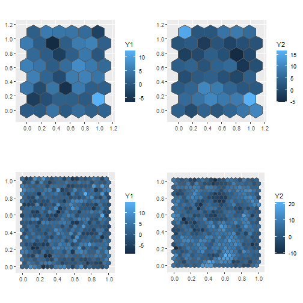
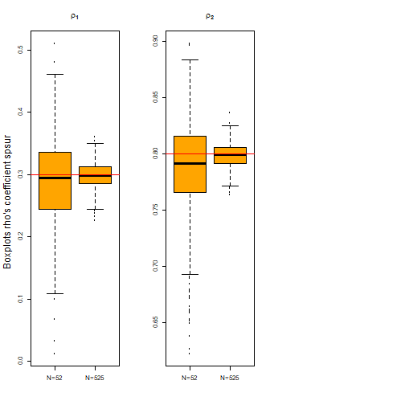
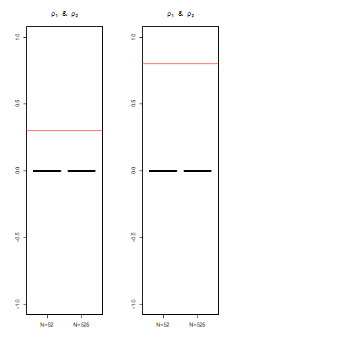
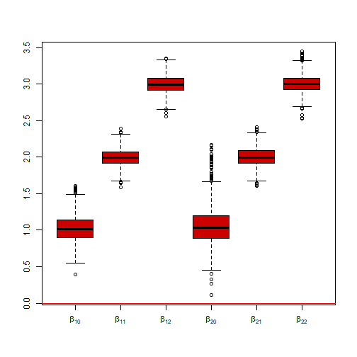
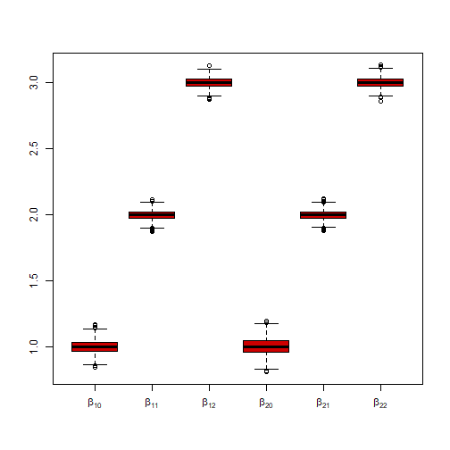
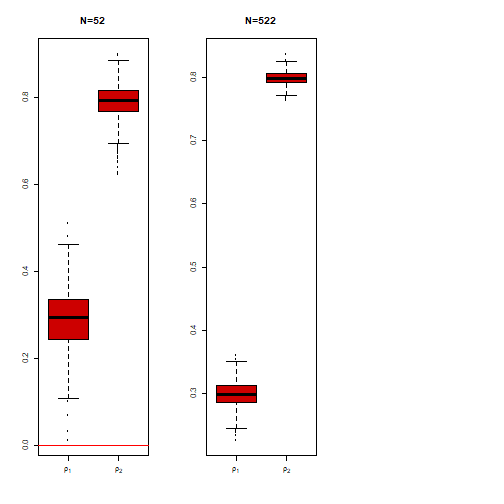
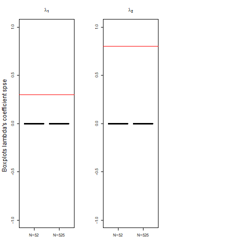
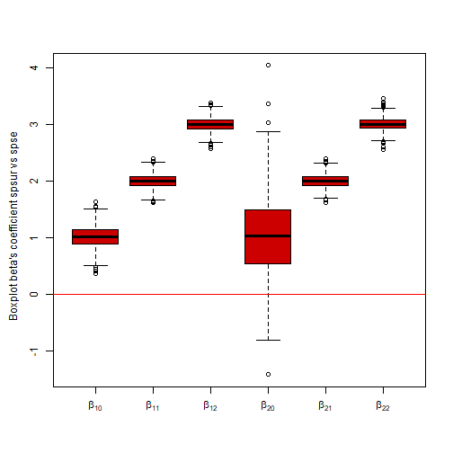
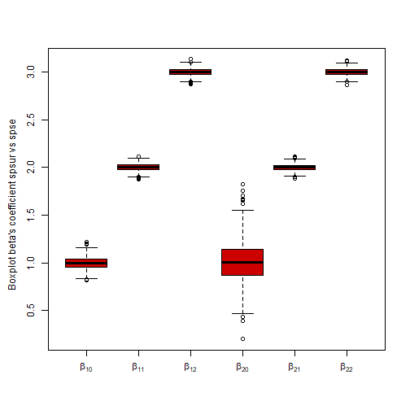
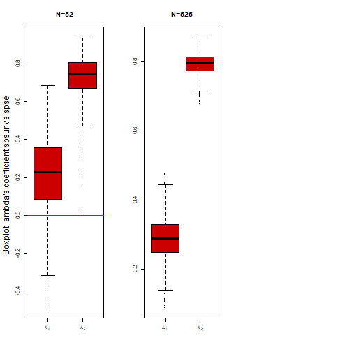

<!-- <style type="text/css"> -->
<!-- a:link { -->
<!--     color: red; -->
<!-- } -->
<!-- .main-container { -->
<!--   max-width: 3800px; -->
<!--   margin-left: 10px; -->
<!--   margin-right: auto; -->
<!-- } -->
<!-- </style> -->


<!-- load cache -->
<!-- whoppeR::load_knitr_cache('spsur-vs-spse_cache/html/') -->


```r
library(spsur)
library(sf)
library(ggplot2)
library(spdep)
library(gridExtra)
```


```r
# install_github("gpiras/spse",force = TRUE)
```

# spsur vs spse

The objective of this vignette is to compare the estimation results obtained with the **spsur** and **spse** R-packages.

We use a simple Monte Carlo exercise.

Two spatial SUR models will be analyzed:

* SUR-SLM
* SUR-SEM

## Monte Carlo setting

The setting of the Monte Carlo exersice is:

1. A temporal period (Tm = 1)
2. Two equations (G=2)
3. Two models SUR-SLM and SUR-SEM
4. Two samples sizes: N=52 and N=525 observations
5. Two exogenous variables in each equation (p=3)
6. Hexagonal regular lattices
7. 1000 iterations

## The hexagonal lattices

Regular hexagonal lattice defined in a square 1x1


```r
sfc <- sf::st_sfc(st_polygon(list(rbind(c(0,0), c(1,0), c(1,1), c(0,1), c(0,0)))))
hexs <- sf::st_make_grid(sfc, cellsize = .18, square = FALSE)
hexs.N52.sf <- sf::st_sf(hexs)
hexs <- sf::st_make_grid(sfc, cellsize = .049, square = FALSE)
hexs.N525.sf <- sf::st_sf(hexs)
```


Plot the geometry


```r
p1 <- ggplot2::ggplot(data = hexs.N52.sf) + ggplot2::geom_sf() 
p2 <- ggplot2::ggplot(data = hexs.N525.sf) + ggplot2::geom_sf()
grid.arrange(p1, p2, nrow = 1)
```


## The W matrix

The W matrix is defined based on the rock criterion in the hexagonal lattice


```r
  W.N52 <- spdep::poly2nb(as(hexs.N52.sf, "Spatial"), queen = FALSE)
  listw.N52 <- spdep::nb2listw(W.N52)
  Wmat.N52 <- spdep::listw2mat(listw.N52)
  
  W.N525 <- spdep::poly2nb(as(hexs.N525.sf, "Spatial"), queen = FALSE)
  listw.N525 <- spdep::nb2listw(W.N525)
  Wmat.N525 <- spdep::listw2mat(listw.N525)
```

# DGP-SUR-SLM Model

The DGP model for SUR-SLM

$$
\begin{equation}
Y_1 = \rho_1 Y_1 +\beta_{10} + \beta_{11}X_{12} +\beta_{12}X_{12} +\epsilon_{1} \\
Y_2 = \rho_2 Y_2 +\beta_{20} + \beta_{21}X_{22} +\beta_{22}X_{22} +\epsilon_{2} \\
Cor(\epsilon_{1},\epsilon_{2}) \neq 0
\end{equation}
$$

Parameter setting for the Monte Carlo exercise


```r
Tm <- 1 # Number of time periods
G <- 2 # Number of equations
N52 <- length(W.N52) # Number observations
N525 <- length(W.N525) # Number observations
p <- 3 # Number of independent variables
Sigma <- matrix(0.5, ncol = G, nrow = G) # Variance-Covariance matrix
diag(Sigma) <- 1
Betas <- rep(1:3, G) # Beta coefficients
rho <- c(0.3, 0.8) # Spatial coefficients
lambda <- c(0,0)
```

The function **dgp_spsur{spsur}** obtain the simulated data set

N=52


```r
it <- 1000 # number of iterations
set.seed(123)
data.spsur.N52 <- list()
data.spse.N52 <- list()
for (i in 1:it){
dgp <- spsur::dgp_spsur(Sigma = Sigma, Betas = Betas, rho = rho, lambda = lambda,
                  Tm = Tm, G = G, N = N52, p = p, listw = listw.N52)

YY <- matrix(dgp$Y[1:(N52*G)],ncol = G)
colnames(YY)<-c("Y1","Y2")
XX <- cbind(rbind(dgp$X[1:N52,2:3]),dgp$X[(1+N52):(2*N52),5:6])
data.spsur.N52[[i]] <- as.data.frame(cbind(YY,XX))
##
data.spse.N52[[i]] <- matrix(0,nrow = N52*G,ncol = 5)
data.spse.N52[[i]] <- data.frame(matrix(0, nrow = G*N52, ncol = (p+1)))
data.spse.N52[[i]][,1] <- as.factor(diag(kronecker(diag(1:N52),diag(2))))
data.spse.N52[[i]][,2] <- diag(kronecker(diag(N52),diag(c(2010,2020))))
data.spse.N52[[i]][seq(1,N52*G,2),3] <- data.spsur.N52[[i]]$Y1
data.spse.N52[[i]][seq(2,N52*G,2),3] <- data.spsur.N52[[i]]$Y2
data.spse.N52[[i]][seq(1,N52*G,2),4] <- data.spsur.N52[[i]]$X1_1
data.spse.N52[[i]][seq(2,N52*G,2),4] <- data.spsur.N52[[i]]$X2_1
data.spse.N52[[i]][seq(1,N52*G,2),5] <- data.spsur.N52[[i]]$X1_2
data.spse.N52[[i]][seq(2,N52*G,2),5] <- data.spsur.N52[[i]]$X2_2
names(data.spse.N52[[i]])<-c("Obs","year","Y","X1","X2")
}
```

For sample size N=525


```r
set.seed(123)
data.spsur.N525 <- list()
data.spse.N525 <- list()
for (i in 1:it){
dgp <- spsur::dgp_spsur(Sigma = Sigma, Betas = Betas, rho = rho, lambda = lambda,
                  Tm = Tm, G = G, N = N525, p = p, listw = listw.N525)

YY <- matrix(dgp$Y[1:(N525*G)],ncol = G)
colnames(YY) <- c("Y1","Y2")
XX <- cbind(rbind(dgp$X[1:N525,2:3]),dgp$X[(1+N525):(2*N525),5:6])
data.spsur.N525[[i]] <- as.data.frame(cbind(YY,XX))
##
data.spse.N525[[i]] <- matrix(0,nrow = N525*G,ncol = 5)
data.spse.N525[[i]] <- data.frame(matrix(0, nrow = G*N525, ncol = (p+1)))
data.spse.N525[[i]][,1] <- as.factor(diag(kronecker(diag(1:N525),diag(2))))
data.spse.N525[[i]][,2] <- diag(kronecker(diag(N525),diag(c(2010,2020))))
data.spse.N525[[i]][seq(1,N525*G,2),3] <- data.spsur.N525[[i]]$Y1
data.spse.N525[[i]][seq(2,N525*G,2),3] <- data.spsur.N525[[i]]$Y2
data.spse.N525[[i]][seq(1,N525*G,2),4] <- data.spsur.N525[[i]]$X1_1
data.spse.N525[[i]][seq(2,N525*G,2),4] <- data.spsur.N525[[i]]$X2_1
data.spse.N525[[i]][seq(1,N525*G,2),5] <- data.spsur.N525[[i]]$X1_2
data.spse.N525[[i]][seq(2,N525*G,2),5] <- data.spsur.N525[[i]]$X2_2
names(data.spse.N525[[i]]) <- c("Obs","year","Y","X1","X2")
}
```


A simple plot of two spatial process correlated ($Y_1$,$Y_2$)


```r
# N=52
hexs.N52.sf$Y1 <- data.spsur.N52[[1]]$Y1
hexs.N52.sf$Y2 <- data.spsur.N52[[1]]$Y2
p1 <- ggplot() + geom_sf(data = hexs.N52.sf) + aes(fill = Y1)
p2 <- ggplot() + geom_sf(data = hexs.N52.sf) + aes(fill = Y2)
# N=525
hexs.N525.sf$Y1 <- data.spsur.N525[[1]]$Y1
hexs.N525.sf$Y2 <- data.spsur.N525[[2]]$Y2
p3 <- ggplot() + geom_sf(data = hexs.N525.sf) + aes(fill = Y1)
p4 <- ggplot() + geom_sf(data = hexs.N525.sf) + aes(fill = Y2)
```

Note that the spatial structure in $Y_2$ is higer than $Y_1$ because the parameter $\rho_1=0.3$ and $\rho_2=0.8$


```r
gridExtra::grid.arrange(p1,p2,p3,p4, nrow = 2)
```



## Estimation using **spsur**

The function **spsurml{spsur}** is used to estimate by ML the models generates. 

Estimation for N=52

The **method = "Matrix"** is select to estimate the models


```r
list.spsur.N52.slm <- list()
formula_spsur <- Y1 | Y2 ~ X1_1 + X1_2 | X2_1 + X2_2
for (i in 1:it){
list.spsur.N52.slm[[i]] <- spsurml(formula = formula_spsur, data = data.spsur.N52[[i]],
                  listw = listw.N52, method = "Matrix", type = "slm",
                  con = list(fdHess = FALSE,trace=FALSE))
}
# save coefficients
results.spsur.N52 <- matrix(0, ncol = 8,nrow = it)
for (i in 1:it){
   results.spsur.N52[i,] <- c(list.spsur.N52.slm[[i]]$coefficients,list.spsur.N52.slm[[i]]$deltas)
 }
colnames(results.spsur.N52) <- c("b10.spsur","b11.spsur","b12.spsur","b20.spsur","b21.spsur","b22.spsur","rho1.spsur","rho2.spsur")
```

Estimation for N=525

The **method = "Matrix"** is select

The option numerical hessian **fdHess = TRUE** is choose


```r
list.spsur.N525.slm <- list()
for (i in 1:it){
list.spsur.N525.slm[[i]] <- spsurml(formula = formula_spsur, data = data.spsur.N525[[i]],listw = listw.N525, method = "Matrix", type = "slm",
                  con = list(fdHess = TRUE,trace=FALSE))
}
# save coefficients
results.spsur.N525 <- matrix(0, ncol = 8,nrow = it)
for (i in 1:it){
   results.spsur.N525[i,] <- c(list.spsur.N525.slm[[i]]$coefficients,list.spsur.N525.slm[[i]]$deltas)
 }
colnames(results.spsur.N525) <- c("b10.spsur","b11.spsur","b12.spsur",
                                  "b20.spsur","b21.spsur","b22.spsur",
                                  "rho1.spsur","rho2.spsur")
```

### Results **spsur**

In this section we present some information about the empirical distribution of

* $\beta$'s coefficients 
* $\rho$'s coefficients

#### **$\beta$'s coefficients**

Boxplots coefficients estimates by ML obtained with **spsur** R-package

(NOTE: real values $\beta_{10}=\beta_{20}=1$; $\beta_{11}=\beta_{21}=2$; $\beta_{12}=\beta_{22}=3$)

Empirical distribution $\beta$'s coefficients N=52 


```r
 par(mfrow=c(1,3))
 mynames <- c("N=52","N=52","N=525","N=525")
 boxplot(cbind(results.spsur.N52[,c(1,4)],results.spsur.N525[,c(1,4)]),names=mynames,col="orange",
         main=expression(paste(bold(beta["10"]),"  &  ",bold(beta["20"]))),las=2)
 abline(h=1, col="red")
 boxplot(cbind(results.spsur.N52[,c(2,5)],results.spsur.N525[,c(2,5)]),names=mynames,col="orange",
         main=expression(paste(bold(beta["11"]),"  &  ",bold(beta["21"]))),las=2)
 abline(h=2, col="red")
 boxplot(cbind(results.spsur.N52[,c(3,6)],results.spsur.N525[,c(3,6)]),names=mynames,col="orange",
         main=expression(paste(bold(beta["12"]),"  &  ",bold(beta["22"]))),las=3)
 abline(h=3, col="red")
 mtext("Boxplots N=525", side = 2, line = -1.5, outer = TRUE)
```


#### $\rho$'s coefficients **spsur**

Boxplots spatial parameters
(NOTE: real values $\rho_1=0.3$; $\rho_2=0.8$)


```r
par(mfrow=c(1,3))
boxplot(cbind(results.spsur.N52[,c(7)],results.spsur.N525[,c(7)]),names=c("N=52","N=525"),col="orange",
        main=expression(paste(bold(rho["1"]))))
abline(h=0.3, col="red")
boxplot(cbind(results.spsur.N52[,c(8)],results.spsur.N525[,c(8)]),names=c("N=52","N=525"),col="orange",
        main=expression(paste(bold(rho["2"]))))
abline(h=0.8, col="red")
mtext("Boxplots rho's coefficient spsur", side = 2, line = -1.5, outer = TRUE)
```



## Estimation using **spse**


```r
list.spse.N52.slm <- list()
eq1 <- Y ~ X1 + X2
eq2 <- Y ~ X1 + X2
listw <- listw.N52
for (i in 1:it){
formula_spse <- list(tp1 = eq1,tp2 = eq2)
list.spse.N52.slm[[i]] <- spse::spseml(formula_spse, data = data.spse.N52[[i]], w = listw, model = "lag",
                              method = "Matrix", quiet = TRUE)
}
```

```
## Loading required package: nlme
```

```r
 # save coefficients
 results.spse.N52 <- matrix(0, ncol = 8,nrow = it)
 for (i in 1:it){
   results.spse.N52[i,] <- c(as.vector(list.spse.N52.slm[[i]]$coefficients),list.spse.N52.slm[[i]]$rho)
 }
 colnames(results.spse.N52) <- c("b10.spse","b11.spse","b12.spse","b20.spse","b21.spse","b22.spse","rho1.spse","rho2.spse")
```


```r
list.spse.N525.slm <- list()
listw <- listw.N525
for (i in 1:it){
formula_spse <- list(tp1 = eq1,tp2 = eq2)
list.spse.N525.slm[[i]] <- spse::spseml(formula_spse, data = data.spse.N525[[i]], w = listw, model = "lag",
                              method = "Matrix", quiet = TRUE)
}
 # save coefficients
 results.spse.N525 <- matrix(0, ncol = 8,nrow = it)
 for (i in 1:it){
   results.spse.N525[i,] <- c(as.vector(list.spse.N525.slm[[i]]$coefficients),list.spse.N525.slm[[i]]$rho)
 }
 colnames(results.spse.N525) <- c("b10.spse","b11.spse","b12.spse","b20.spse","b21.spse","b22.spse","rho1.spse","rho2.spse")
```

### Results **spse**

In this subsection we present some information about the empirical distribution of

* $\beta$'s coefficients 
* $\rho$'s coefficients

#### $\beta$ coefficients 

Boxplots comparing coefficients obtainied with **spse**

(NOTE: real values $\beta_{10}=\beta_{20}=1$; $\beta_{11}=\beta_{21}=2$; $\beta_{12}=\beta_{22}=3$; $\rho_1=0.3$; $\rho_2=0.8$)


```r
 par(mfrow=c(1,3))
 mynames <- c(expression(beta["10"]),expression(beta["20"]),"N=525","N=525")
 boxplot(cbind(results.spse.N52[,c(1,4)],results.spse.N525[,c(1,4)]),names=mynames,col="gray",
         main=expression(paste(bold(beta["10"]),"  &  ",bold(beta["20"]))),las=2)
 abline(h=1, col="red")
 boxplot(cbind(results.spse.N52[,c(2,5)],results.spse.N525[,c(2,5)]),names=mynames,col="gray",
         main=expression(paste(bold(beta["11"]),"  &  ",bold(beta["21"]))),las=2)
 abline(h=2, col="red")
 boxplot(cbind(results.spse.N52[,c(3,6)],results.spse.N525[,c(3,6)]),names=mynames,col="gray",
         main=expression(paste(bold(beta["12"]),"  &  ",bold(beta["22"]))),las=2)
 abline(h=3, col="red")
 mtext("Boxplots coefficients spse", side = 2, line = -1.5, outer = TRUE)
```


#### $\rho$'s coefficients

Boxplots spatial parameters


```r
par(mfrow=c(1,3))
boxplot(cbind(results.spse.N52[,c(7)],results.spse.N525[,c(7)]),names=c("N=52","N=525"),col="grey",
        main=expression(paste(bold(rho["1"]),"  &  ",bold(rho["2"]))))
abline(h=0.3, col="red")
boxplot(cbind(results.spse.N52[,c(8)],results.spse.N525[,c(8)]),names=c("N=52","N=525"),col="grey",
        main=expression(paste(bold(rho["1"]),"  &  ",bold(rho["2"]))))
abline(h=0.8, col="red")
```



## Differences model to model

In this section compare the values of the coefficients estimate using **spsurml{spsur}** with **spse{spse}**

\begin{equation}
\beta_{ij}^{spsur}-\beta_{ij}^{spse}
\end{equation}

The next boxplot show the differences in $\beta$'s and $\rho$'s coefficients model to model

### Differences $\beta's$ coefficients model to model


```r
mynames <- c(expression(beta["10"]),expression(beta["11"]),expression(beta["12"]),
expression(beta["20"]),expression(beta["21"]),expression(beta["22"]))
boxplot(results.spsur.N52[,1:6]-results.spse.N52[,1:6],names=mynames,col="red3")
abline(h=0, col="red")
```



For N=525


```r
mynames <- c(expression(beta["10"]),expression(beta["11"]),expression(beta["12"]),
expression(beta["20"]),expression(beta["21"]),expression(beta["22"]))
boxplot(results.spsur.N525[,1:6]-results.spse.N525[,1:6],names=mynames,col="red3")
abline(h=0, col="red")
```



### Differences $\rho's$ coefficients model to model


```r
par(mfrow=c(1,3))
boxplot(results.spsur.N52[,7:8]-results.spse.N52[,7:8], names=c(expression(rho[1]),expression(rho[2])),col="red3",main="N=52")
abline(h=0, col="red")
boxplot(results.spsur.N525[,7:8]-results.spse.N525[,7:8],
names=c(expression(rho[1]),expression(rho[2])),col="red3",main="N=522")
abline(h=0, col="red")
```



# DGP-SUR-SEM Model

The DGP model SUR-SEM

$$
\begin{equation}
Y_1 =\beta_{10} + \beta_{11}X_{12} + \beta_{12}X_{12} + u_{1};\ \  u_{1}=\lambda_{1}Wu_{1} + \epsilon_{1} \\
Y_2 =\beta_{20} + \beta_{21}X_{22} + \beta_{22}X_{22} +u_{2};\ \ u_{2}=\lambda_{2}Wu_{2} + \epsilon_{2} \\
Cor(\epsilon_{1},\epsilon_{2}) \neq 0
\end{equation}
$$

Parameter setting for the Monte Carlo exercise


```r
# Tm <- 1 # Number of time periods
# G <- 2 # Number of equations
# N52 <- length(W.N52) # number observations
# N525 <- length(W.N525) # number observations
# p <- 3 # Number of independent variables
# Sigma <- matrix(0.5, ncol = G, nrow = G)
# diag(Sigma) <- 1
# Betas <- rep(1:3, G)
rho <- c(0,0) 
lambda <- c(0.3, 0.8)
```


The function **dgp_spsur{spsur}** obtain the simulated data set

For sample size 52


```r
it <- 1000
set.seed(123)
data.spsur.sem.N52 <- list()
data.spse.sem.N52 <- list()
for (i in 1:it){
dgp <- spsur::dgp_spsur(Sigma = Sigma, Betas = Betas, rho = rho, lambda = lambda,
                  Tm = Tm, G = G, N = N52, p = p, listw = listw.N52)

YY <- matrix(dgp$Y[1:(N52*G)],ncol = G)
colnames(YY)<-c("Y1","Y2")
XX <- cbind(rbind(dgp$X[1:N52,2:3]),dgp$X[(1+N52):(2*N52),5:6])
data.spsur.sem.N52[[i]] <- as.data.frame(cbind(YY,XX))
##
data.spse.sem.N52[[i]] <- matrix(0,nrow = N52*G,ncol = 5)
data.spse.sem.N52[[i]] <- data.frame(matrix(0, nrow = G*N52, ncol = (p+1)))
data.spse.sem.N52[[i]][,1] <- as.factor(diag(kronecker(diag(1:N52),diag(2))))
data.spse.sem.N52[[i]][,2] <- diag(kronecker(diag(N52),diag(c(2010,2020))))
data.spse.sem.N52[[i]][seq(1,N52*G,2),3] <- data.spsur.sem.N52[[i]]$Y1
data.spse.sem.N52[[i]][seq(2,N52*G,2),3] <- data.spsur.sem.N52[[i]]$Y2
data.spse.sem.N52[[i]][seq(1,N52*G,2),4] <- data.spsur.sem.N52[[i]]$X1_1
data.spse.sem.N52[[i]][seq(2,N52*G,2),4] <- data.spsur.sem.N52[[i]]$X2_1
data.spse.sem.N52[[i]][seq(1,N52*G,2),5] <- data.spsur.sem.N52[[i]]$X1_2
data.spse.sem.N52[[i]][seq(2,N52*G,2),5] <- data.spsur.sem.N52[[i]]$X2_2
names(data.spse.sem.N52[[i]])<-c("Obs","year","Y","X1","X2")
}
```

For sample size 525


```r
set.seed(123)
data.spsur.sem.N525 <- list()
data.spse.sem.N525 <- list()
for (i in 1:it){
dgp <- spsur::dgp_spsur(Sigma = Sigma, Betas = Betas, rho = rho, lambda = lambda,
                  Tm = Tm, G = G, N = N525, p = p, listw = listw.N525)

YY <- matrix(dgp$Y[1:(N525*G)],ncol = G)
colnames(YY) <- c("Y1","Y2")
XX <- cbind(rbind(dgp$X[1:N525,2:3]),dgp$X[(1+N525):(2*N525),5:6])
data.spsur.sem.N525[[i]] <- as.data.frame(cbind(YY,XX))
##
data.spse.sem.N525[[i]] <- matrix(0,nrow = N525*G,ncol = 5)
data.spse.sem.N525[[i]] <- data.frame(matrix(0, nrow = G*N525, ncol = (p+1)))
data.spse.sem.N525[[i]][,1] <- as.factor(diag(kronecker(diag(1:N525),diag(2))))
data.spse.sem.N525[[i]][,2] <- diag(kronecker(diag(N525),diag(c(2010,2020))))
data.spse.sem.N525[[i]][seq(1,N525*G,2),3] <- data.spsur.sem.N525[[i]]$Y1
data.spse.sem.N525[[i]][seq(2,N525*G,2),3] <- data.spsur.sem.N525[[i]]$Y2
data.spse.sem.N525[[i]][seq(1,N525*G,2),4] <- data.spsur.sem.N525[[i]]$X1_1
data.spse.sem.N525[[i]][seq(2,N525*G,2),4] <- data.spsur.sem.N525[[i]]$X2_1
data.spse.sem.N525[[i]][seq(1,N525*G,2),5] <- data.spsur.sem.N525[[i]]$X1_2
data.spse.sem.N525[[i]][seq(2,N525*G,2),5] <- data.spsur.sem.N525[[i]]$X2_2
names(data.spse.sem.N525[[i]]) <- c("Obs","year","Y","X1","X2")
}
```

## Estimation using **spsur**

Estimation **spsurml{spsur}**

Monte Carlo N = 52


```r
list.spsur.sem.N52 <- list()
formula_spsur <- Y1 | Y2 ~ X1_1 + X1_2 | X2_1 + X2_2
for (i in 1:it){
list.spsur.sem.N52[[i]] <- spsurml(formula = formula_spsur, data = data.spsur.sem.N52[[i]],
                  listw = listw.N52, method = "Matrix", type = "sem",
                  con = list(fdHess = FALSE,trace=FALSE))
}
# save coefficients
results.spsur.sem.N52 <- matrix(0, ncol = 8,nrow = it)
for (i in 1:it){
   results.spsur.sem.N52[i,] <- c(list.spsur.sem.N52[[i]]$coefficients,list.spsur.sem.N52[[i]]$deltas)
 }
colnames(results.spsur.sem.N52) <- c("b10.spsur","b11.spsur","b12.spsur","b20.spsur","b21.spsur","b22.spsur","rho1.spsur","rho2.spsur")
```

Monte Carlo Estimation for N=525

The **method = "Matrix"** is select

The option numerical hessian **fdHess = TRUE** is choose


```r
list.spsur.sem.N525 <- list()
for (i in 1:it){
list.spsur.sem.N525[[i]] <- spsurml(formula = formula_spsur, data = data.spsur.sem.N525[[i]],listw = listw.N525, method = "Matrix", type = "sem",con = list(fdHess = TRUE,trace=FALSE))
}
# save coefficients
results.spsur.sem.N525 <- matrix(0, ncol = 8,nrow = it)
for (i in 1:it){
   results.spsur.sem.N525[i,] <- c(list.spsur.sem.N525[[i]]$coefficients,list.spsur.sem.N525[[i]]$deltas)
 }
colnames(results.spsur.sem.N525) <- c("b10.spsur","b11.spsur","b12.spsur",
                                  "b20.spsur","b21.spsur","b22.spsur",
                                  "rho1.spsur","rho2.spsur")
```


### Results **spsur**

#### $\beta$'s coefficients 

Boxplots coefficients estimates by ML obtained with **spsur** R-package

(NOTE: real values $\beta_{10}=\beta_{20}=1$; $\beta_{11}=\beta_{21}=2$; $\beta_{12}=\beta_{22}=3$)

Empirical distribution $\beta$'s coefficients estimated with **spsur** (N=52, 525) 


```r
 par(mfrow=c(1,3))
 mynames <- c(expression(paste("(N=52) ",beta[10])),"N=52","N=525","N=525")
 boxplot(cbind(results.spsur.sem.N52[,c(1,4)],results.spsur.sem.N525[,c(1,4)]),names=mynames,col="orange",
         main=expression(paste(bold(beta["10"]),"  &  ",bold(beta["20"]))),las=2) # "b10.spsur & b20.spsur"
 abline(h=1, col="red")
 boxplot(cbind(results.spsur.sem.N52[,c(2,5)],results.spsur.sem.N525[,c(2,5)]),names=mynames,col="orange",
         main=expression(paste(bold(beta["11"]),"  &  ",bold(beta["21"]))),las=2)
 abline(h=2, col="red")
 boxplot(cbind(results.spsur.sem.N52[,c(3,6)],results.spsur.sem.N525[,c(3,6)]),names=mynames,col="orange",
         main=expression(paste(bold(beta["12"]),"  &  ",bold(beta["22"]))),las=2)
 abline(h=3, col="red")
 mtext("Boxplots beta's coefficient spsur", side = 2, line = -1.5, outer = TRUE)
```


#### $\rho$'s coefficients

Boxplots spatial parameters

(NOTE: real values $\rho_1=0.3$; $\rho_2=0.8$)


```r
par(mfrow=c(1,3))
boxplot(cbind(results.spsur.N52[,c(7)],results.spsur.N525[,c(7)]),names=c("N=52","N=525"),col="orange",
        main=expression(paste(bold(rho["1"]))))
abline(h=0.3, col="red")
boxplot(cbind(results.spsur.N52[,c(8)],results.spsur.N525[,c(8)]),names=c("N=52","N=525"),col="orange",
        main=expression(paste(bold(rho["2"]))))
abline(h=0.8, col="red")
```


## Estimation using **spse**


```r
list.spse.sem.N52<-list()
eq1 <- Y ~ X1 + X2
eq2 <- Y ~ X1 + X2
listw <- listw.N52
for (i in 1:it){
formula_spse <- list(tp1 = eq1,tp2 = eq2)
list.spse.sem.N52[[i]] <- spse::spseml(formula_spse, data = data.spse.sem.N52[[i]], w = listw, model = "error",
                              method = "Matrix", quiet = TRUE)
}
 # save coefficients
 results.spse.sem.N52 <- matrix(0, ncol = 8,nrow = it)
 for (i in 1:it){
   results.spse.sem.N52[i,] <- c(as.vector(list.spse.sem.N52[[i]]$coefficients),list.spse.sem.N52[[i]]$rho)
 }
 colnames(results.spse.sem.N52) <- c("b10.spse","b11.spse","b12.spse","b20.spse","b21.spse","b22.spse","rho1.spse","rho2.spse")
```


```r
list.spse.sem.N525<-list()
listw <- listw.N525
for (i in 1:it){
formula_spse <- list(tp1 = eq1,tp2 = eq2)
list.spse.sem.N525[[i]] <- spse::spseml(formula_spse, data = data.spse.sem.N525[[i]], w = listw, model = "error",
                              method = "Matrix", quiet = TRUE)
}
 # save coefficients
 results.spse.sem.N525<-matrix(0, ncol = 8,nrow = it)
 for (i in 1:it){
   results.spse.sem.N525[i,] <- c(as.vector(list.spse.sem.N525[[i]]$coefficients),list.spse.sem.N525[[i]]$rho)
 }
 colnames(results.spse.sem.N525) <- c("b10.spse","b11.spse","b12.spse","b20.spse","b21.spse","b22.spse","rho1.spse","rho2.spse")
```


### Results **spse**

#### $\beta$ coefficients **spse**

Boxplots comparing coefficients with **spse**

(NOTE: real values $\beta_{10}=\beta_{20}=1$; $\beta_{11}=\beta_{21}=2$; $\beta_{12}=\beta_{22}=3$; $\rho_1=0.3$; $\rho_2=0.8$)


```r
 par(mfrow=c(1,3))
 mynames <- c(expression(beta["10"]),expression(beta["20"]),"N=525","N=525")
 boxplot(cbind(results.spse.sem.N52[,c(1,4)],results.spse.sem.N525[,c(1,4)]),names=mynames,col="gray",
         main=expression(paste(bold(beta["10"]),"  &  ",bold(beta["20"]))),las=2)
 abline(h=1, col="red")
 boxplot(cbind(results.spse.sem.N52[,c(2,5)],results.spse.sem.N525[,c(2,5)]),names=mynames,col="gray",
         main=expression(paste(bold(beta["11"]),"  &  ",bold(beta["21"]))),las=2)
 abline(h=2, col="red")
 boxplot(cbind(results.spse.sem.N52[,c(3,6)],results.spse.sem.N525[,c(3,6)]),names=mynames,col="gray",
         main=expression(paste(bold(beta["12"]),"  &  ",bold(beta["22"]))),las=2)
 abline(h=3, col="red")
 mtext("Boxplots beta's coefficient spse", side = 2, line = -1.5, outer = TRUE)
```


#### $\rho$'s coefficients **spse**

Boxplots spatial parameters


```r
par(mfrow=c(1,3))
boxplot(cbind(results.spse.sem.N52[,c(7)],results.spse.sem.N525[,c(7)]),names=c("N=52","N=525"),col="grey",
        main=expression(paste(bold(lambda["1"]))))
abline(h=0.3, col="red")
boxplot(cbind(results.spse.sem.N52[,c(8)],results.spse.sem.N525[,c(8)]),names=c("N=52","N=525"),col="grey",
        main=expression(paste(bold(lambda["2"]))))
abline(h=0.8, col="red")
mtext("Boxplots lambda's coefficient spse", side = 2, line = -1.5, outer = TRUE)
```



## Differences model to model

In this section compare the values of the coefficients estimated with **spsurml{spsur}** and **spseml{spse}** for each equation.

\begin{equation}
\beta_{ij}^{spsur}-\beta_{ij}^{spse}
\end{equation}

The next boxplots show the differences in $\beta$'s and $\rho$'s coefficients model to model

### Differences $\beta's$ coefficients model to model SUR-SEM

N=52


```r
mynames <- c(expression(beta["10"]),expression(beta["11"]),expression(beta["12"]),
expression(beta["20"]),expression(beta["21"]),expression(beta["22"]))
boxplot(results.spsur.sem.N52[,1:6]-results.spse.sem.N52[,1:6],names=mynames,col="red3")
abline(h=0, col="red")
mtext("Boxplot beta's coefficient spsur vs spse", side = 2, line = -1.5, outer = TRUE)
```



For N=525


```r
mynames <- c(expression(beta["10"]),expression(beta["11"]),expression(beta["12"]),
expression(beta["20"]),expression(beta["21"]),expression(beta["22"]))
boxplot(results.spsur.sem.N525[,1:6]-results.spse.sem.N525[,1:6],names=mynames,col="red3")
abline(h=0, col="red")
mtext("Boxplot beta's coefficient spsur vs spse", side = 2, line = -1.5, outer = TRUE)
```



### Differences $\rho's$ coefficients model to model


```r
par(mfrow=c(1,3))
boxplot(results.spsur.sem.N52[,7:8]-results.spse.sem.N52[,7:8],
        names=c(expression(lambda[1]),expression(lambda[2])),col="red3",main="N=52")
abline(h=0, col="red")
boxplot(results.spsur.sem.N525[,7:8]-results.spse.sem.N525[,7:8],
        names=c(expression(lambda[1]),expression(lambda[2])),col="red3",main="N=525")
abline(h=0, col="red")
mtext("Boxplot lambda's coefficient spsur vs spse", side = 2, line = -1.5, outer = TRUE)
```


